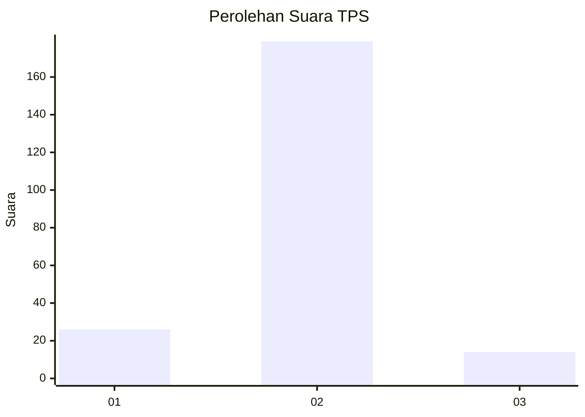
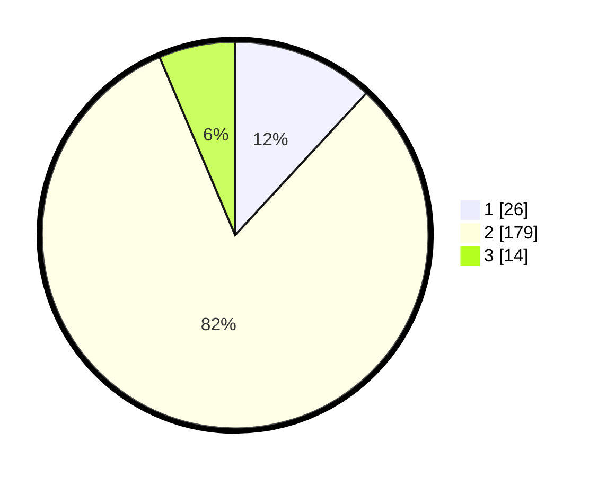

# Hasil

## Grafik

## Tabel

| No. | Nama Paslon    | Suara | Suara (raw) | Persentase |
|:--- |:-------------- | -----:| -----------:| ----------:|
| 1   | ANIES MUHAIMIN | 26    | [26][p-1]   | 11,87      |
| 2   | PRABOWO GIBRAN | 179   | [179][p-2]  | 81,74      |
| 3   | GANJAR MAHFUD  | 14    | [14][p-3]   | 6,39       |

[p-1]: https://github.com/gigit-pemilu/pemilu-2024/blob/main/pilpres/hitung-suara/sub/32-jawa-barat/sub/16-bekasi/sub/23-bojongmangu/sub/2001-karangmulya/sub/005-tps/sub/paslon-1.txt
[p-2]: https://github.com/gigit-pemilu/pemilu-2024/blob/main/pilpres/hitung-suara/sub/32-jawa-barat/sub/16-bekasi/sub/23-bojongmangu/sub/2001-karangmulya/sub/005-tps/sub/paslon-2.txt
[p-3]: https://github.com/gigit-pemilu/pemilu-2024/blob/main/pilpres/hitung-suara/sub/32-jawa-barat/sub/16-bekasi/sub/23-bojongmangu/sub/2001-karangmulya/sub/005-tps/sub/paslon-3.txt

## Foto C Plano

https://sirekap-obj-formc.kpu.go.id/4cd8/pemilu/ppwp/32/16/23/20/01/3216232001005-20240214-233335--b9709f34-413d-43f4-ae9b-24d6a0505865.jpg

https://sirekap-obj-formc.kpu.go.id/4cd8/pemilu/ppwp/32/16/23/20/01/3216232001005-20240214-160111--e78fea57-8f3a-450c-8f4b-1470cbbb4555.jpg

https://sirekap-obj-formc.kpu.go.id/4cd8/pemilu/ppwp/32/16/23/20/01/3216232001005-20240214-233406--f1b4444c-5dc4-4442-9bbd-ba38d406b942.jpg

## Metadata

| Key        | Value               |
| ---------- | ------------------- |
| Time Stamp | 2024-02-24 22:31:28 |

