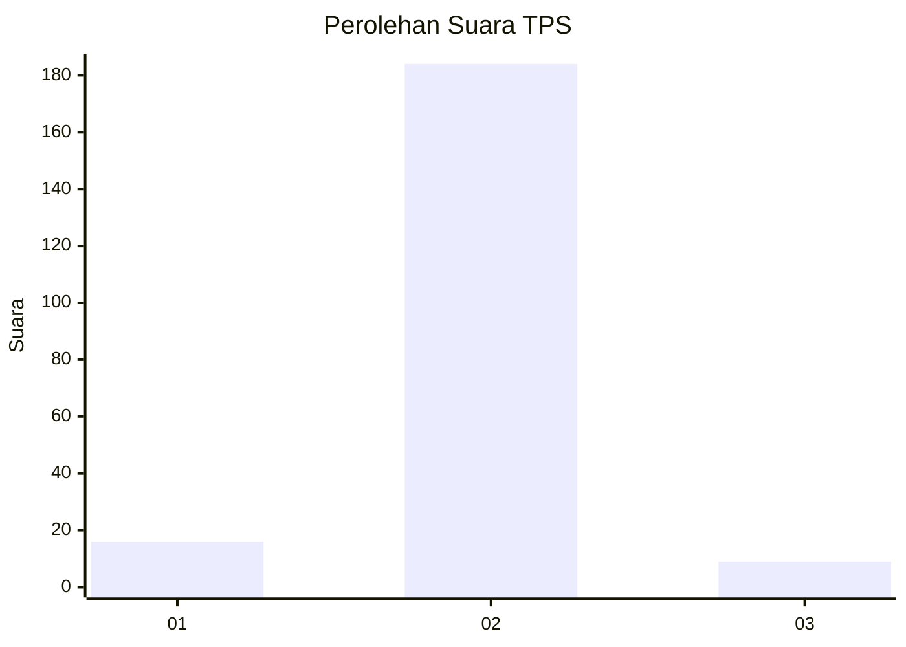
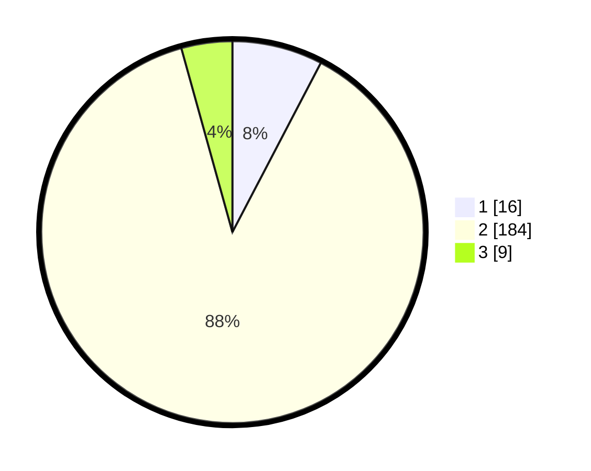

# Hasil

## Grafik

## Tabel

| No. | Nama Paslon    | Suara | Suara (raw) | Persentase |
|:--- |:-------------- | -----:| -----------:| ----------:|
| 1   | ANIES MUHAIMIN | 16    | [16][p-1]   | 7,66       |
| 2   | PRABOWO GIBRAN | 184   | [184][p-2]  | 88,04      |
| 3   | GANJAR MAHFUD  | 9     | [9][p-3]    | 4,31       |

[p-1]: https://github.com/gigit-pemilu/pemilu-2024/blob/main/pilpres/hitung-suara/sub/32-jawa-barat/sub/16-bekasi/sub/23-bojongmangu/sub/2003-bojongmangu/sub/003-tps/sub/paslon-1.txt
[p-2]: https://github.com/gigit-pemilu/pemilu-2024/blob/main/pilpres/hitung-suara/sub/32-jawa-barat/sub/16-bekasi/sub/23-bojongmangu/sub/2003-bojongmangu/sub/003-tps/sub/paslon-2.txt
[p-3]: https://github.com/gigit-pemilu/pemilu-2024/blob/main/pilpres/hitung-suara/sub/32-jawa-barat/sub/16-bekasi/sub/23-bojongmangu/sub/2003-bojongmangu/sub/003-tps/sub/paslon-3.txt

## Foto C Plano

https://sirekap-obj-formc.kpu.go.id/e5ef/pemilu/ppwp/32/16/23/20/03/3216232003003-20240215-005637--692cad15-d74e-46e5-a7a4-8b942d8b3711.jpg

https://sirekap-obj-formc.kpu.go.id/e5ef/pemilu/ppwp/32/16/23/20/03/3216232003003-20240215-005839--2ffb2f09-6362-4df1-b924-89a914b12e1b.jpg

https://sirekap-obj-formc.kpu.go.id/e5ef/pemilu/ppwp/32/16/23/20/03/3216232003003-20240215-005845--90b6af14-8c41-4e3d-a2f4-ca2d9ce43232.jpg

## Metadata

| Key        | Value               |
| ---------- | ------------------- |
| Time Stamp | 2024-02-24 22:31:28 |

