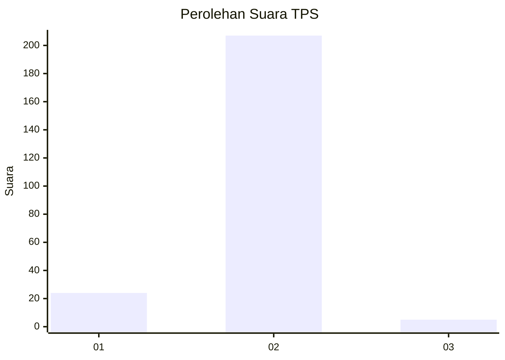
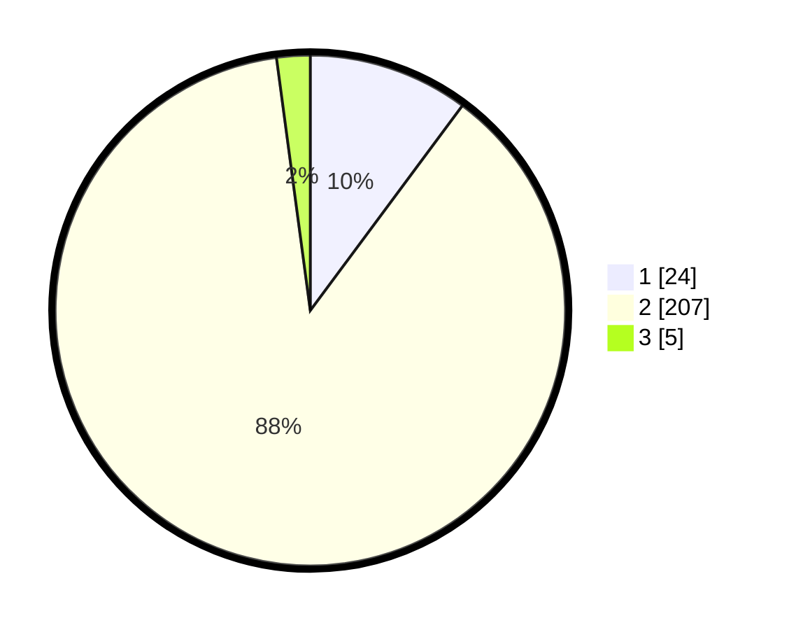

# Hasil

## Grafik

## Tabel

| No. | Nama Paslon    | Suara | Suara (raw) | Persentase |
|:--- |:-------------- | -----:| -----------:| ----------:|
| 1   | ANIES MUHAIMIN | 24    | [24][p-1]   | 10,17      |
| 2   | PRABOWO GIBRAN | 207   | [207][p-2]  | 87,71      |
| 3   | GANJAR MAHFUD  | 5     | [5][p-3]    | 2,12       |

[p-1]: https://github.com/gigit-pemilu/pemilu-2024-32-jawa-barat/blob/main/pilpres/hitung-suara/sub/32-jawa-barat/sub/16-bekasi/sub/23-bojongmangu/sub/2004-sukabungah/sub/006-tps/sub/paslon-1.txt
[p-2]: https://github.com/gigit-pemilu/pemilu-2024-32-jawa-barat/blob/main/pilpres/hitung-suara/sub/32-jawa-barat/sub/16-bekasi/sub/23-bojongmangu/sub/2004-sukabungah/sub/006-tps/sub/paslon-2.txt
[p-3]: https://github.com/gigit-pemilu/pemilu-2024-32-jawa-barat/blob/main/pilpres/hitung-suara/sub/32-jawa-barat/sub/16-bekasi/sub/23-bojongmangu/sub/2004-sukabungah/sub/006-tps/sub/paslon-3.txt

## Foto C Plano

https://sirekap-obj-formc.kpu.go.id/85fe/pemilu/ppwp/32/16/23/20/04/3216232004006-20240215-000917--ac5aa9ac-e240-4bd4-9ae8-d59fe26c8a4c.jpg

https://sirekap-obj-formc.kpu.go.id/85fe/pemilu/ppwp/32/16/23/20/04/3216232004006-20240215-000721--00b18ab1-3ef3-4f67-8a15-7438eb492aa9.jpg

https://sirekap-obj-formc.kpu.go.id/85fe/pemilu/ppwp/32/16/23/20/04/3216232004006-20240215-001058--5a9086f2-4b0d-4b7e-b19f-c8b3417d07dd.jpg

## Metadata

| Key        | Value               |
| ---------- | ------------------- |
| Time Stamp | 2024-02-15 03:06:03 |

