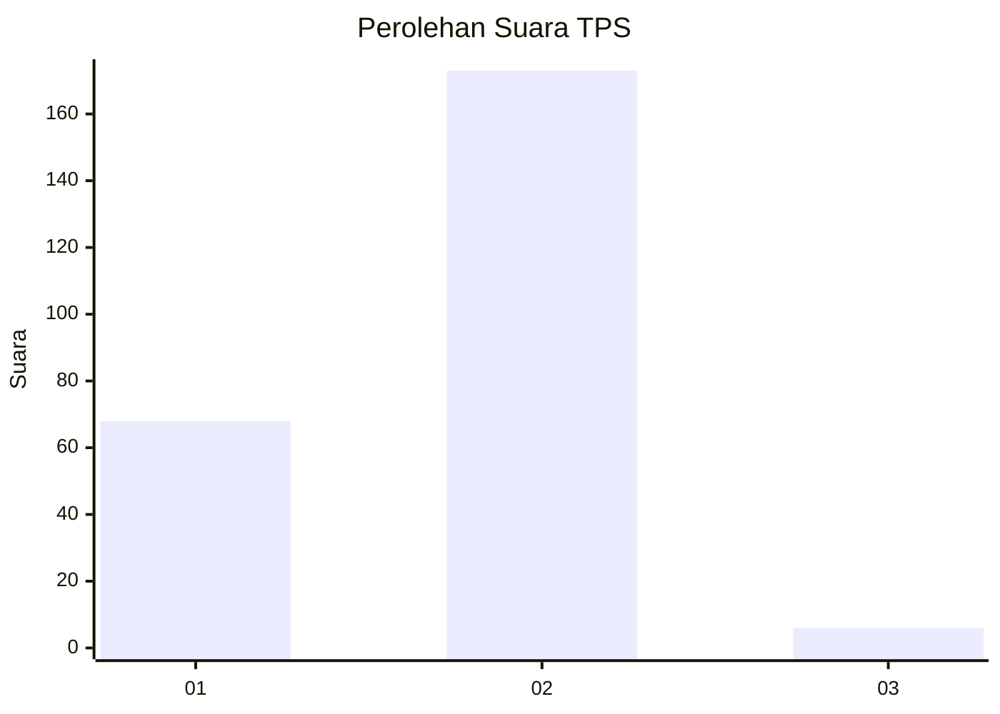
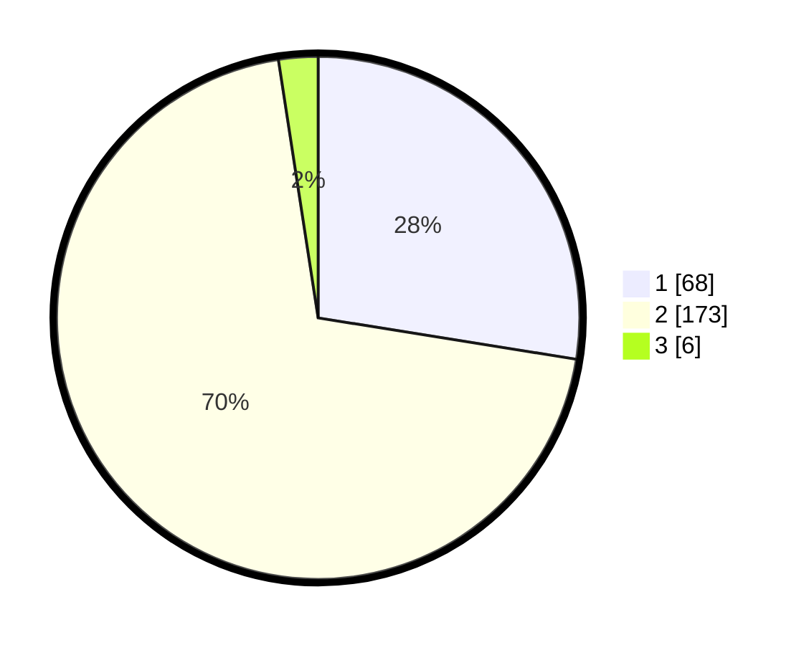

# Hasil

## Grafik

## Tabel

| No. | Nama Paslon    | Suara | Suara (raw) | Persentase |
|:--- |:-------------- | -----:| -----------:| ----------:|
| 1   | ANIES MUHAIMIN | 68    | [68][p-1]   | 27,53      |
| 2   | PRABOWO GIBRAN | 173   | [173][p-2]  | 70,04      |
| 3   | GANJAR MAHFUD  | 6     | [6][p-3]    | 2,43       |

[p-1]: https://github.com/gigit-pemilu/pemilu-2024/blob/main/pilpres/hitung-suara/sub/32-jawa-barat/sub/17-bandung-barat/sub/01-lembang/sub/2001-pagerwangi/sub/001-tps/sub/paslon-1.txt
[p-2]: https://github.com/gigit-pemilu/pemilu-2024/blob/main/pilpres/hitung-suara/sub/32-jawa-barat/sub/17-bandung-barat/sub/01-lembang/sub/2001-pagerwangi/sub/001-tps/sub/paslon-2.txt
[p-3]: https://github.com/gigit-pemilu/pemilu-2024/blob/main/pilpres/hitung-suara/sub/32-jawa-barat/sub/17-bandung-barat/sub/01-lembang/sub/2001-pagerwangi/sub/001-tps/sub/paslon-3.txt

## Foto C Plano

https://sirekap-obj-formc.kpu.go.id/be4f/pemilu/ppwp/32/17/01/20/01/3217012001001-20240217-145444--3ba64964-d2a7-4ea0-8293-0a943e3343dc.jpg

https://sirekap-obj-formc.kpu.go.id/be4f/pemilu/ppwp/32/17/01/20/01/3217012001001-20240217-145654--21c48f14-e366-44f3-a734-1acd2bd03578.jpg

https://sirekap-obj-formc.kpu.go.id/be4f/pemilu/ppwp/32/17/01/20/01/3217012001001-20240214-211127--bebc48e0-8fd4-40fe-904a-4d166bd85767.jpg

## Metadata

| Key        | Value               |
| ---------- | ------------------- |
| Time Stamp | 2024-02-19 06:16:00 |

