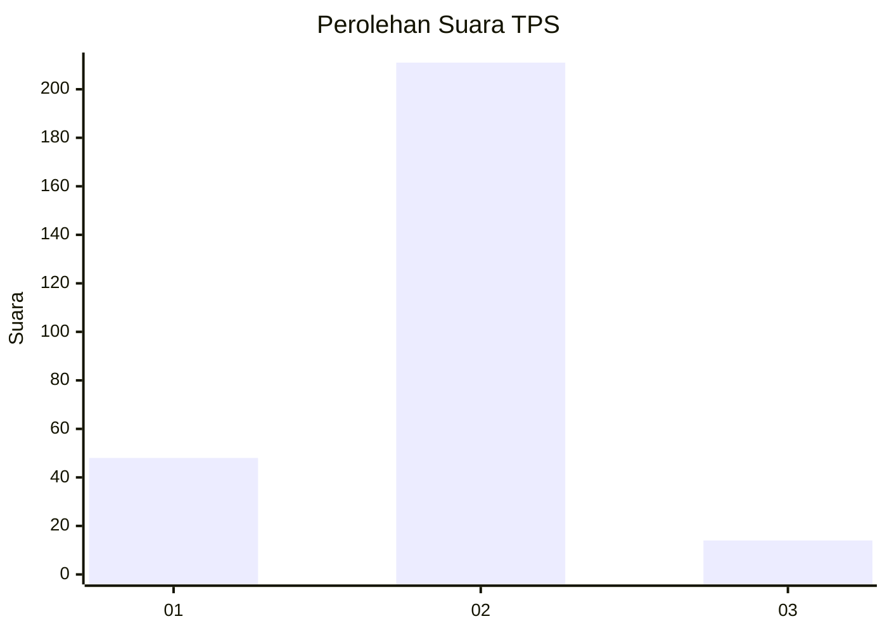
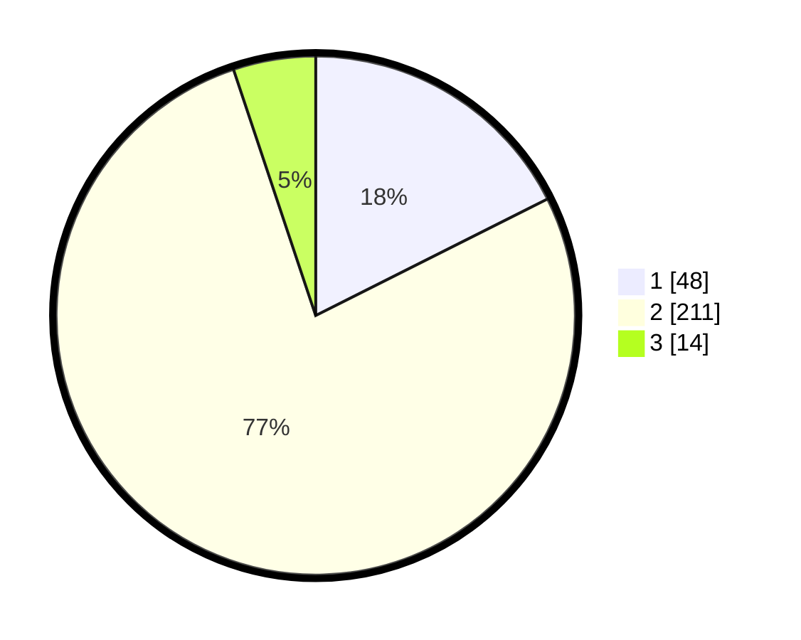

# Hasil

## Grafik

## Tabel

| No. | Nama Paslon    | Suara | Suara (raw) | Persentase |
|:--- |:-------------- | -----:| -----------:| ----------:|
| 1   | ANIES MUHAIMIN | 48    | [48][p-1]   | 17,58      |
| 2   | PRABOWO GIBRAN | 211   | [211][p-2]  | 77,29      |
| 3   | GANJAR MAHFUD  | 14    | [14][p-3]   | 5,13       |

[p-1]: https://github.com/gigit-pemilu/pemilu-2024-32-jawa-barat/blob/main/pilpres/hitung-suara/sub/32-jawa-barat/sub/17-bandung-barat/sub/01-lembang/sub/2001-pagerwangi/sub/013-tps/sub/paslon-1.txt
[p-2]: https://github.com/gigit-pemilu/pemilu-2024-32-jawa-barat/blob/main/pilpres/hitung-suara/sub/32-jawa-barat/sub/17-bandung-barat/sub/01-lembang/sub/2001-pagerwangi/sub/013-tps/sub/paslon-2.txt
[p-3]: https://github.com/gigit-pemilu/pemilu-2024-32-jawa-barat/blob/main/pilpres/hitung-suara/sub/32-jawa-barat/sub/17-bandung-barat/sub/01-lembang/sub/2001-pagerwangi/sub/013-tps/sub/paslon-3.txt

## Foto C Plano

https://sirekap-obj-formc.kpu.go.id/87c5/pemilu/ppwp/32/17/01/20/01/3217012001013-20240214-193933--4c2bea25-3a0a-49f7-8a01-7a6fa98b9425.jpg

https://sirekap-obj-formc.kpu.go.id/87c5/pemilu/ppwp/32/17/01/20/01/3217012001013-20240214-193950--c30f2fb4-e106-48e9-9e41-fa8b5f81d217.jpg

https://sirekap-obj-formc.kpu.go.id/87c5/pemilu/ppwp/32/17/01/20/01/3217012001013-20240214-194005--76dad850-a311-4053-a13d-3c42afa72b7e.jpg

## Metadata

| Key        | Value               |
| ---------- | ------------------- |
| Time Stamp | 2024-02-17 16:00:02 |

## DATA PEMILIH TETAP

Jumlah pemilih dalam DPT: **299**.
 * L: **158**.
 * P: **141**.

## DATA PENGGUNA HAK PILIH

Jumlah pengguna hak pilih dalam DPT: **277**.
 * L: **145**.
 * P: **132**.

Jumlah pengguna hak pilih dalam DPTb: **0**.
 * L: **0**.
 * P: **0**.

Jumlah pengguna hak pilih dalam DPK: **0**.
 * L: **0**.
 * P: **0**.

Jumlah pengguna hak pilih: **277**.
 * L: **145**.
 * P: **132**.

## JUMLAH SUARA SAH DAN TIDAK SAH

JUMLAH SELURUH SUARA SAH: **273**.

JUMLAH SUARA TIDAK SAH: **4**.

JUMLAH SELURUH SUARA SAH DAN SUARA TIDAK SAH: **277**.

