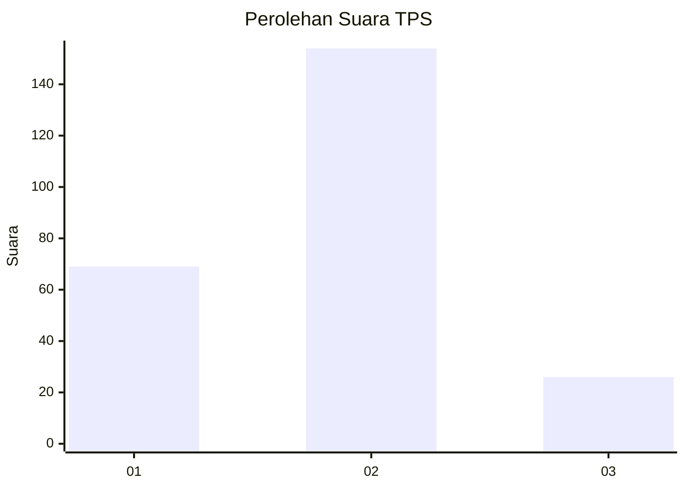
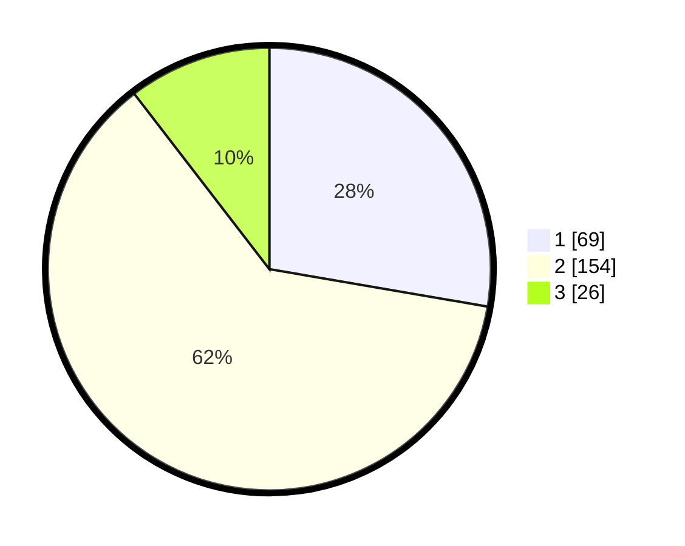

# Hasil

## Grafik

## Tabel

| No. | Nama Paslon    | Suara | Suara (raw) | Persentase |
|:--- |:-------------- | -----:| -----------:| ----------:|
| 1   | ANIES MUHAIMIN | 69    | [69][p-1]   | 27,71      |
| 2   | PRABOWO GIBRAN | 154   | [154][p-2]  | 61,85      |
| 3   | GANJAR MAHFUD  | 26    | [26][p-3]   | 10,44      |

[p-1]: https://github.com/gigit-pemilu/pemilu-2024-32-jawa-barat/blob/main/pilpres/hitung-suara/sub/32-jawa-barat/sub/17-bandung-barat/sub/01-lembang/sub/2001-pagerwangi/sub/016-tps/sub/paslon-1.txt
[p-2]: https://github.com/gigit-pemilu/pemilu-2024-32-jawa-barat/blob/main/pilpres/hitung-suara/sub/32-jawa-barat/sub/17-bandung-barat/sub/01-lembang/sub/2001-pagerwangi/sub/016-tps/sub/paslon-2.txt
[p-3]: https://github.com/gigit-pemilu/pemilu-2024-32-jawa-barat/blob/main/pilpres/hitung-suara/sub/32-jawa-barat/sub/17-bandung-barat/sub/01-lembang/sub/2001-pagerwangi/sub/016-tps/sub/paslon-3.txt

## Foto C Plano

https://sirekap-obj-formc.kpu.go.id/3dc5/pemilu/ppwp/32/17/01/20/01/3217012001016-20240214-193329--db83ac49-2959-41a8-bc5f-b12956d64f8b.jpg

https://sirekap-obj-formc.kpu.go.id/3dc5/pemilu/ppwp/32/17/01/20/01/3217012001016-20240214-193511--047a7497-f0ee-4020-8806-bab2fc7a4c97.jpg

https://sirekap-obj-formc.kpu.go.id/3dc5/pemilu/ppwp/32/17/01/20/01/3217012001016-20240214-193641--8100a7cb-f007-4b31-8a13-09fda02a204d.jpg

## Metadata

| Key        | Value               |
| ---------- | ------------------- |
| Time Stamp | 2024-02-19 06:16:00 |

