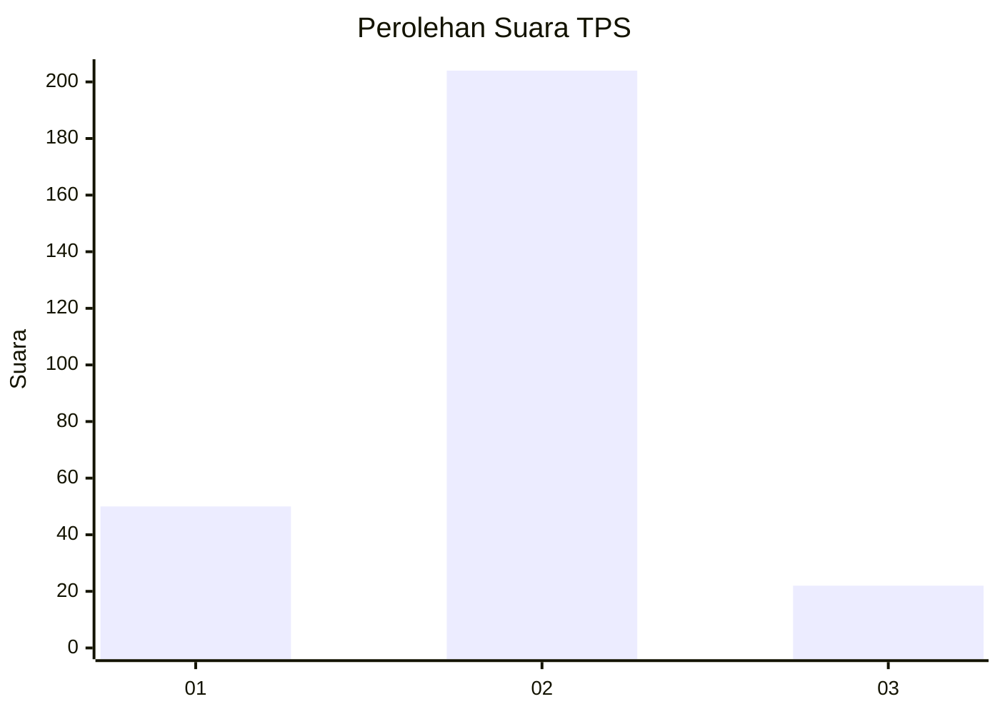
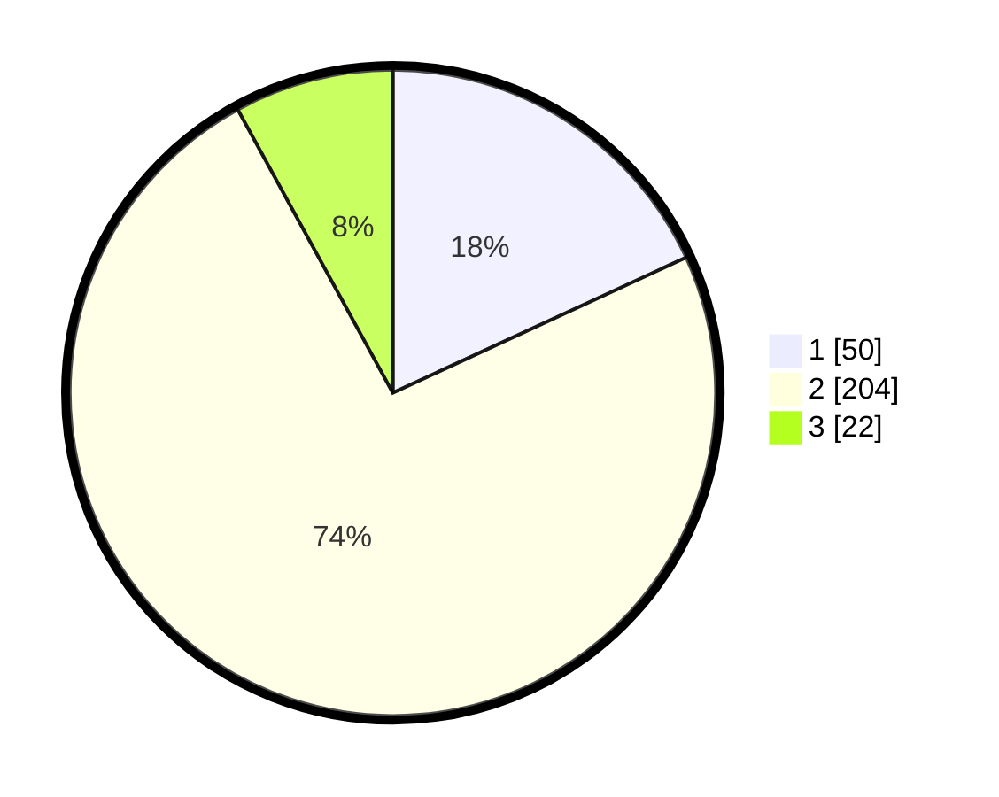

# Hasil

## Grafik

## Tabel

| No. | Nama Paslon    | Suara | Suara (raw) | Persentase |
|:--- |:-------------- | -----:| -----------:| ----------:|
| 1   | ANIES MUHAIMIN | 50    | [50][p-1]   | 18,12      |
| 2   | PRABOWO GIBRAN | 204   | [204][p-2]  | 73,91      |
| 3   | GANJAR MAHFUD  | 22    | [22][p-3]   | 7,97       |

[p-1]: https://github.com/gigit-pemilu/pemilu-2024-32-jawa-barat/blob/main/pilpres/hitung-suara/sub/32-jawa-barat/sub/17-bandung-barat/sub/01-lembang/sub/2001-pagerwangi/sub/025-tps/sub/paslon-1.txt
[p-2]: https://github.com/gigit-pemilu/pemilu-2024-32-jawa-barat/blob/main/pilpres/hitung-suara/sub/32-jawa-barat/sub/17-bandung-barat/sub/01-lembang/sub/2001-pagerwangi/sub/025-tps/sub/paslon-2.txt
[p-3]: https://github.com/gigit-pemilu/pemilu-2024-32-jawa-barat/blob/main/pilpres/hitung-suara/sub/32-jawa-barat/sub/17-bandung-barat/sub/01-lembang/sub/2001-pagerwangi/sub/025-tps/sub/paslon-3.txt

## Foto C Plano

https://sirekap-obj-formc.kpu.go.id/80ca/pemilu/ppwp/32/17/01/20/01/3217012001025-20240214-213930--8875cb2c-1dc7-4ed2-a724-4af44080247c.jpg

https://sirekap-obj-formc.kpu.go.id/80ca/pemilu/ppwp/32/17/01/20/01/3217012001025-20240214-214202--d54be209-c13e-4fc1-a750-befb8c1e15a6.jpg

https://sirekap-obj-formc.kpu.go.id/80ca/pemilu/ppwp/32/17/01/20/01/3217012001025-20240214-214126--f21fdadc-1db1-468d-b864-457108b906fc.jpg

## Metadata

| Key        | Value               |
| ---------- | ------------------- |
| Time Stamp | 2024-02-19 06:16:00 |

