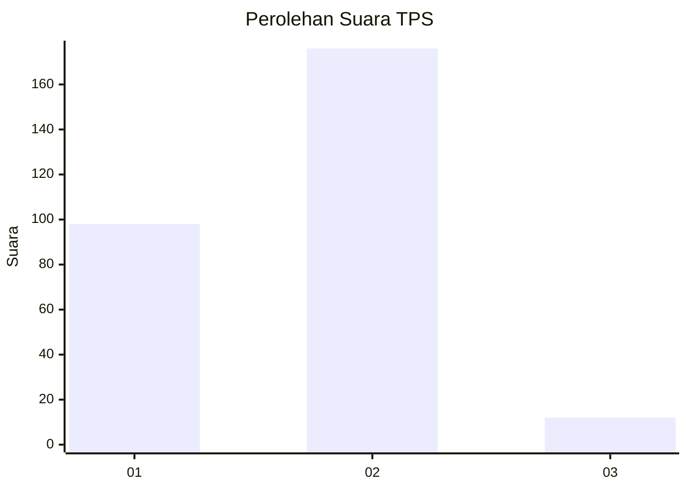
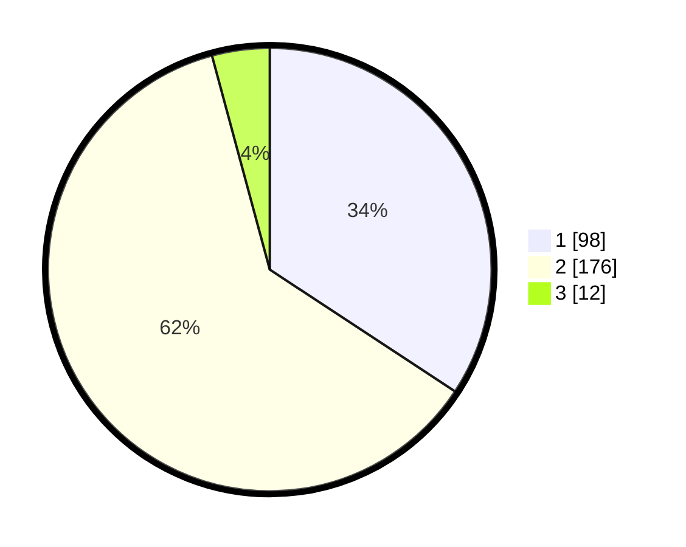

# Hasil

## Grafik

## Tabel

| No. | Nama Paslon    | Suara | Suara (raw) | Persentase |
|:--- |:-------------- | -----:| -----------:| ----------:|
| 1   | ANIES MUHAIMIN | 98    | [98][p-1]   | 34,27      |
| 2   | PRABOWO GIBRAN | 176   | [176][p-2]  | 61,54      |
| 3   | GANJAR MAHFUD  | 12    | [12][p-3]   | 4,20       |

[p-1]: https://github.com/gigit-pemilu/pemilu-2024/blob/main/pilpres/hitung-suara/sub/32-jawa-barat/sub/17-bandung-barat/sub/01-lembang/sub/2003-lembang/sub/003-tps/sub/paslon-1.txt
[p-2]: https://github.com/gigit-pemilu/pemilu-2024/blob/main/pilpres/hitung-suara/sub/32-jawa-barat/sub/17-bandung-barat/sub/01-lembang/sub/2003-lembang/sub/003-tps/sub/paslon-2.txt
[p-3]: https://github.com/gigit-pemilu/pemilu-2024/blob/main/pilpres/hitung-suara/sub/32-jawa-barat/sub/17-bandung-barat/sub/01-lembang/sub/2003-lembang/sub/003-tps/sub/paslon-3.txt

## Foto C Plano

https://sirekap-obj-formc.kpu.go.id/5a40/pemilu/ppwp/32/17/01/20/03/3217012003003-20240214-193522--919965d2-5be0-4150-a0c0-35a7a71c5652.jpg

https://sirekap-obj-formc.kpu.go.id/5a40/pemilu/ppwp/32/17/01/20/03/3217012003003-20240216-214634--83231a83-ba34-4b3e-99ff-d3f93cd30726.jpg

https://sirekap-obj-formc.kpu.go.id/5a40/pemilu/ppwp/32/17/01/20/03/3217012003003-20240214-193020--8cdee000-bbb2-413d-b863-1fd9fecfa8fe.jpg

## Metadata

| Key        | Value               |
| ---------- | ------------------- |
| Time Stamp | 2024-02-19 06:16:00 |

