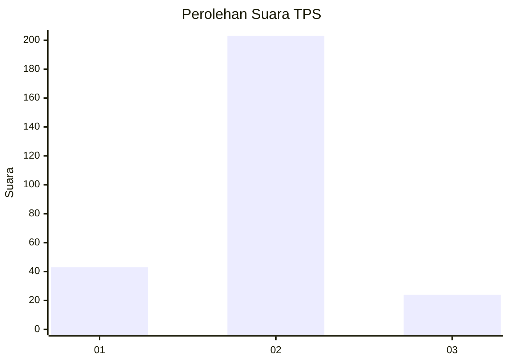
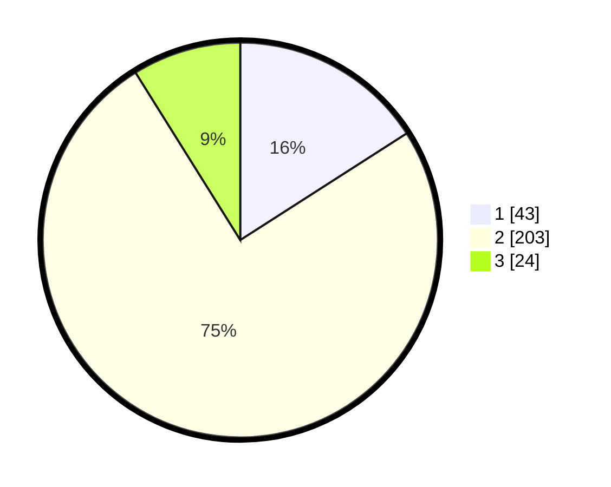

# Hasil

## Grafik

## Tabel

| No. | Nama Paslon    | Suara | Suara (raw) | Persentase |
|:--- |:-------------- | -----:| -----------:| ----------:|
| 1   | ANIES MUHAIMIN | 43    | [43][p-1]   | 15,93      |
| 2   | PRABOWO GIBRAN | 203   | [203][p-2]  | 75,19      |
| 3   | GANJAR MAHFUD  | 24    | [24][p-3]   | 8,89       |

[p-1]: https://github.com/gigit-pemilu/pemilu-2024-32-jawa-barat/blob/main/pilpres/hitung-suara/sub/32-jawa-barat/sub/17-bandung-barat/sub/01-lembang/sub/2015-wangunharja/sub/005-tps/sub/paslon-1.txt
[p-2]: https://github.com/gigit-pemilu/pemilu-2024-32-jawa-barat/blob/main/pilpres/hitung-suara/sub/32-jawa-barat/sub/17-bandung-barat/sub/01-lembang/sub/2015-wangunharja/sub/005-tps/sub/paslon-2.txt
[p-3]: https://github.com/gigit-pemilu/pemilu-2024-32-jawa-barat/blob/main/pilpres/hitung-suara/sub/32-jawa-barat/sub/17-bandung-barat/sub/01-lembang/sub/2015-wangunharja/sub/005-tps/sub/paslon-3.txt

## Foto C Plano

https://sirekap-obj-formc.kpu.go.id/aeb5/pemilu/ppwp/32/17/01/20/15/3217012015005-20240214-212325--0fc776c8-b30e-4a1a-a432-3b1d0a7040b1.jpg

https://sirekap-obj-formc.kpu.go.id/aeb5/pemilu/ppwp/32/17/01/20/15/3217012015005-20240214-212103--376ad95e-2b3e-482d-a5db-b6090878218f.jpg

https://sirekap-obj-formc.kpu.go.id/aeb5/pemilu/ppwp/32/17/01/20/15/3217012015005-20240214-212228--a59437ab-b8e3-4e8d-baf9-a049400be9ca.jpg

## Metadata

| Key        | Value               |
| ---------- | ------------------- |
| Time Stamp | 2024-02-15 12:00:28 |

