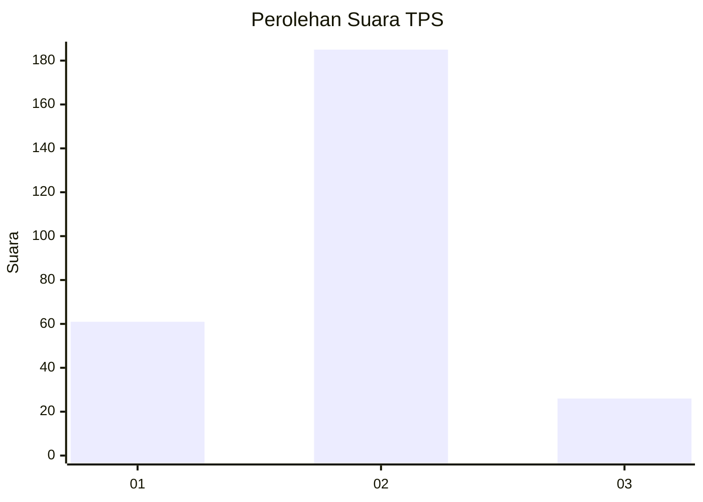

# Hasil

## Grafik

## Tabel

| No. | Nama Paslon    | Suara | Suara (raw) | Persentase |
|:--- |:-------------- | -----:| -----------:| ----------:|
| 1   | ANIES MUHAIMIN | 61    | [61][p-1]   | 22,43      |
| 2   | PRABOWO GIBRAN | 185   | [185][p-2]  | 68,01      |
| 3   | GANJAR MAHFUD  | 26    | [26][p-3]   | 9,56       |

[p-1]: https://github.com/gigit-pemilu/pemilu-2024/blob/main/pilpres/hitung-suara/sub/32-jawa-barat/sub/17-bandung-barat/sub/01-lembang/sub/2015-wangunharja/sub/016-tps/sub/paslon-1.txt
[p-2]: https://github.com/gigit-pemilu/pemilu-2024/blob/main/pilpres/hitung-suara/sub/32-jawa-barat/sub/17-bandung-barat/sub/01-lembang/sub/2015-wangunharja/sub/016-tps/sub/paslon-2.txt
[p-3]: https://github.com/gigit-pemilu/pemilu-2024/blob/main/pilpres/hitung-suara/sub/32-jawa-barat/sub/17-bandung-barat/sub/01-lembang/sub/2015-wangunharja/sub/016-tps/sub/paslon-3.txt

## Foto C Plano

https://sirekap-obj-formc.kpu.go.id/b581/pemilu/ppwp/32/17/01/20/15/3217012015016-20240216-195553--6009f142-cad5-4356-a34a-36451be27664.jpg

https://sirekap-obj-formc.kpu.go.id/b581/pemilu/ppwp/32/17/01/20/15/3217012015016-20240215-112541--22b79d16-599b-4883-b505-0b16b44d1c32.jpg

https://sirekap-obj-formc.kpu.go.id/b581/pemilu/ppwp/32/17/01/20/15/3217012015016-20240216-195553--b835c943-e0e7-419a-81d1-5ac5f27809bd.jpg

## Metadata

| Key        | Value               |
| ---------- | ------------------- |
| Time Stamp | 2024-02-16 21:01:00 |

