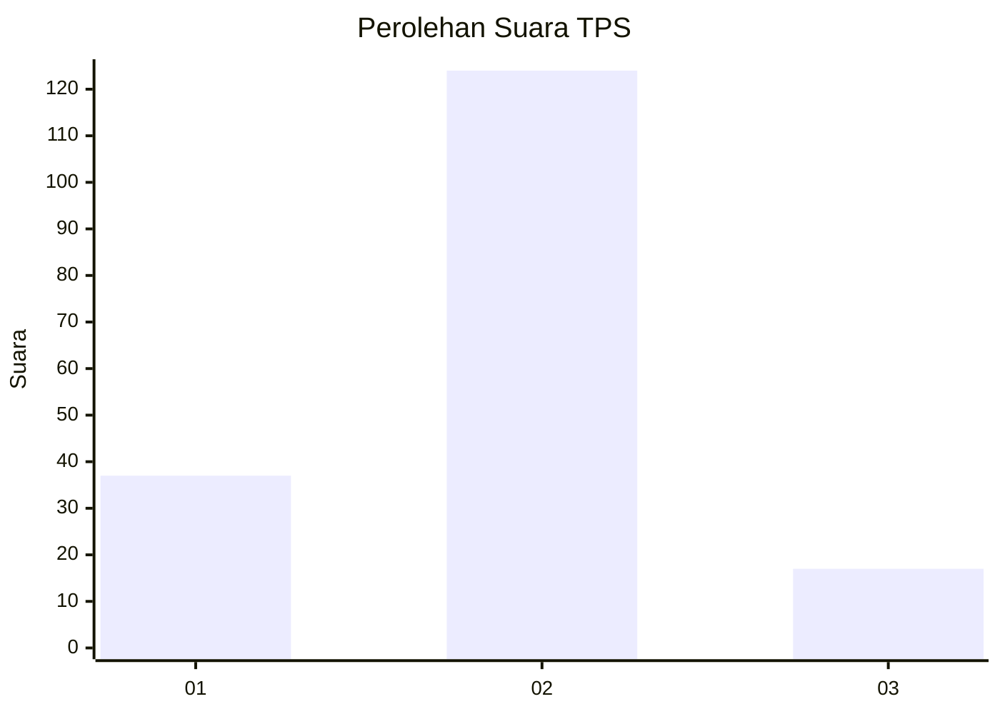

# Hasil

## Grafik

## Tabel

| No. | Nama Paslon    | Suara | Suara (raw) | Persentase |
|:--- |:-------------- | -----:| -----------:| ----------:|
| 1   | ANIES MUHAIMIN | 37    | [37][p-1]   | 20,79      |
| 2   | PRABOWO GIBRAN | 124   | [124][p-2]  | 69,66      |
| 3   | GANJAR MAHFUD  | 17    | [17][p-3]   | 9,55       |

[p-1]: https://github.com/gigit-pemilu/pemilu-2024/blob/main/pilpres/hitung-suara/sub/32-jawa-barat/sub/17-bandung-barat/sub/02-parongpong/sub/2001-karyawangi/sub/006-tps/sub/paslon-1.txt
[p-2]: https://github.com/gigit-pemilu/pemilu-2024/blob/main/pilpres/hitung-suara/sub/32-jawa-barat/sub/17-bandung-barat/sub/02-parongpong/sub/2001-karyawangi/sub/006-tps/sub/paslon-2.txt
[p-3]: https://github.com/gigit-pemilu/pemilu-2024/blob/main/pilpres/hitung-suara/sub/32-jawa-barat/sub/17-bandung-barat/sub/02-parongpong/sub/2001-karyawangi/sub/006-tps/sub/paslon-3.txt

## Foto C Plano

https://sirekap-obj-formc.kpu.go.id/c96f/pemilu/ppwp/32/17/02/20/01/3217022001006-20240214-230554--d4130343-b059-4c1e-a498-a5eaf24c8eec.jpg

https://sirekap-obj-formc.kpu.go.id/c96f/pemilu/ppwp/32/17/02/20/01/3217022001006-20240214-231212--99a96ba0-47aa-4de2-9f5b-f8c6e06d2dc7.jpg

https://sirekap-obj-formc.kpu.go.id/c96f/pemilu/ppwp/32/17/02/20/01/3217022001006-20240214-231350--988ad219-7af1-4a96-a5f5-8e642dd498c1.jpg

## Metadata

| Key        | Value               |
| ---------- | ------------------- |
| Time Stamp | 2024-02-19 06:16:00 |

