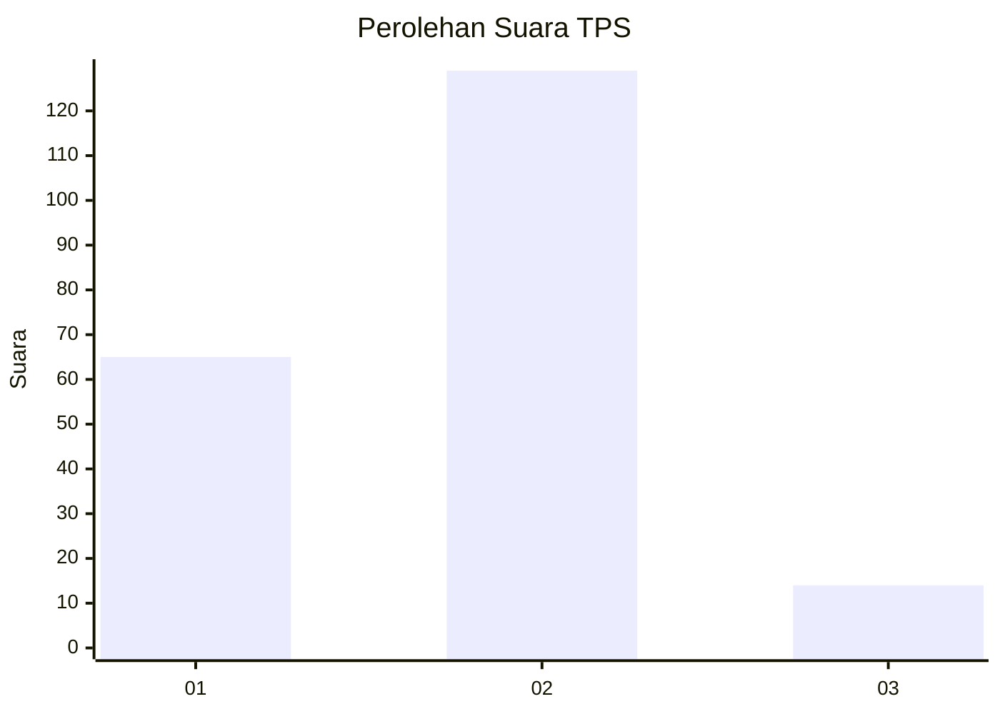
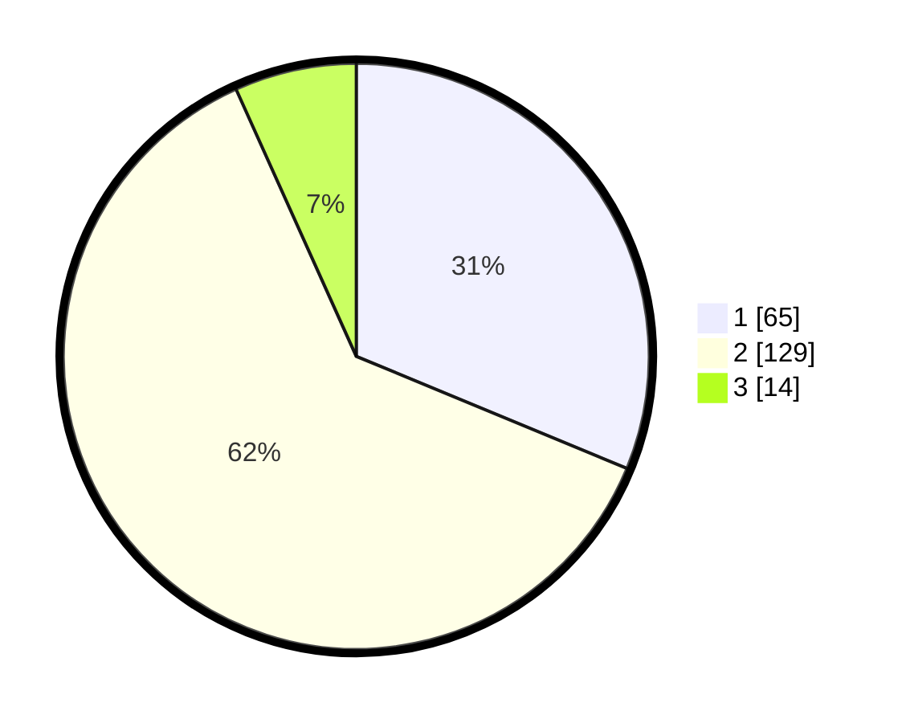

# Hasil

## Grafik

## Tabel

| No. | Nama Paslon    | Suara | Suara (raw) | Persentase |
|:--- |:-------------- | -----:| -----------:| ----------:|
| 1   | ANIES MUHAIMIN | 65    | [65][p-1]   | 31,25      |
| 2   | PRABOWO GIBRAN | 129   | [129][p-2]  | 62,02      |
| 3   | GANJAR MAHFUD  | 14    | [14][p-3]   | 6,73       |

[p-1]: https://github.com/gigit-pemilu/pemilu-2024/blob/main/pilpres/hitung-suara/sub/32-jawa-barat/sub/17-bandung-barat/sub/02-parongpong/sub/2001-karyawangi/sub/010-tps/sub/paslon-1.txt
[p-2]: https://github.com/gigit-pemilu/pemilu-2024/blob/main/pilpres/hitung-suara/sub/32-jawa-barat/sub/17-bandung-barat/sub/02-parongpong/sub/2001-karyawangi/sub/010-tps/sub/paslon-2.txt
[p-3]: https://github.com/gigit-pemilu/pemilu-2024/blob/main/pilpres/hitung-suara/sub/32-jawa-barat/sub/17-bandung-barat/sub/02-parongpong/sub/2001-karyawangi/sub/010-tps/sub/paslon-3.txt

## Foto C Plano

https://sirekap-obj-formc.kpu.go.id/18ef/pemilu/ppwp/32/17/02/20/01/3217022001010-20240215-124848--5ff794bf-02cd-4d3f-843f-139edddd00aa.jpg

https://sirekap-obj-formc.kpu.go.id/18ef/pemilu/ppwp/32/17/02/20/01/3217022001010-20240215-124902--1960a8f6-d030-479f-a2ff-e2ea64c78238.jpg

https://sirekap-obj-formc.kpu.go.id/18ef/pemilu/ppwp/32/17/02/20/01/3217022001010-20240215-124910--97d08468-7ea6-40e2-9a13-b4356d249fe2.jpg

## Metadata

| Key        | Value               |
| ---------- | ------------------- |
| Time Stamp | 2024-02-15 18:00:26 |

