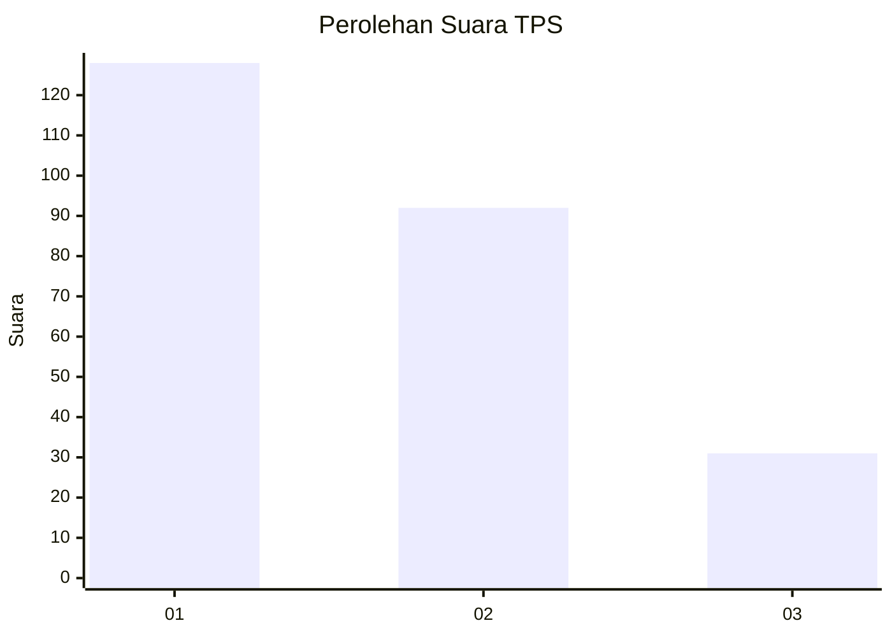
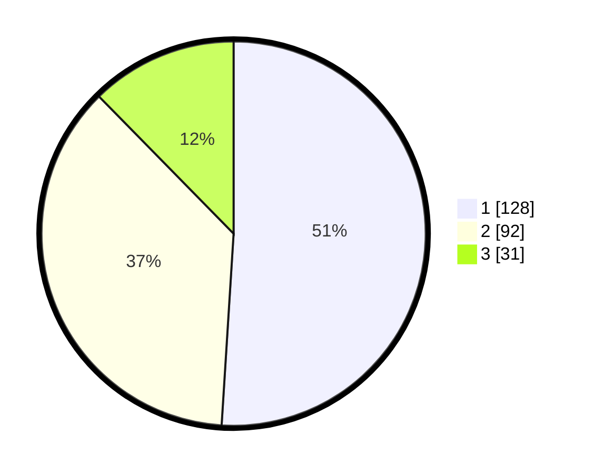

# Hasil

## Grafik

## Tabel

| No. | Nama Paslon    | Suara | Suara (raw) | Persentase |
|:--- |:-------------- | -----:| -----------:| ----------:|
| 1   | ANIES MUHAIMIN | 128   | [128][p-1]  | 51,00      |
| 2   | PRABOWO GIBRAN | 92    | [92][p-2]   | 36,65      |
| 3   | GANJAR MAHFUD  | 31    | [31][p-3]   | 12,35      |

[p-1]: https://github.com/gigit-pemilu/pemilu-2024/blob/main/pilpres/hitung-suara/sub/32-jawa-barat/sub/17-bandung-barat/sub/02-parongpong/sub/2002-cihanjuang/sub/001-tps/sub/paslon-1.txt
[p-2]: https://github.com/gigit-pemilu/pemilu-2024/blob/main/pilpres/hitung-suara/sub/32-jawa-barat/sub/17-bandung-barat/sub/02-parongpong/sub/2002-cihanjuang/sub/001-tps/sub/paslon-2.txt
[p-3]: https://github.com/gigit-pemilu/pemilu-2024/blob/main/pilpres/hitung-suara/sub/32-jawa-barat/sub/17-bandung-barat/sub/02-parongpong/sub/2002-cihanjuang/sub/001-tps/sub/paslon-3.txt

## Foto C Plano

https://sirekap-obj-formc.kpu.go.id/0c4c/pemilu/ppwp/32/17/02/20/02/3217022002001-20240214-200147--6a556e25-3203-472c-b386-5af7ebdc5fb9.jpg

https://sirekap-obj-formc.kpu.go.id/0c4c/pemilu/ppwp/32/17/02/20/02/3217022002001-20240214-195826--a9ef02e0-1a83-4602-809f-78d4bc8edccb.jpg

https://sirekap-obj-formc.kpu.go.id/0c4c/pemilu/ppwp/32/17/02/20/02/3217022002001-20240215-220431--d6a3cdf9-5d50-4039-802e-aa08d70f1dec.jpg

## Metadata

| Key        | Value               |
| ---------- | ------------------- |
| Time Stamp | 2024-02-15 22:30:27 |

