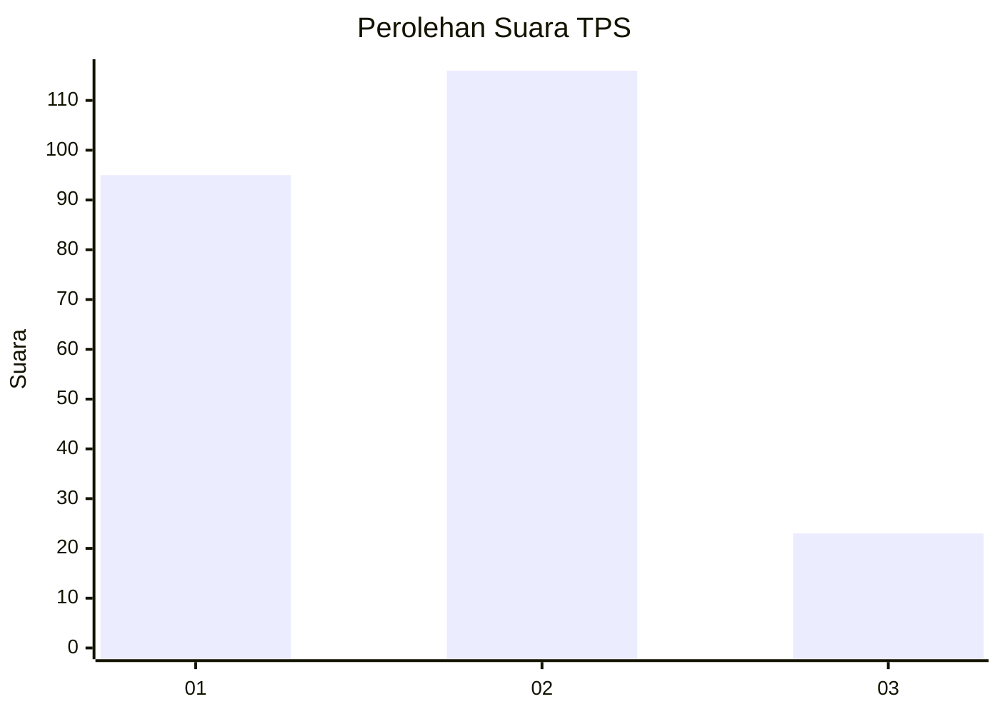
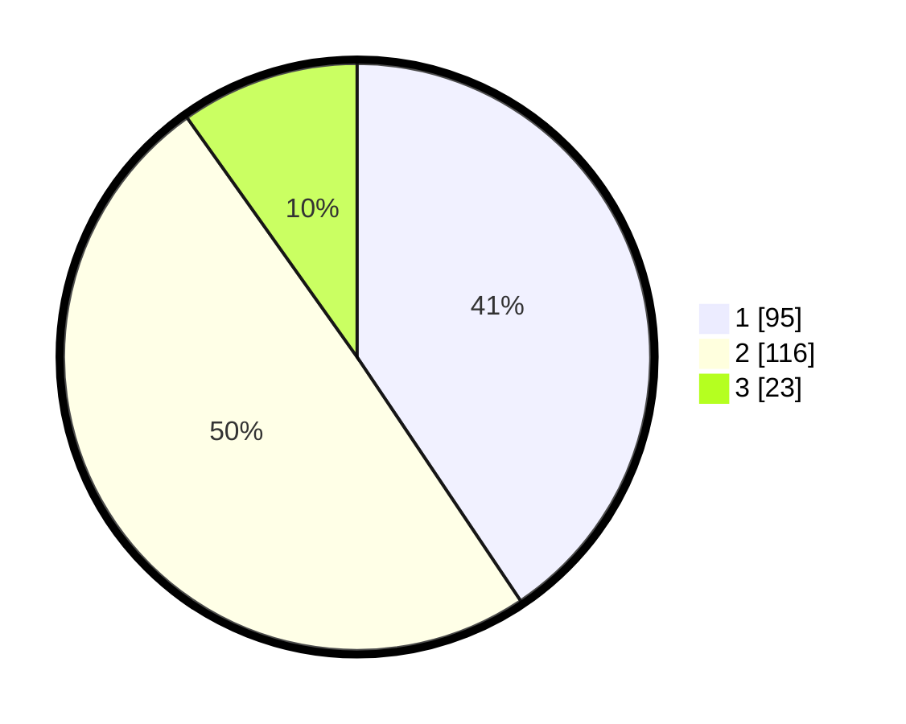

# Hasil

## Grafik

## Tabel

| No. | Nama Paslon    | Suara | Suara (raw) | Persentase |
|:--- |:-------------- | -----:| -----------:| ----------:|
| 1   | ANIES MUHAIMIN | 95    | [95][p-1]   | 40,60      |
| 2   | PRABOWO GIBRAN | 116   | [116][p-2]  | 49,57      |
| 3   | GANJAR MAHFUD  | 23    | [23][p-3]   | 9,83       |

[p-1]: https://github.com/gigit-pemilu/pemilu-2024/blob/main/pilpres/hitung-suara/sub/32-jawa-barat/sub/17-bandung-barat/sub/02-parongpong/sub/2002-cihanjuang/sub/002-tps/sub/paslon-1.txt
[p-2]: https://github.com/gigit-pemilu/pemilu-2024/blob/main/pilpres/hitung-suara/sub/32-jawa-barat/sub/17-bandung-barat/sub/02-parongpong/sub/2002-cihanjuang/sub/002-tps/sub/paslon-2.txt
[p-3]: https://github.com/gigit-pemilu/pemilu-2024/blob/main/pilpres/hitung-suara/sub/32-jawa-barat/sub/17-bandung-barat/sub/02-parongpong/sub/2002-cihanjuang/sub/002-tps/sub/paslon-3.txt

## Foto C Plano

https://sirekap-obj-formc.kpu.go.id/b726/pemilu/ppwp/32/17/02/20/02/3217022002002-20240214-200643--af45e93d-af0b-40ee-9329-44dcaff6222e.jpg

https://sirekap-obj-formc.kpu.go.id/b726/pemilu/ppwp/32/17/02/20/02/3217022002002-20240214-200837--4e689c7d-0ce6-41f3-89e2-c2fe48e21974.jpg

https://sirekap-obj-formc.kpu.go.id/b726/pemilu/ppwp/32/17/02/20/02/3217022002002-20240214-201006--3ac9a9e2-6b9c-43aa-a6a6-959e11f2177f.jpg

## Metadata

| Key        | Value               |
| ---------- | ------------------- |
| Time Stamp | 2024-02-19 06:16:00 |

