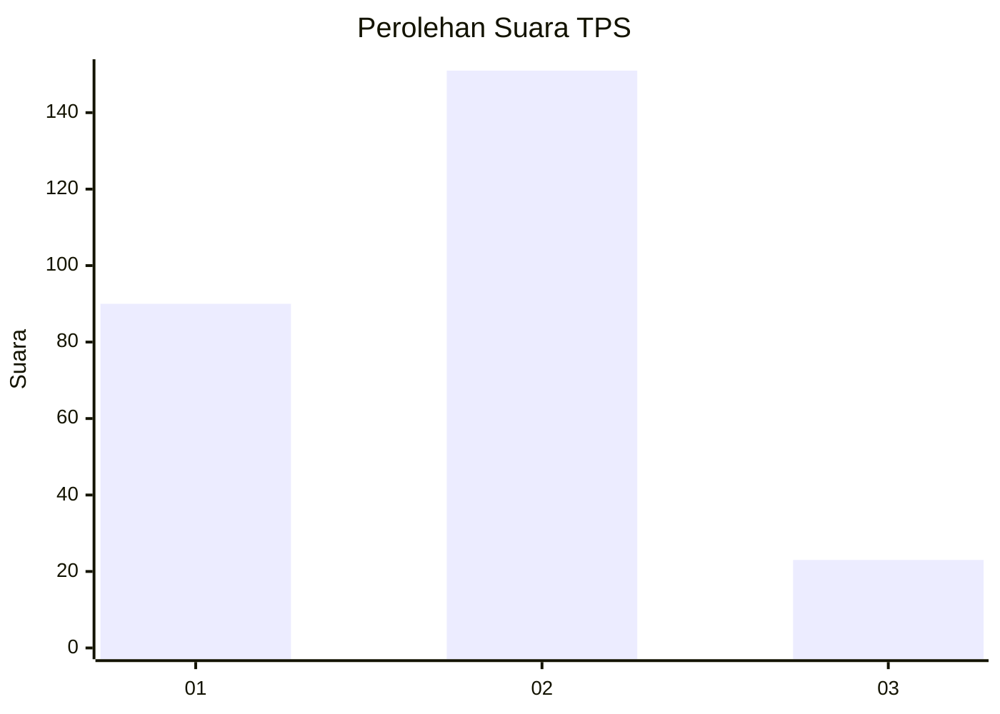
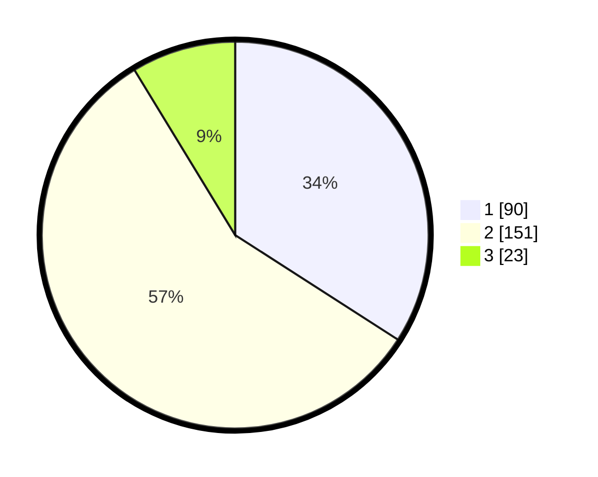

# Hasil

## Grafik

## Tabel

| No. | Nama Paslon    | Suara | Suara (raw) | Persentase |
|:--- |:-------------- | -----:| -----------:| ----------:|
| 1   | ANIES MUHAIMIN | 90    | [90][p-1]   | 34,09      |
| 2   | PRABOWO GIBRAN | 151   | [151][p-2]  | 57,20      |
| 3   | GANJAR MAHFUD  | 23    | [23][p-3]   | 8,71       |

[p-1]: https://github.com/gigit-pemilu/pemilu-2024/blob/main/pilpres/hitung-suara/sub/32-jawa-barat/sub/17-bandung-barat/sub/02-parongpong/sub/2002-cihanjuang/sub/055-tps/sub/paslon-1.txt
[p-2]: https://github.com/gigit-pemilu/pemilu-2024/blob/main/pilpres/hitung-suara/sub/32-jawa-barat/sub/17-bandung-barat/sub/02-parongpong/sub/2002-cihanjuang/sub/055-tps/sub/paslon-2.txt
[p-3]: https://github.com/gigit-pemilu/pemilu-2024/blob/main/pilpres/hitung-suara/sub/32-jawa-barat/sub/17-bandung-barat/sub/02-parongpong/sub/2002-cihanjuang/sub/055-tps/sub/paslon-3.txt

## Foto C Plano

https://sirekap-obj-formc.kpu.go.id/e650/pemilu/ppwp/32/17/02/20/02/3217022002055-20240214-155911--00cbab0f-8a1d-4574-bc45-300eea4890fa.jpg

https://sirekap-obj-formc.kpu.go.id/e650/pemilu/ppwp/32/17/02/20/02/3217022002055-20240214-155916--2993cd03-c46f-4d17-a0e0-af9a53535ce3.jpg

https://sirekap-obj-formc.kpu.go.id/e650/pemilu/ppwp/32/17/02/20/02/3217022002055-20240214-155851--6e0ed66e-7938-4e6e-bcc3-1782b0dd8a06.jpg

## Metadata

| Key        | Value               |
| ---------- | ------------------- |
| Time Stamp | 2024-02-15 12:00:28 |

