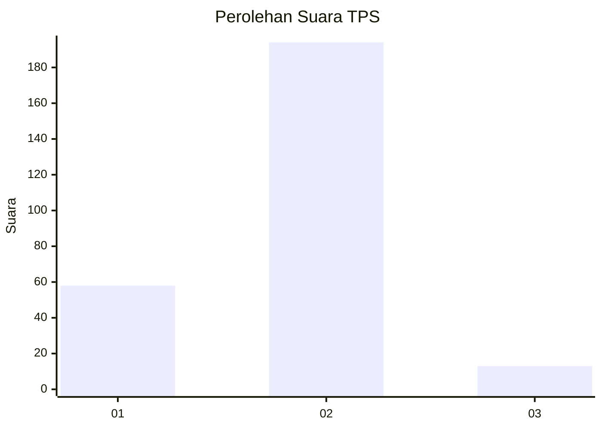
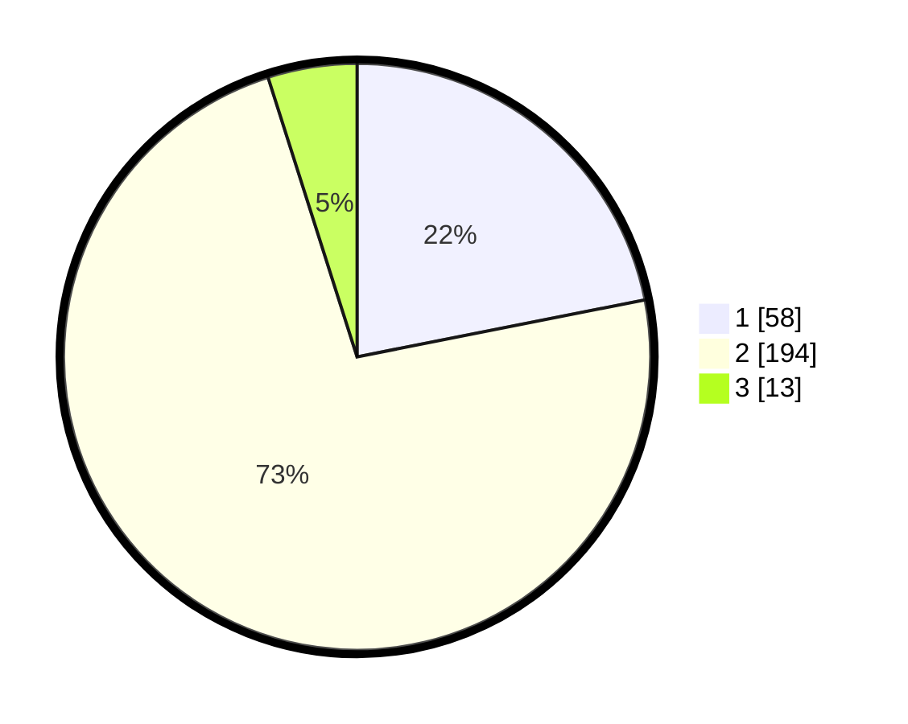

# Hasil

## Grafik

## Tabel

| No. | Nama Paslon    | Suara | Suara (raw) | Persentase |
|:--- |:-------------- | -----:| -----------:| ----------:|
| 1   | ANIES MUHAIMIN | 58    | [58][p-1]   | 21,89      |
| 2   | PRABOWO GIBRAN | 194   | [194][p-2]  | 73,21      |
| 3   | GANJAR MAHFUD  | 13    | [13][p-3]   | 4,91       |

[p-1]: https://github.com/gigit-pemilu/pemilu-2024-32-jawa-barat/blob/main/pilpres/hitung-suara/sub/32-jawa-barat/sub/17-bandung-barat/sub/02-parongpong/sub/2004-cihideung/sub/045-tps/sub/paslon-1.txt
[p-2]: https://github.com/gigit-pemilu/pemilu-2024-32-jawa-barat/blob/main/pilpres/hitung-suara/sub/32-jawa-barat/sub/17-bandung-barat/sub/02-parongpong/sub/2004-cihideung/sub/045-tps/sub/paslon-2.txt
[p-3]: https://github.com/gigit-pemilu/pemilu-2024-32-jawa-barat/blob/main/pilpres/hitung-suara/sub/32-jawa-barat/sub/17-bandung-barat/sub/02-parongpong/sub/2004-cihideung/sub/045-tps/sub/paslon-3.txt

## Foto C Plano

https://sirekap-obj-formc.kpu.go.id/0ae2/pemilu/ppwp/32/17/02/20/04/3217022004045-20240215-081021--b65e5980-d458-490a-8d31-8df0d3b9ccbd.jpg

https://sirekap-obj-formc.kpu.go.id/0ae2/pemilu/ppwp/32/17/02/20/04/3217022004045-20240214-235617--4f49b5d9-4983-42b1-bc62-658cf71efbff.jpg

https://sirekap-obj-formc.kpu.go.id/0ae2/pemilu/ppwp/32/17/02/20/04/3217022004045-20240214-235654--47e7baeb-8a43-4005-bcc9-7cd581da3a62.jpg

## Metadata

| Key        | Value               |
| ---------- | ------------------- |
| Time Stamp | 2024-02-15 19:30:26 |

