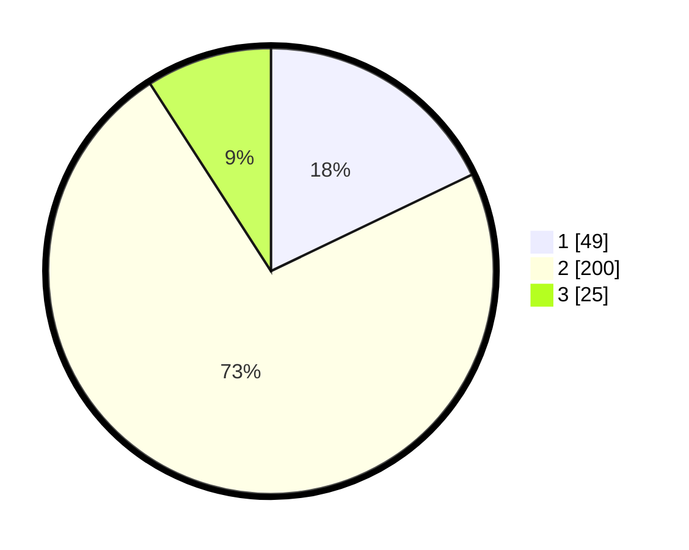

# Hasil

## Grafik

## Tabel

| No. | Nama Paslon    | Suara | Suara (raw) | Persentase |
|:--- |:-------------- | -----:| -----------:| ----------:|
| 1   | ANIES MUHAIMIN | 49    | [49][p-1]   | 17,88      |
| 2   | PRABOWO GIBRAN | 200   | [200][p-2]  | 72,99      |
| 3   | GANJAR MAHFUD  | 25    | [25][p-3]   | 9,12       |

[p-1]: https://github.com/gigit-pemilu/pemilu-2024/blob/main/pilpres/hitung-suara/sub/32-jawa-barat/sub/17-bandung-barat/sub/02-parongpong/sub/2006-cigugurgirang/sub/003-tps/sub/paslon-1.txt
[p-2]: https://github.com/gigit-pemilu/pemilu-2024/blob/main/pilpres/hitung-suara/sub/32-jawa-barat/sub/17-bandung-barat/sub/02-parongpong/sub/2006-cigugurgirang/sub/003-tps/sub/paslon-2.txt
[p-3]: https://github.com/gigit-pemilu/pemilu-2024/blob/main/pilpres/hitung-suara/sub/32-jawa-barat/sub/17-bandung-barat/sub/02-parongpong/sub/2006-cigugurgirang/sub/003-tps/sub/paslon-3.txt

## Foto C Plano

https://sirekap-obj-formc.kpu.go.id/b336/pemilu/ppwp/32/17/02/20/06/3217022006003-20240215-061038--4d38df0b-c3d9-4a11-8011-d3d6e5714d69.jpg

https://sirekap-obj-formc.kpu.go.id/b336/pemilu/ppwp/32/17/02/20/06/3217022006003-20240215-061133--2ae3146d-bdab-4ab7-918d-fa9351549dab.jpg

https://sirekap-obj-formc.kpu.go.id/b336/pemilu/ppwp/32/17/02/20/06/3217022006003-20240215-061228--c3e9f325-77d2-43ad-80c2-9f92c9e0768b.jpg

## Metadata

| Key        | Value               |
| ---------- | ------------------- |
| Time Stamp | 2024-02-19 06:16:00 |

