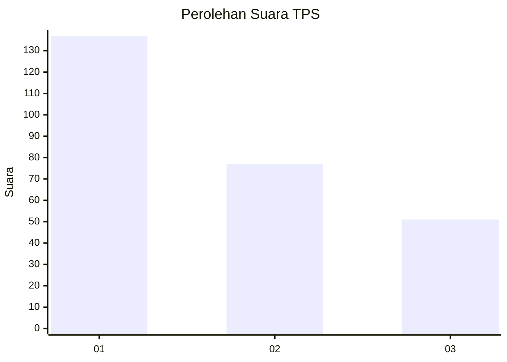
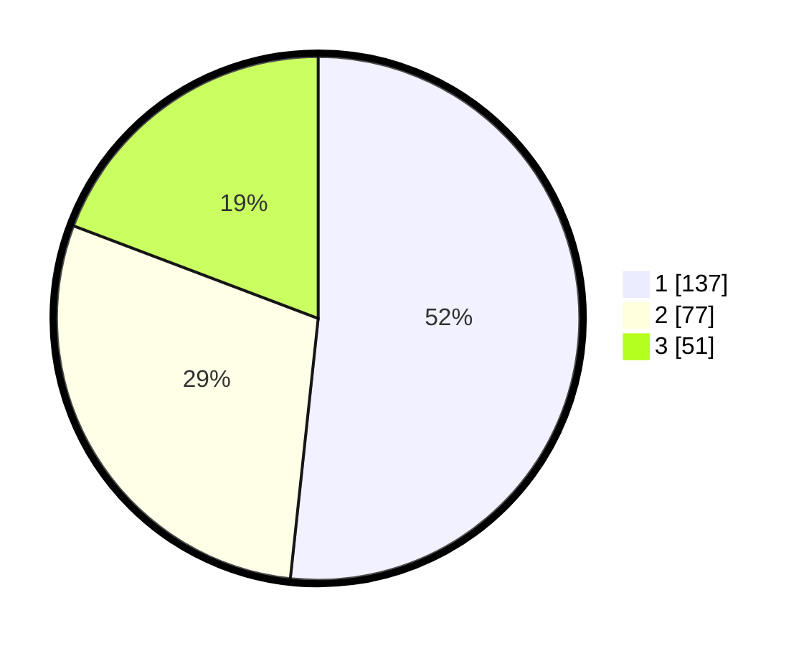

# Hasil

## Grafik

## Tabel

| No. | Nama Paslon    | Suara | Suara (raw) | Persentase |
|:--- |:-------------- | -----:| -----------:| ----------:|
| 1   | ANIES MUHAIMIN | 137   | [137][p-1]  | 51,70      |
| 2   | PRABOWO GIBRAN | 77    | [77][p-2]   | 29,06      |
| 3   | GANJAR MAHFUD  | 51    | [51][p-3]   | 19,25      |

[p-1]: https://github.com/gigit-pemilu/pemilu-2024/blob/main/pilpres/hitung-suara/sub/32-jawa-barat/sub/17-bandung-barat/sub/02-parongpong/sub/2007-sariwangi/sub/026-tps/sub/paslon-1.txt
[p-2]: https://github.com/gigit-pemilu/pemilu-2024/blob/main/pilpres/hitung-suara/sub/32-jawa-barat/sub/17-bandung-barat/sub/02-parongpong/sub/2007-sariwangi/sub/026-tps/sub/paslon-2.txt
[p-3]: https://github.com/gigit-pemilu/pemilu-2024/blob/main/pilpres/hitung-suara/sub/32-jawa-barat/sub/17-bandung-barat/sub/02-parongpong/sub/2007-sariwangi/sub/026-tps/sub/paslon-3.txt

## Foto C Plano

https://sirekap-obj-formc.kpu.go.id/7766/pemilu/ppwp/32/17/02/20/07/3217022007026-20240214-195741--74181c01-5e10-42ca-b955-093f85fc8af6.jpg

https://sirekap-obj-formc.kpu.go.id/7766/pemilu/ppwp/32/17/02/20/07/3217022007026-20240214-195804--aca079ac-c871-4575-8550-870e93e01e7c.jpg

https://sirekap-obj-formc.kpu.go.id/7766/pemilu/ppwp/32/17/02/20/07/3217022007026-20240214-195825--523db665-cca5-40f9-b285-a68041cf0a5f.jpg

## Metadata

| Key        | Value               |
| ---------- | ------------------- |
| Time Stamp | 2024-02-15 12:00:28 |

