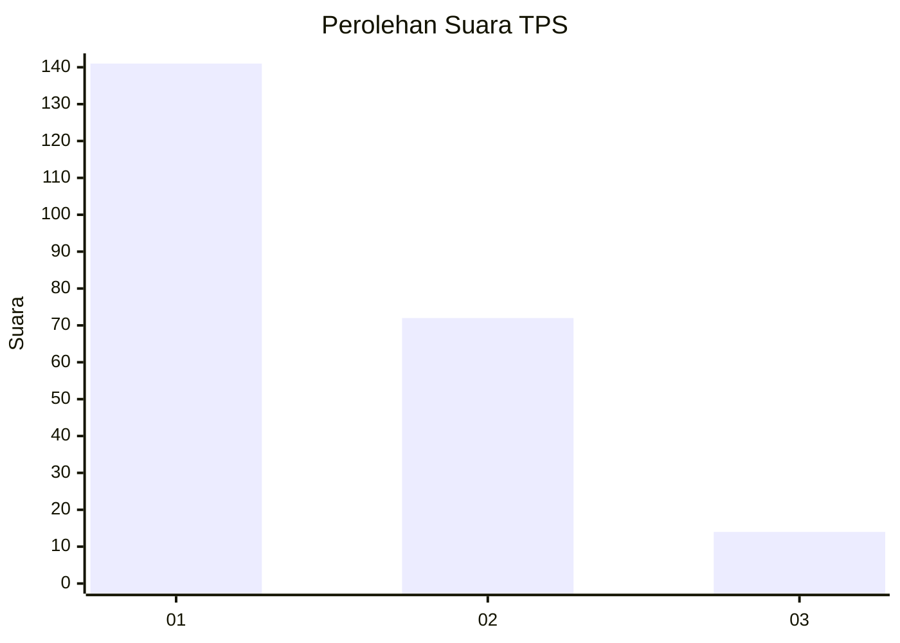
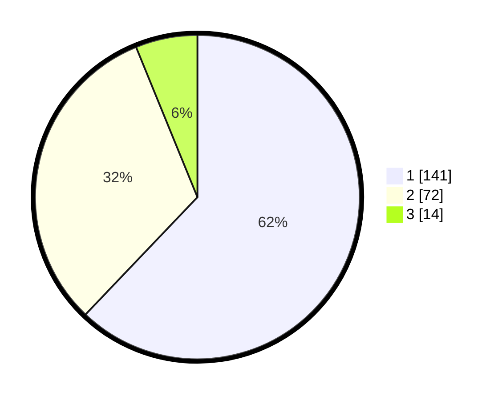

# Hasil

## Grafik

## Tabel

| No. | Nama Paslon    | Suara | Suara (raw) | Persentase |
|:--- |:-------------- | -----:| -----------:| ----------:|
| 1   | ANIES MUHAIMIN | 141   | [141][p-1]  | 62,11      |
| 2   | PRABOWO GIBRAN | 72    | [72][p-2]   | 31,72      |
| 3   | GANJAR MAHFUD  | 14    | [14][p-3]   | 6,17       |

[p-1]: https://github.com/gigit-pemilu/pemilu-2024/blob/main/pilpres/hitung-suara/sub/32-jawa-barat/sub/17-bandung-barat/sub/02-parongpong/sub/2007-sariwangi/sub/032-tps/sub/paslon-1.txt
[p-2]: https://github.com/gigit-pemilu/pemilu-2024/blob/main/pilpres/hitung-suara/sub/32-jawa-barat/sub/17-bandung-barat/sub/02-parongpong/sub/2007-sariwangi/sub/032-tps/sub/paslon-2.txt
[p-3]: https://github.com/gigit-pemilu/pemilu-2024/blob/main/pilpres/hitung-suara/sub/32-jawa-barat/sub/17-bandung-barat/sub/02-parongpong/sub/2007-sariwangi/sub/032-tps/sub/paslon-3.txt

## Foto C Plano

https://sirekap-obj-formc.kpu.go.id/a8f3/pemilu/ppwp/32/17/02/20/07/3217022007032-20240215-011201--1ff1c513-23db-4e38-a461-7607e5cfdcec.jpg

https://sirekap-obj-formc.kpu.go.id/a8f3/pemilu/ppwp/32/17/02/20/07/3217022007032-20240215-011304--47451479-7834-4591-be37-9bfad6d88cab.jpg

https://sirekap-obj-formc.kpu.go.id/a8f3/pemilu/ppwp/32/17/02/20/07/3217022007032-20240215-011936--cf2df23a-5557-4530-9947-f71aee6a3684.jpg

## Metadata

| Key        | Value               |
| ---------- | ------------------- |
| Time Stamp | 2024-02-24 22:31:28 |

