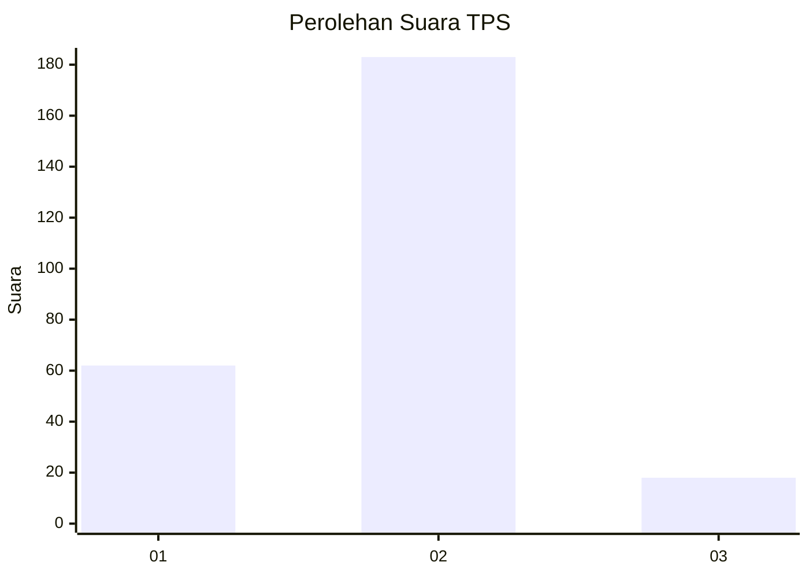
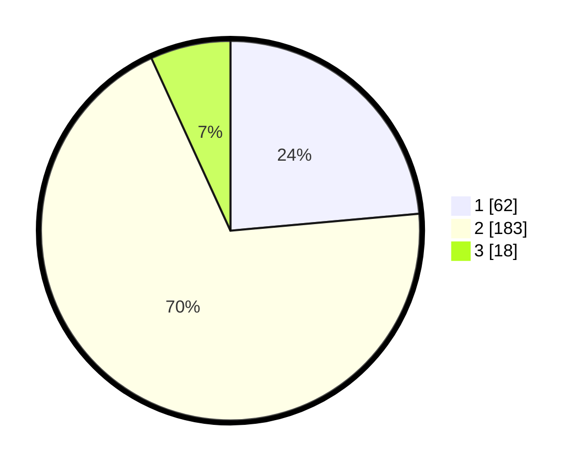

# Hasil

## Grafik

## Tabel

| No. | Nama Paslon    | Suara | Suara (raw) | Persentase |
|:--- |:-------------- | -----:| -----------:| ----------:|
| 1   | ANIES MUHAIMIN | 62    | [62][p-1]   | 23,57      |
| 2   | PRABOWO GIBRAN | 183   | [183][p-2]  | 69,58      |
| 3   | GANJAR MAHFUD  | 18    | [18][p-3]   | 6,84       |

[p-1]: https://github.com/gigit-pemilu/pemilu-2024-32-jawa-barat/blob/main/pilpres/hitung-suara/sub/32-jawa-barat/sub/17-bandung-barat/sub/03-cisarua/sub/2001-jambudipa/sub/003-tps/sub/paslon-1.txt
[p-2]: https://github.com/gigit-pemilu/pemilu-2024-32-jawa-barat/blob/main/pilpres/hitung-suara/sub/32-jawa-barat/sub/17-bandung-barat/sub/03-cisarua/sub/2001-jambudipa/sub/003-tps/sub/paslon-2.txt
[p-3]: https://github.com/gigit-pemilu/pemilu-2024-32-jawa-barat/blob/main/pilpres/hitung-suara/sub/32-jawa-barat/sub/17-bandung-barat/sub/03-cisarua/sub/2001-jambudipa/sub/003-tps/sub/paslon-3.txt

## Foto C Plano

https://sirekap-obj-formc.kpu.go.id/3a59/pemilu/ppwp/32/17/03/20/01/3217032001003-20240217-132410--456c2a66-28bb-4df8-afd2-8c1a3d5383a8.jpg

https://sirekap-obj-formc.kpu.go.id/3a59/pemilu/ppwp/32/17/03/20/01/3217032001003-20240215-011806--277ad4e9-4701-4c7b-8f70-a389c67e29fe.jpg

https://sirekap-obj-formc.kpu.go.id/3a59/pemilu/ppwp/32/17/03/20/01/3217032001003-20240215-012018--61829d74-985b-448d-bc85-22a194f1a86d.jpg

## Metadata

| Key        | Value               |
| ---------- | ------------------- |
| Time Stamp | 2024-02-25 18:00:00 |

