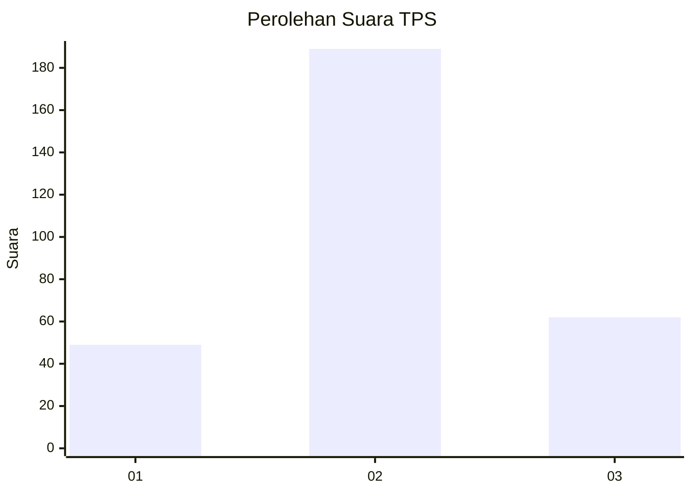
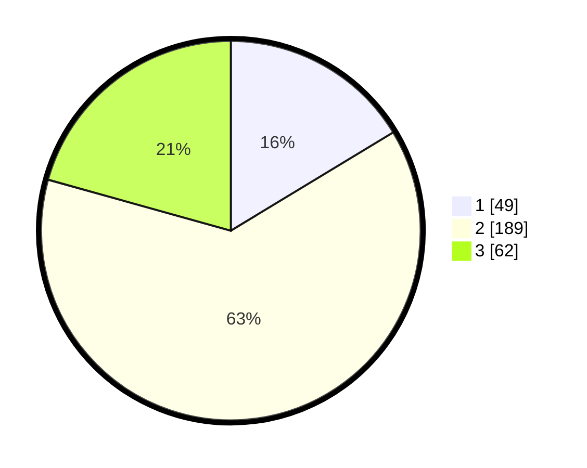

# Hasil

## Grafik

## Tabel

| No. | Nama Paslon    | Suara | Suara (raw) | Persentase |
|:--- |:-------------- | -----:| -----------:| ----------:|
| 1   | ANIES MUHAIMIN | 49    | [49][p-1]   | 16,33      |
| 2   | PRABOWO GIBRAN | 189   | [189][p-2]  | 63,00      |
| 3   | GANJAR MAHFUD  | 62    | [62][p-3]   | 20,67      |

[p-1]: https://github.com/gigit-pemilu/pemilu-2024-32-jawa-barat/blob/main/pilpres/hitung-suara/sub/32-jawa-barat/sub/17-bandung-barat/sub/03-cisarua/sub/2006-kertawangi/sub/002-tps/sub/paslon-1.txt
[p-2]: https://github.com/gigit-pemilu/pemilu-2024-32-jawa-barat/blob/main/pilpres/hitung-suara/sub/32-jawa-barat/sub/17-bandung-barat/sub/03-cisarua/sub/2006-kertawangi/sub/002-tps/sub/paslon-2.txt
[p-3]: https://github.com/gigit-pemilu/pemilu-2024-32-jawa-barat/blob/main/pilpres/hitung-suara/sub/32-jawa-barat/sub/17-bandung-barat/sub/03-cisarua/sub/2006-kertawangi/sub/002-tps/sub/paslon-3.txt

## Foto C Plano

https://sirekap-obj-formc.kpu.go.id/9e95/pemilu/ppwp/32/17/03/20/06/3217032006002-20240215-042051--7be6bf68-ba99-43f9-9395-400c28fa2625.jpg

https://sirekap-obj-formc.kpu.go.id/9e95/pemilu/ppwp/32/17/03/20/06/3217032006002-20240217-133149--65feaa35-e1fb-4039-82f5-94310def5eb3.jpg

https://sirekap-obj-formc.kpu.go.id/9e95/pemilu/ppwp/32/17/03/20/06/3217032006002-20240217-132015--6b44c530-7d9b-430f-84d8-13805ee44dc8.jpg

## Metadata

| Key        | Value               |
| ---------- | ------------------- |
| Time Stamp | 2024-02-17 14:45:18 |

