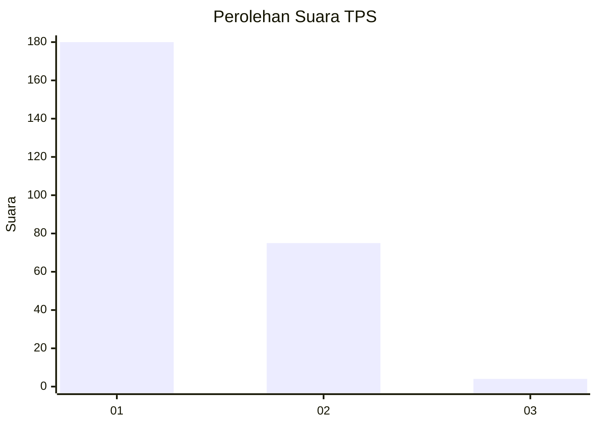
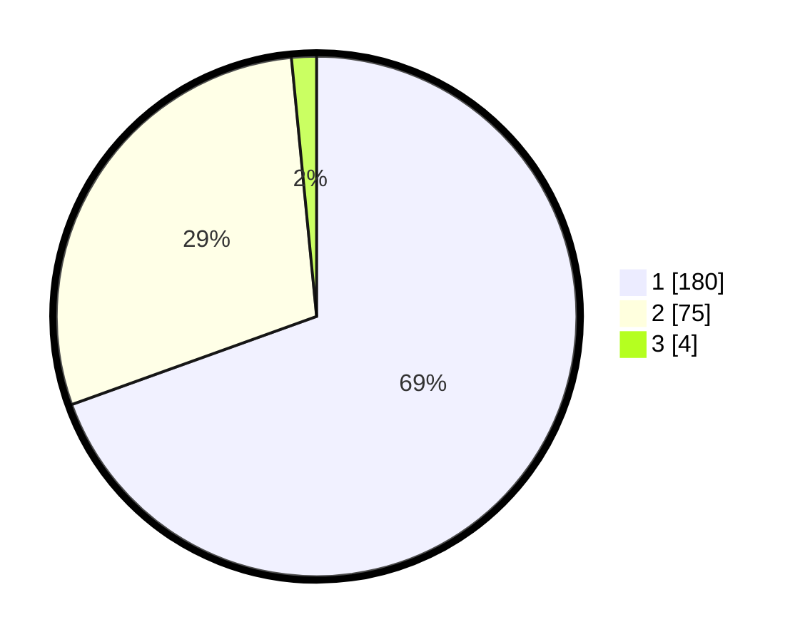

# Hasil

## Grafik

## Tabel

| No. | Nama Paslon    | Suara | Suara (raw) | Persentase |
|:--- |:-------------- | -----:| -----------:| ----------:|
| 1   | ANIES MUHAIMIN | 180   | [180][p-1]  | 69,50      |
| 2   | PRABOWO GIBRAN | 75    | [75][p-2]   | 28,96      |
| 3   | GANJAR MAHFUD  | 4     | [4][p-3]    | 1,54       |

[p-1]: https://github.com/gigit-pemilu/pemilu-2024/blob/main/pilpres/hitung-suara/sub/32-jawa-barat/sub/17-bandung-barat/sub/04-cikalongwetan/sub/2004-cisomangbarat/sub/019-tps/sub/paslon-1.txt
[p-2]: https://github.com/gigit-pemilu/pemilu-2024/blob/main/pilpres/hitung-suara/sub/32-jawa-barat/sub/17-bandung-barat/sub/04-cikalongwetan/sub/2004-cisomangbarat/sub/019-tps/sub/paslon-2.txt
[p-3]: https://github.com/gigit-pemilu/pemilu-2024/blob/main/pilpres/hitung-suara/sub/32-jawa-barat/sub/17-bandung-barat/sub/04-cikalongwetan/sub/2004-cisomangbarat/sub/019-tps/sub/paslon-3.txt

## Foto C Plano

https://sirekap-obj-formc.kpu.go.id/2d90/pemilu/ppwp/32/17/04/20/04/3217042004019-20240219-094717--6a894f77-f13a-46d2-ab40-94f6bc59af0f.jpg

https://sirekap-obj-formc.kpu.go.id/2d90/pemilu/ppwp/32/17/04/20/04/3217042004019-20240217-060007--e980ddcb-6a14-4c70-90bd-ae6ea1130713.jpg

https://sirekap-obj-formc.kpu.go.id/2d90/pemilu/ppwp/32/17/04/20/04/3217042004019-20240214-155851--dc321dd5-75bb-4831-9d32-ff79465ca478.jpg

## Metadata

| Key        | Value               |
| ---------- | ------------------- |
| Time Stamp | 2024-02-25 23:00:00 |

