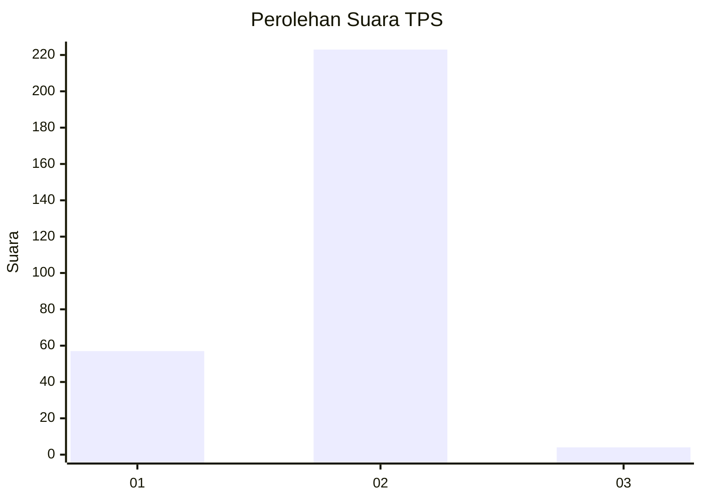
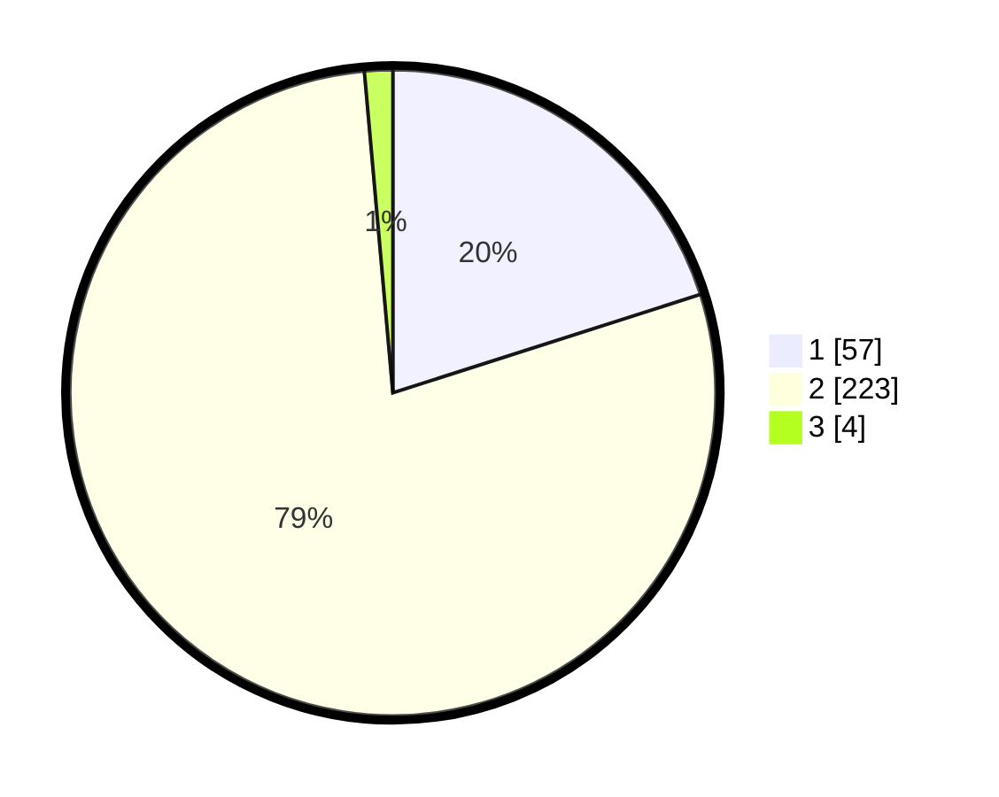

# Hasil

## Grafik

## Tabel

| No. | Nama Paslon    | Suara | Suara (raw) | Persentase |
|:--- |:-------------- | -----:| -----------:| ----------:|
| 1   | ANIES MUHAIMIN | 57    | [57][p-1]   | 20,07      |
| 2   | PRABOWO GIBRAN | 223   | [223][p-2]  | 78,52      |
| 3   | GANJAR MAHFUD  | 4     | [4][p-3]    | 1,41       |

[p-1]: https://github.com/gigit-pemilu/pemilu-2024-32-jawa-barat/blob/main/pilpres/hitung-suara/sub/32-jawa-barat/sub/17-bandung-barat/sub/04-cikalongwetan/sub/2013-wangunjaya/sub/015-tps/sub/paslon-1.txt
[p-2]: https://github.com/gigit-pemilu/pemilu-2024-32-jawa-barat/blob/main/pilpres/hitung-suara/sub/32-jawa-barat/sub/17-bandung-barat/sub/04-cikalongwetan/sub/2013-wangunjaya/sub/015-tps/sub/paslon-2.txt
[p-3]: https://github.com/gigit-pemilu/pemilu-2024-32-jawa-barat/blob/main/pilpres/hitung-suara/sub/32-jawa-barat/sub/17-bandung-barat/sub/04-cikalongwetan/sub/2013-wangunjaya/sub/015-tps/sub/paslon-3.txt

## Foto C Plano

https://sirekap-obj-formc.kpu.go.id/e093/pemilu/ppwp/32/17/04/20/13/3217042013015-20240215-235449--6739de6e-f581-4ae7-ab55-96e69b71d3d3.jpg

https://sirekap-obj-formc.kpu.go.id/e093/pemilu/ppwp/32/17/04/20/13/3217042013015-20240216-000632--d3b0fb9c-ec3f-4bad-9dcb-a9e17cc6cf26.jpg

https://sirekap-obj-formc.kpu.go.id/e093/pemilu/ppwp/32/17/04/20/13/3217042013015-20240216-000920--0b30e6a3-65e0-4b73-b970-a4fa8cbd725e.jpg

## Metadata

| Key        | Value               |
| ---------- | ------------------- |
| Time Stamp | 2024-02-26 21:00:00 |

