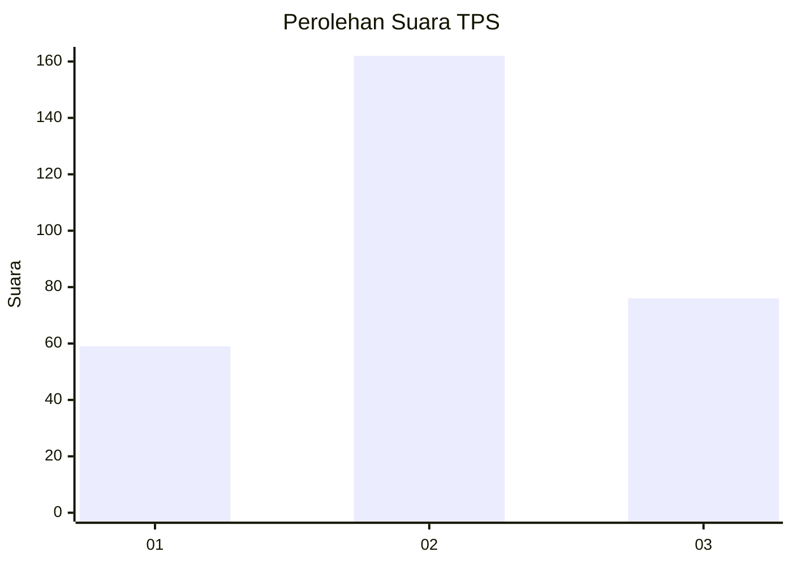
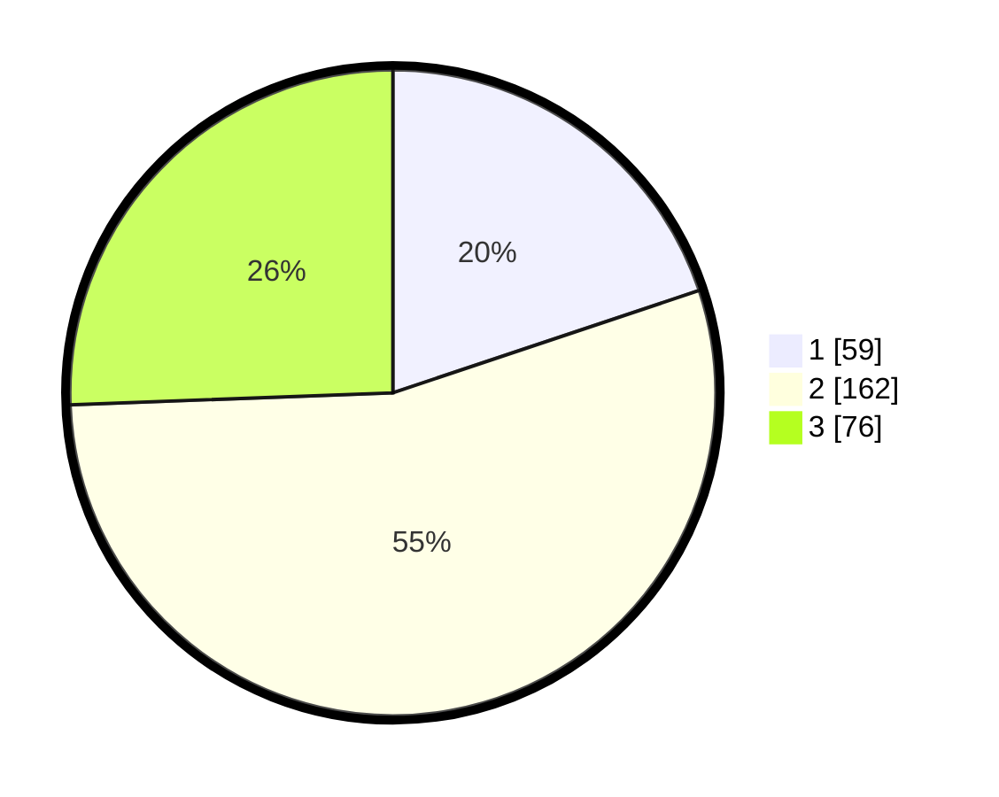

# Hasil

## Grafik

## Tabel

| No. | Nama Paslon    | Suara | Suara (raw) | Persentase |
|:--- |:-------------- | -----:| -----------:| ----------:|
| 1   | ANIES MUHAIMIN | 59    | [59][p-1]   | 19,87      |
| 2   | PRABOWO GIBRAN | 162   | [162][p-2]  | 54,55      |
| 3   | GANJAR MAHFUD  | 76    | [76][p-3]   | 25,59      |

[p-1]: https://github.com/gigit-pemilu/pemilu-2024/blob/main/pilpres/hitung-suara/sub/32-jawa-barat/sub/17-bandung-barat/sub/05-cipeundeuy/sub/2006-margalaksana/sub/019-tps/sub/paslon-1.txt
[p-2]: https://github.com/gigit-pemilu/pemilu-2024/blob/main/pilpres/hitung-suara/sub/32-jawa-barat/sub/17-bandung-barat/sub/05-cipeundeuy/sub/2006-margalaksana/sub/019-tps/sub/paslon-2.txt
[p-3]: https://github.com/gigit-pemilu/pemilu-2024/blob/main/pilpres/hitung-suara/sub/32-jawa-barat/sub/17-bandung-barat/sub/05-cipeundeuy/sub/2006-margalaksana/sub/019-tps/sub/paslon-3.txt

## Foto C Plano

https://sirekap-obj-formc.kpu.go.id/97a5/pemilu/ppwp/32/17/05/20/06/3217052006019-20240214-203507--5044d75c-4b31-4a30-afa1-bf2fe2b0e9c9.jpg

https://sirekap-obj-formc.kpu.go.id/97a5/pemilu/ppwp/32/17/05/20/06/3217052006019-20240214-211915--eb199807-1208-4b5c-8a06-97645dff4633.jpg

https://sirekap-obj-formc.kpu.go.id/97a5/pemilu/ppwp/32/17/05/20/06/3217052006019-20240214-203730--91661ef5-b5c9-4ee3-a036-c4e77b8c8ca1.jpg

## Metadata

| Key        | Value               |
| ---------- | ------------------- |
| Time Stamp | 2024-02-16 01:00:27 |

