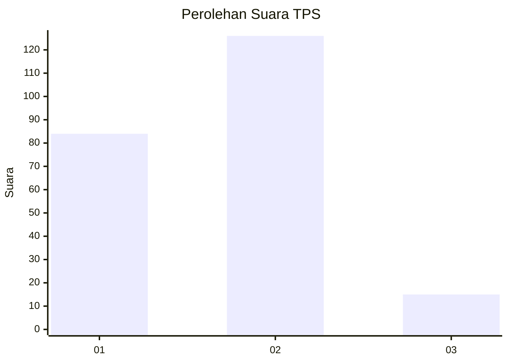
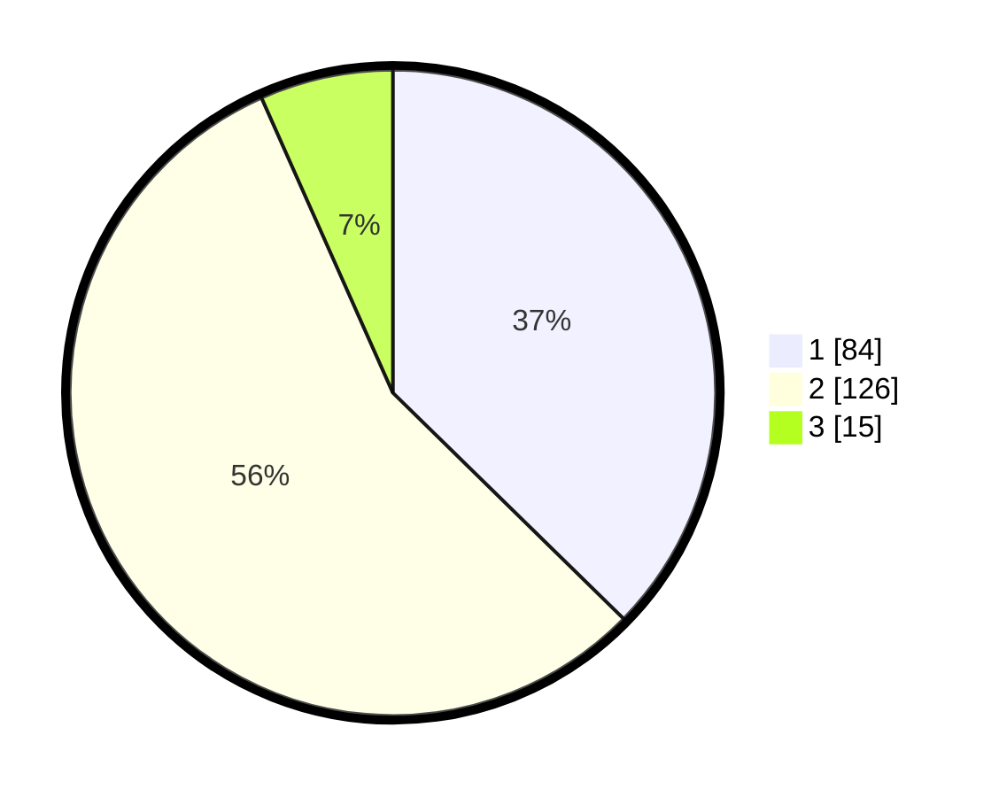

# Hasil

## Grafik

## Tabel

| No. | Nama Paslon    | Suara | Suara (raw) | Persentase |
|:--- |:-------------- | -----:| -----------:| ----------:|
| 1   | ANIES MUHAIMIN | 84    | [84][p-1]   | 37,33      |
| 2   | PRABOWO GIBRAN | 126   | [126][p-2]  | 56,00      |
| 3   | GANJAR MAHFUD  | 15    | [15][p-3]   | 6,67       |

[p-1]: https://github.com/gigit-pemilu/pemilu-2024-32-jawa-barat/blob/main/pilpres/hitung-suara/sub/32-jawa-barat/sub/17-bandung-barat/sub/06-ngamprah/sub/2001-ngamprah/sub/003-tps/sub/paslon-1.txt
[p-2]: https://github.com/gigit-pemilu/pemilu-2024-32-jawa-barat/blob/main/pilpres/hitung-suara/sub/32-jawa-barat/sub/17-bandung-barat/sub/06-ngamprah/sub/2001-ngamprah/sub/003-tps/sub/paslon-2.txt
[p-3]: https://github.com/gigit-pemilu/pemilu-2024-32-jawa-barat/blob/main/pilpres/hitung-suara/sub/32-jawa-barat/sub/17-bandung-barat/sub/06-ngamprah/sub/2001-ngamprah/sub/003-tps/sub/paslon-3.txt

## Foto C Plano

https://sirekap-obj-formc.kpu.go.id/e1b6/pemilu/ppwp/32/17/06/20/01/3217062001003-20240215-062136--935c251a-3967-4a4b-b699-09120cfdba3d.jpg

https://sirekap-obj-formc.kpu.go.id/e1b6/pemilu/ppwp/32/17/06/20/01/3217062001003-20240219-221720--dfc0aeec-61a3-4d9a-9db4-8ae9e456dd8f.jpg

https://sirekap-obj-formc.kpu.go.id/e1b6/pemilu/ppwp/32/17/06/20/01/3217062001003-20240219-221729--061f211d-cf60-4654-94f0-035e525e552b.jpg

## Metadata

| Key        | Value               |
| ---------- | ------------------- |
| Time Stamp | 2024-02-25 13:00:00 |

