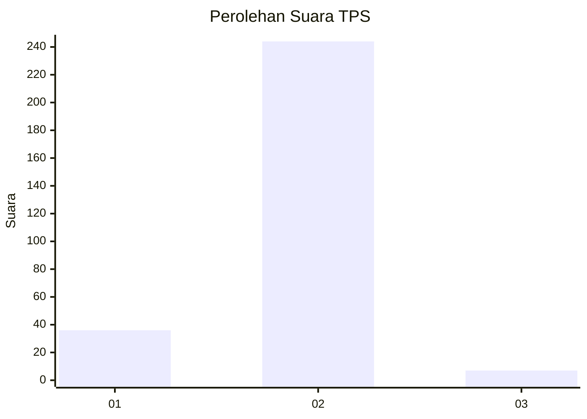
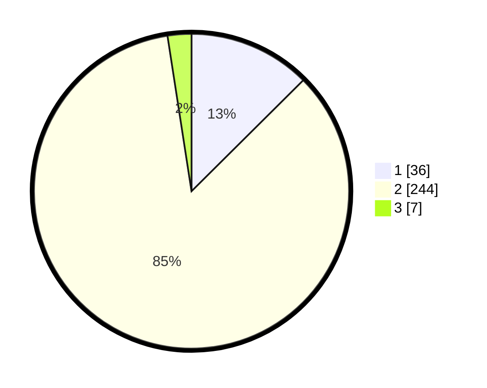

# Hasil

## Grafik

## Tabel

| No. | Nama Paslon    | Suara | Suara (raw) | Persentase |
|:--- |:-------------- | -----:| -----------:| ----------:|
| 1   | ANIES MUHAIMIN | 36    | [36][p-1]   | 12,54      |
| 2   | PRABOWO GIBRAN | 244   | [244][p-2]  | 85,02      |
| 3   | GANJAR MAHFUD  | 7     | [7][p-3]    | 2,44       |

[p-1]: https://github.com/gigit-pemilu/pemilu-2024/blob/main/pilpres/hitung-suara/sub/32-jawa-barat/sub/17-bandung-barat/sub/06-ngamprah/sub/2001-ngamprah/sub/009-tps/sub/paslon-1.txt
[p-2]: https://github.com/gigit-pemilu/pemilu-2024/blob/main/pilpres/hitung-suara/sub/32-jawa-barat/sub/17-bandung-barat/sub/06-ngamprah/sub/2001-ngamprah/sub/009-tps/sub/paslon-2.txt
[p-3]: https://github.com/gigit-pemilu/pemilu-2024/blob/main/pilpres/hitung-suara/sub/32-jawa-barat/sub/17-bandung-barat/sub/06-ngamprah/sub/2001-ngamprah/sub/009-tps/sub/paslon-3.txt

## Foto C Plano

https://sirekap-obj-formc.kpu.go.id/f05a/pemilu/ppwp/32/17/06/20/01/3217062001009-20240215-003323--0643ce62-ebd2-402b-b7e8-7f240ed070f0.jpg

https://sirekap-obj-formc.kpu.go.id/f05a/pemilu/ppwp/32/17/06/20/01/3217062001009-20240215-003811--51c503dd-2b88-4da4-9640-499547117139.jpg

https://sirekap-obj-formc.kpu.go.id/f05a/pemilu/ppwp/32/17/06/20/01/3217062001009-20240215-003418--2517de77-d8b6-40d7-9eda-892bc824ceda.jpg

## Metadata

| Key        | Value               |
| ---------- | ------------------- |
| Time Stamp | 2024-02-19 06:16:00 |

