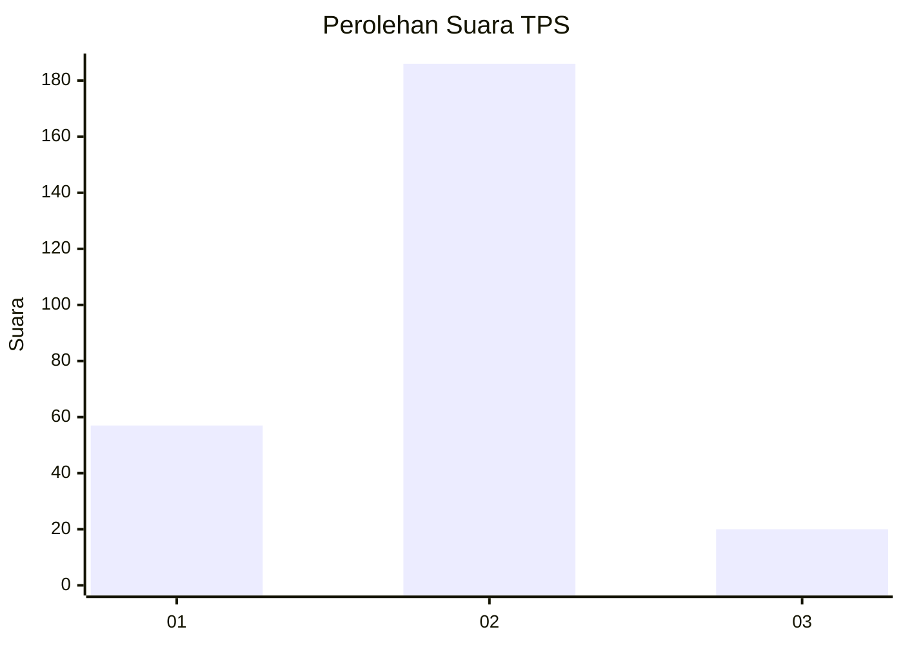
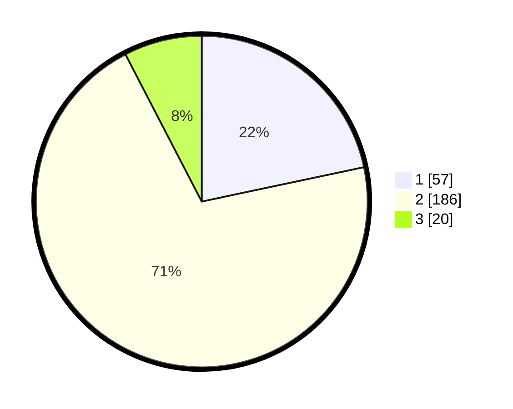

# Hasil

## Grafik

## Tabel

| No. | Nama Paslon    | Suara | Suara (raw) | Persentase |
|:--- |:-------------- | -----:| -----------:| ----------:|
| 1   | ANIES MUHAIMIN | 57    | [57][p-1]   | 21,67      |
| 2   | PRABOWO GIBRAN | 186   | [186][p-2]  | 70,72      |
| 3   | GANJAR MAHFUD  | 20    | [20][p-3]   | 7,60       |

[p-1]: https://github.com/gigit-pemilu/pemilu-2024/blob/main/pilpres/hitung-suara/sub/32-jawa-barat/sub/17-bandung-barat/sub/06-ngamprah/sub/2003-cilame/sub/023-tps/sub/paslon-1.txt
[p-2]: https://github.com/gigit-pemilu/pemilu-2024/blob/main/pilpres/hitung-suara/sub/32-jawa-barat/sub/17-bandung-barat/sub/06-ngamprah/sub/2003-cilame/sub/023-tps/sub/paslon-2.txt
[p-3]: https://github.com/gigit-pemilu/pemilu-2024/blob/main/pilpres/hitung-suara/sub/32-jawa-barat/sub/17-bandung-barat/sub/06-ngamprah/sub/2003-cilame/sub/023-tps/sub/paslon-3.txt

## Foto C Plano

https://sirekap-obj-formc.kpu.go.id/2530/pemilu/ppwp/32/17/06/20/03/3217062003023-20240215-024216--3166da5d-dd76-4ee5-b5e8-aaa6c432d0cc.jpg

https://sirekap-obj-formc.kpu.go.id/2530/pemilu/ppwp/32/17/06/20/03/3217062003023-20240215-024333--ba58fe5c-9dbc-4ce5-939f-9b94bf6fd380.jpg

https://sirekap-obj-formc.kpu.go.id/2530/pemilu/ppwp/32/17/06/20/03/3217062003023-20240215-023951--1c1b164a-6ca9-4bb1-a4ff-8bdd64f7807e.jpg

## Metadata

| Key        | Value               |
| ---------- | ------------------- |
| Time Stamp | 2024-02-19 06:16:00 |

