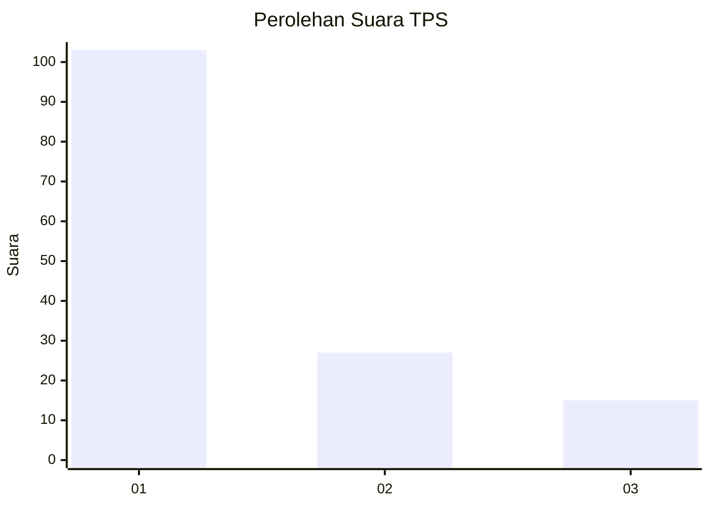
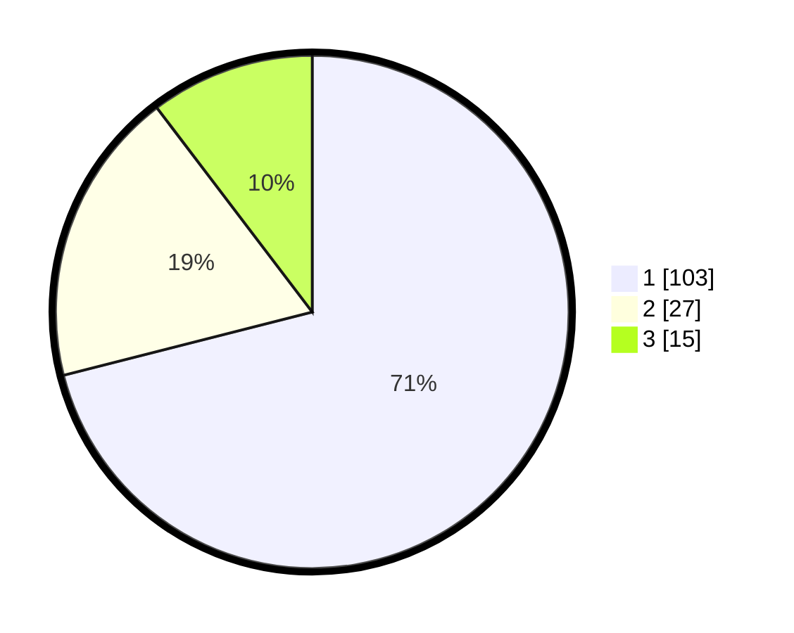

# Hasil

## Grafik

## Tabel

| No. | Nama Paslon    | Suara | Suara (raw) | Persentase |
|:--- |:-------------- | -----:| -----------:| ----------:|
| 1   | ANIES MUHAIMIN | 103   | [103][p-1]  | 71,03      |
| 2   | PRABOWO GIBRAN | 27    | [27][p-2]   | 18,62      |
| 3   | GANJAR MAHFUD  | 15    | [15][p-3]   | 10,34      |

[p-1]: https://github.com/gigit-pemilu/pemilu-2024-32-jawa-barat/blob/main/pilpres/hitung-suara/sub/32-jawa-barat/sub/17-bandung-barat/sub/06-ngamprah/sub/2003-cilame/sub/068-tps/sub/paslon-1.txt
[p-2]: https://github.com/gigit-pemilu/pemilu-2024-32-jawa-barat/blob/main/pilpres/hitung-suara/sub/32-jawa-barat/sub/17-bandung-barat/sub/06-ngamprah/sub/2003-cilame/sub/068-tps/sub/paslon-2.txt
[p-3]: https://github.com/gigit-pemilu/pemilu-2024-32-jawa-barat/blob/main/pilpres/hitung-suara/sub/32-jawa-barat/sub/17-bandung-barat/sub/06-ngamprah/sub/2003-cilame/sub/068-tps/sub/paslon-3.txt

## Foto C Plano

https://sirekap-obj-formc.kpu.go.id/325b/pemilu/ppwp/32/17/06/20/03/3217062003068-20240215-005640--cbdd7824-d1c5-425a-b455-af88a31bd776.jpg

https://sirekap-obj-formc.kpu.go.id/325b/pemilu/ppwp/32/17/06/20/03/3217062003068-20240215-005707--513053ca-1291-44ef-8fd5-1e820a7aed7f.jpg

https://sirekap-obj-formc.kpu.go.id/325b/pemilu/ppwp/32/17/06/20/03/3217062003068-20240215-005933--5f6e2435-1027-4ecd-8afc-b2b87bfdc0a8.jpg

## Metadata

| Key        | Value               |
| ---------- | ------------------- |
| Time Stamp | 2024-02-19 06:16:00 |

