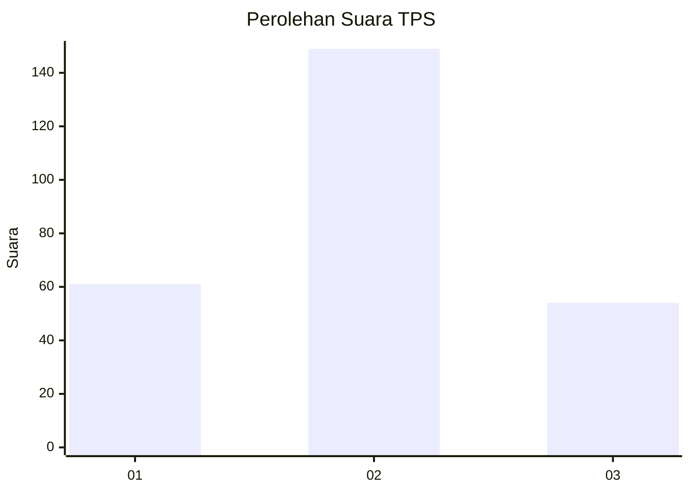
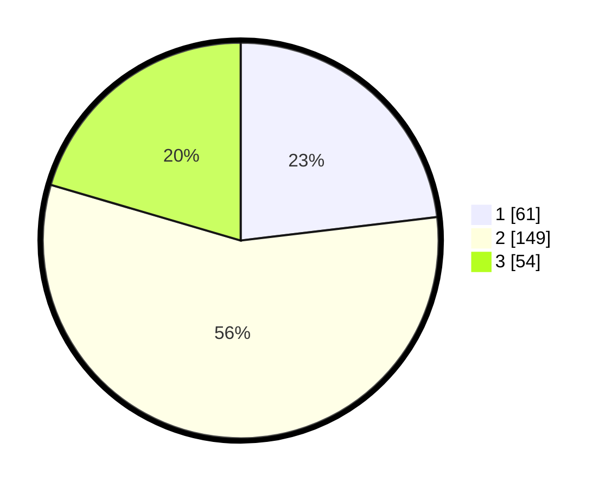

# Hasil

## Grafik

## Tabel

| No. | Nama Paslon    | Suara | Suara (raw) | Persentase |
|:--- |:-------------- | -----:| -----------:| ----------:|
| 1   | ANIES MUHAIMIN | 61    | [61][p-1]   | 23,11      |
| 2   | PRABOWO GIBRAN | 149   | [149][p-2]  | 56,44      |
| 3   | GANJAR MAHFUD  | 54    | [54][p-3]   | 20,45      |

[p-1]: https://github.com/gigit-pemilu/pemilu-2024-32-jawa-barat/blob/main/pilpres/hitung-suara/sub/32-jawa-barat/sub/17-bandung-barat/sub/06-ngamprah/sub/2011-pakuhaji/sub/005-tps/sub/paslon-1.txt
[p-2]: https://github.com/gigit-pemilu/pemilu-2024-32-jawa-barat/blob/main/pilpres/hitung-suara/sub/32-jawa-barat/sub/17-bandung-barat/sub/06-ngamprah/sub/2011-pakuhaji/sub/005-tps/sub/paslon-2.txt
[p-3]: https://github.com/gigit-pemilu/pemilu-2024-32-jawa-barat/blob/main/pilpres/hitung-suara/sub/32-jawa-barat/sub/17-bandung-barat/sub/06-ngamprah/sub/2011-pakuhaji/sub/005-tps/sub/paslon-3.txt

## Foto C Plano

https://sirekap-obj-formc.kpu.go.id/e567/pemilu/ppwp/32/17/06/20/11/3217062011005-20240217-173032--79d8027b-1634-4dc9-83ec-8963f30cf4b5.jpg

https://sirekap-obj-formc.kpu.go.id/e567/pemilu/ppwp/32/17/06/20/11/3217062011005-20240217-173044--3d16d583-36f3-40c4-b0de-16c8387ac91d.jpg

https://sirekap-obj-formc.kpu.go.id/e567/pemilu/ppwp/32/17/06/20/11/3217062011005-20240217-173051--697862b6-58ed-43c7-bee6-800250b3d2b8.jpg

## Metadata

| Key        | Value               |
| ---------- | ------------------- |
| Time Stamp | 2024-02-17 18:00:00 |

