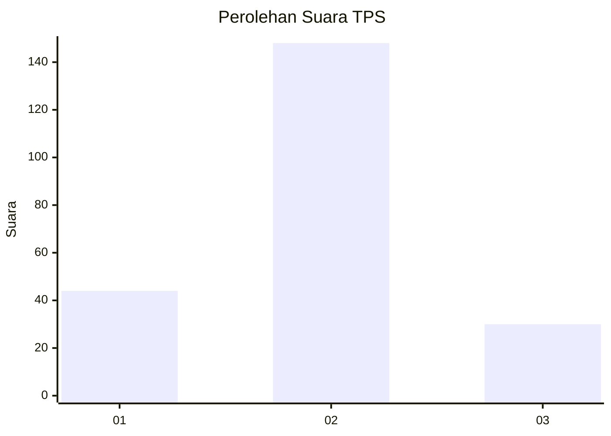
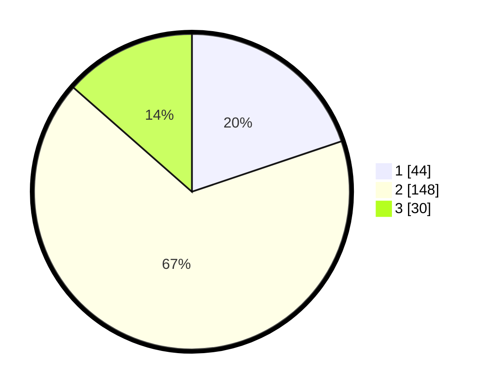

# Hasil

## Grafik

## Tabel

| No. | Nama Paslon    | Suara | Suara (raw) | Persentase |
|:--- |:-------------- | -----:| -----------:| ----------:|
| 1   | ANIES MUHAIMIN | 44    | [44][p-1]   | 19,82      |
| 2   | PRABOWO GIBRAN | 148   | [148][p-2]  | 66,67      |
| 3   | GANJAR MAHFUD  | 30    | [30][p-3]   | 13,51      |

[p-1]: https://github.com/gigit-pemilu/pemilu-2024-32-jawa-barat/blob/main/pilpres/hitung-suara/sub/32-jawa-barat/sub/17-bandung-barat/sub/07-cipatat/sub/2001-ciptaharja/sub/003-tps/sub/paslon-1.txt
[p-2]: https://github.com/gigit-pemilu/pemilu-2024-32-jawa-barat/blob/main/pilpres/hitung-suara/sub/32-jawa-barat/sub/17-bandung-barat/sub/07-cipatat/sub/2001-ciptaharja/sub/003-tps/sub/paslon-2.txt
[p-3]: https://github.com/gigit-pemilu/pemilu-2024-32-jawa-barat/blob/main/pilpres/hitung-suara/sub/32-jawa-barat/sub/17-bandung-barat/sub/07-cipatat/sub/2001-ciptaharja/sub/003-tps/sub/paslon-3.txt

## Foto C Plano

https://sirekap-obj-formc.kpu.go.id/b81c/pemilu/ppwp/32/17/07/20/01/3217072001003-20240215-074603--7c9ba24c-c805-4eea-bc24-d9e091e5ede4.jpg

https://sirekap-obj-formc.kpu.go.id/b81c/pemilu/ppwp/32/17/07/20/01/3217072001003-20240215-074720--d8e98434-8c61-4d0f-9432-1f066fe366f8.jpg

https://sirekap-obj-formc.kpu.go.id/b81c/pemilu/ppwp/32/17/07/20/01/3217072001003-20240215-074937--5fdc69a2-0423-4334-a25e-a5221841e6f8.jpg

## Metadata

| Key        | Value               |
| ---------- | ------------------- |
| Time Stamp | 2024-02-19 06:16:00 |

