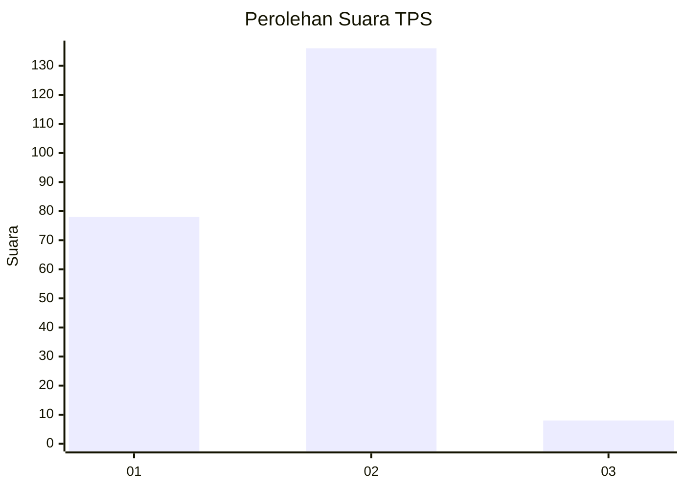
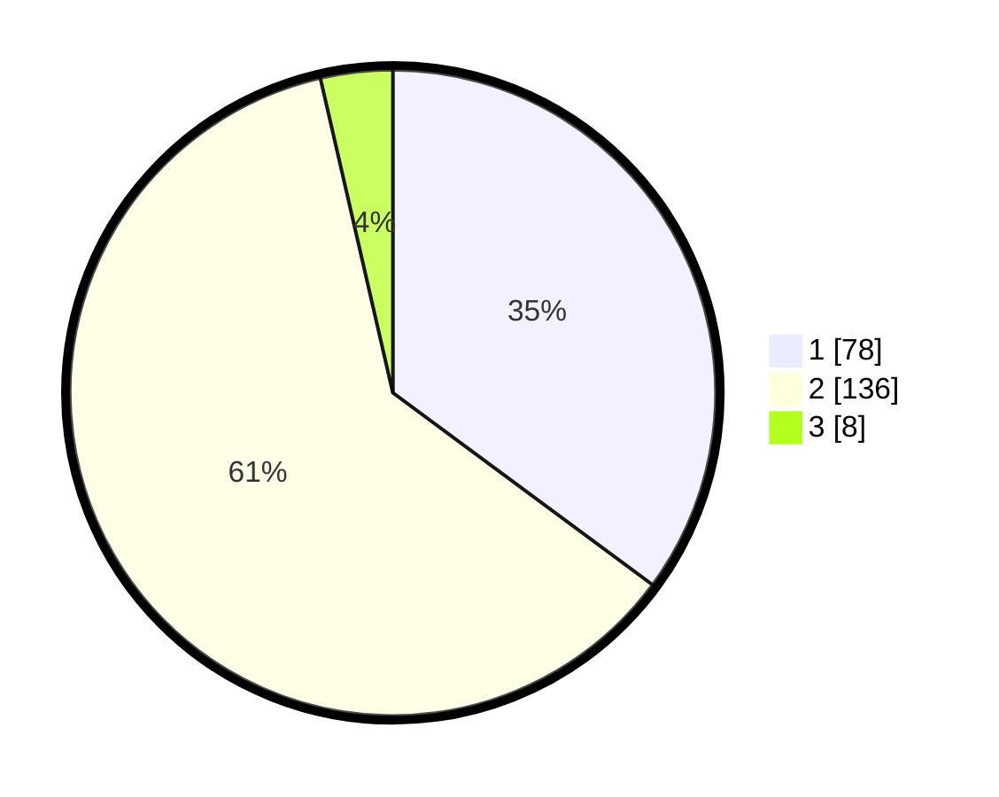

# Hasil

## Grafik

## Tabel

| No. | Nama Paslon    | Suara | Suara (raw) | Persentase |
|:--- |:-------------- | -----:| -----------:| ----------:|
| 1   | ANIES MUHAIMIN | 78    | [78][p-1]   | 35,14      |
| 2   | PRABOWO GIBRAN | 136   | [136][p-2]  | 61,26      |
| 3   | GANJAR MAHFUD  | 8     | [8][p-3]    | 3,60       |

[p-1]: https://github.com/gigit-pemilu/pemilu-2024-32-jawa-barat/blob/main/pilpres/hitung-suara/sub/32-jawa-barat/sub/17-bandung-barat/sub/07-cipatat/sub/2001-ciptaharja/sub/005-tps/sub/paslon-1.txt
[p-2]: https://github.com/gigit-pemilu/pemilu-2024-32-jawa-barat/blob/main/pilpres/hitung-suara/sub/32-jawa-barat/sub/17-bandung-barat/sub/07-cipatat/sub/2001-ciptaharja/sub/005-tps/sub/paslon-2.txt
[p-3]: https://github.com/gigit-pemilu/pemilu-2024-32-jawa-barat/blob/main/pilpres/hitung-suara/sub/32-jawa-barat/sub/17-bandung-barat/sub/07-cipatat/sub/2001-ciptaharja/sub/005-tps/sub/paslon-3.txt

## Foto C Plano

https://sirekap-obj-formc.kpu.go.id/7235/pemilu/ppwp/32/17/07/20/01/3217072001005-20240215-141620--7727ee7e-f6e6-42e7-b370-0e8dac2f0679.jpg

https://sirekap-obj-formc.kpu.go.id/7235/pemilu/ppwp/32/17/07/20/01/3217072001005-20240215-014751--8798183c-4797-4057-8509-f86ec4139a6e.jpg

https://sirekap-obj-formc.kpu.go.id/7235/pemilu/ppwp/32/17/07/20/01/3217072001005-20240215-100547--ceddae80-5a91-413c-8933-7a4116f6ce5b.jpg

## Metadata

| Key        | Value               |
| ---------- | ------------------- |
| Time Stamp | 2024-02-19 06:16:00 |

