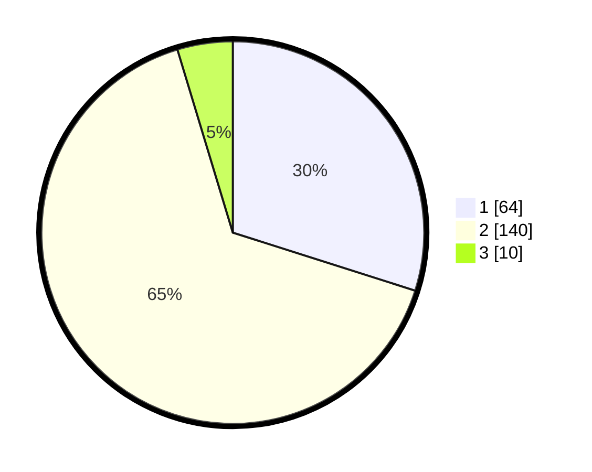

# Hasil

## Grafik

## Tabel

| No. | Nama Paslon    | Suara | Suara (raw) | Persentase |
|:--- |:-------------- | -----:| -----------:| ----------:|
| 1   | ANIES MUHAIMIN | 64    | [64][p-1]   | 29,91      |
| 2   | PRABOWO GIBRAN | 140   | [140][p-2]  | 65,42      |
| 3   | GANJAR MAHFUD  | 10    | [10][p-3]   | 4,67       |

[p-1]: https://github.com/gigit-pemilu/pemilu-2024/blob/main/pilpres/hitung-suara/sub/32-jawa-barat/sub/17-bandung-barat/sub/08-padalarang/sub/2001-kertamulya/sub/001-tps/sub/paslon-1.txt
[p-2]: https://github.com/gigit-pemilu/pemilu-2024/blob/main/pilpres/hitung-suara/sub/32-jawa-barat/sub/17-bandung-barat/sub/08-padalarang/sub/2001-kertamulya/sub/001-tps/sub/paslon-2.txt
[p-3]: https://github.com/gigit-pemilu/pemilu-2024/blob/main/pilpres/hitung-suara/sub/32-jawa-barat/sub/17-bandung-barat/sub/08-padalarang/sub/2001-kertamulya/sub/001-tps/sub/paslon-3.txt

## Foto C Plano

https://sirekap-obj-formc.kpu.go.id/2a12/pemilu/ppwp/32/17/08/20/01/3217082001001-20240217-134401--67c85db7-b531-4b5a-afb9-a504263f9b8b.jpg

https://sirekap-obj-formc.kpu.go.id/2a12/pemilu/ppwp/32/17/08/20/01/3217082001001-20240217-195221--87b3c577-3dcc-46e3-ae97-a9214ecddbb7.jpg

https://sirekap-obj-formc.kpu.go.id/2a12/pemilu/ppwp/32/17/08/20/01/3217082001001-20240217-195221--c2503acb-025a-4813-a82f-3fcc5d0d3777.jpg

## Metadata

| Key        | Value               |
| ---------- | ------------------- |
| Time Stamp | 2024-02-27 12:00:00 |

