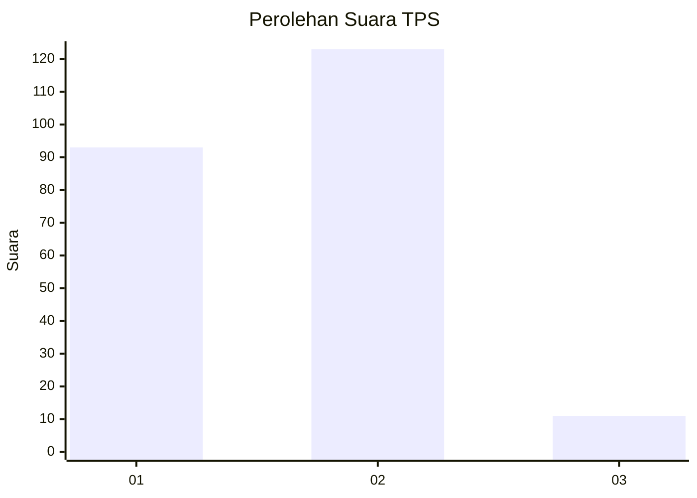
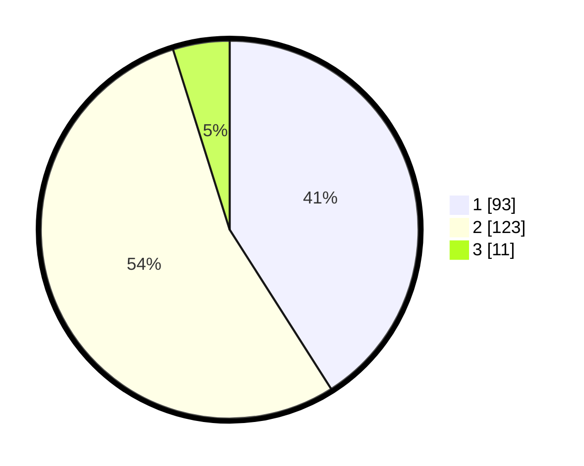

# Hasil

## Grafik

## Tabel

| No. | Nama Paslon    | Suara | Suara (raw) | Persentase |
|:--- |:-------------- | -----:| -----------:| ----------:|
| 1   | ANIES MUHAIMIN | 93    | [93][p-1]   | 40,97      |
| 2   | PRABOWO GIBRAN | 123   | [123][p-2]  | 54,19      |
| 3   | GANJAR MAHFUD  | 11    | [11][p-3]   | 4,85       |

[p-1]: https://github.com/gigit-pemilu/pemilu-2024-32-jawa-barat/blob/main/pilpres/hitung-suara/sub/32-jawa-barat/sub/17-bandung-barat/sub/08-padalarang/sub/2001-kertamulya/sub/002-tps/sub/paslon-1.txt
[p-2]: https://github.com/gigit-pemilu/pemilu-2024-32-jawa-barat/blob/main/pilpres/hitung-suara/sub/32-jawa-barat/sub/17-bandung-barat/sub/08-padalarang/sub/2001-kertamulya/sub/002-tps/sub/paslon-2.txt
[p-3]: https://github.com/gigit-pemilu/pemilu-2024-32-jawa-barat/blob/main/pilpres/hitung-suara/sub/32-jawa-barat/sub/17-bandung-barat/sub/08-padalarang/sub/2001-kertamulya/sub/002-tps/sub/paslon-3.txt

## Foto C Plano

https://sirekap-obj-formc.kpu.go.id/902d/pemilu/ppwp/32/17/08/20/01/3217082001002-20240217-211514--974cb3f8-4548-4a84-bfa5-07f2931f0e9f.jpg

https://sirekap-obj-formc.kpu.go.id/902d/pemilu/ppwp/32/17/08/20/01/3217082001002-20240217-211833--72c5eb4f-6af3-439b-ad63-9914dec0d545.jpg

https://sirekap-obj-formc.kpu.go.id/902d/pemilu/ppwp/32/17/08/20/01/3217082001002-20240217-212703--e3861cc8-b132-4f3d-b478-4046f04316fb.jpg

## Metadata

| Key        | Value               |
| ---------- | ------------------- |
| Time Stamp | 2024-02-19 06:16:00 |

