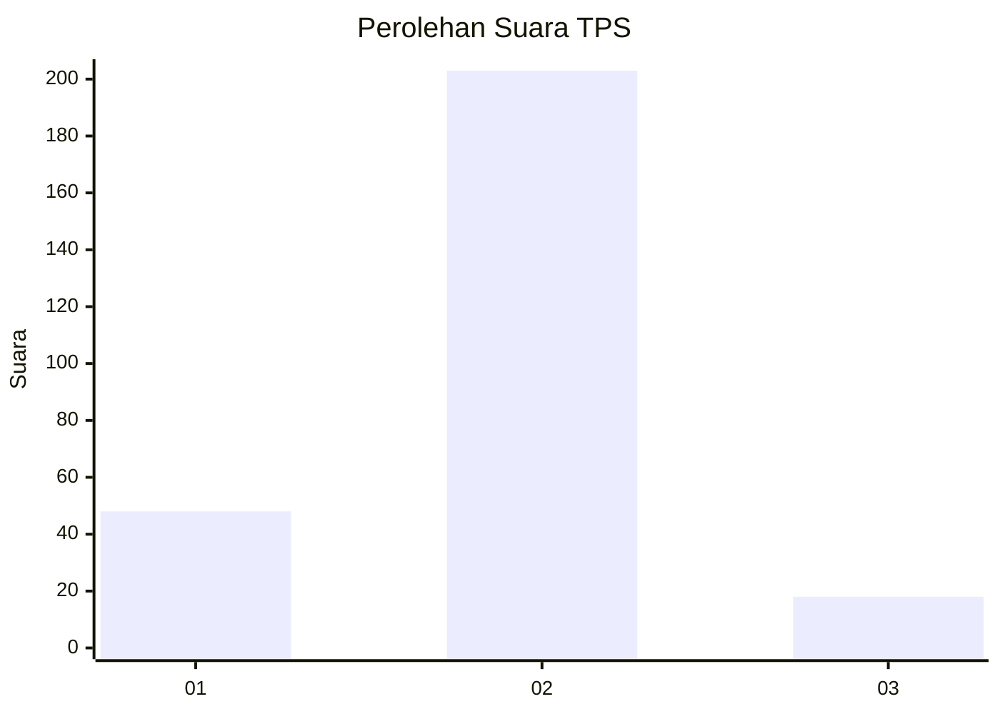
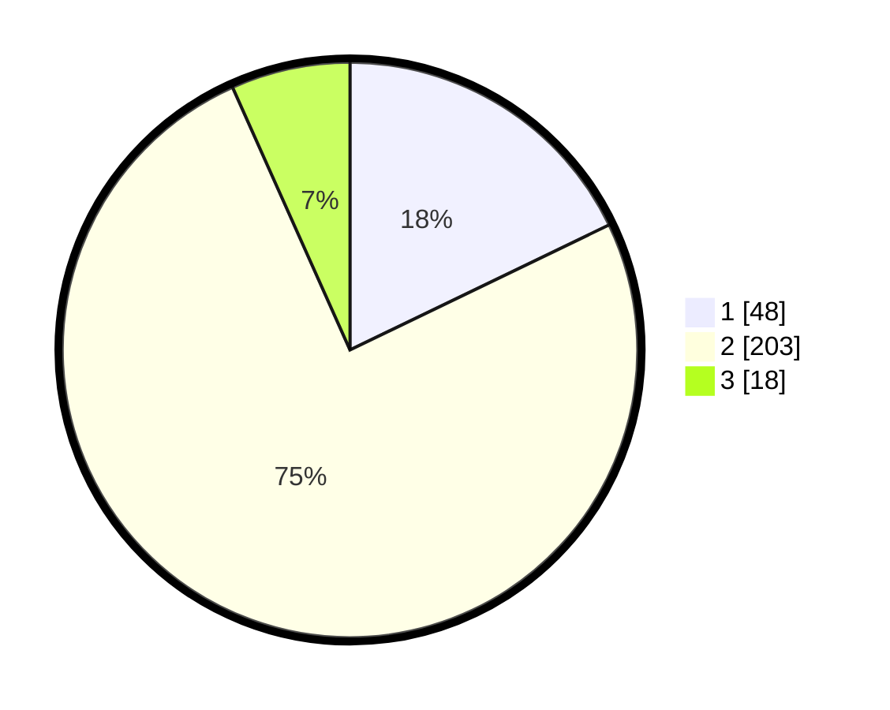

# Hasil

## Grafik

## Tabel

| No. | Nama Paslon    | Suara | Suara (raw) | Persentase |
|:--- |:-------------- | -----:| -----------:| ----------:|
| 1   | ANIES MUHAIMIN | 48    | [48][p-1]   | 17,84      |
| 2   | PRABOWO GIBRAN | 203   | [203][p-2]  | 75,46      |
| 3   | GANJAR MAHFUD  | 18    | [18][p-3]   | 6,69       |

[p-1]: https://github.com/gigit-pemilu/pemilu-2024/blob/main/pilpres/hitung-suara/sub/32-jawa-barat/sub/17-bandung-barat/sub/08-padalarang/sub/2003-cimerang/sub/018-tps/sub/paslon-1.txt
[p-2]: https://github.com/gigit-pemilu/pemilu-2024/blob/main/pilpres/hitung-suara/sub/32-jawa-barat/sub/17-bandung-barat/sub/08-padalarang/sub/2003-cimerang/sub/018-tps/sub/paslon-2.txt
[p-3]: https://github.com/gigit-pemilu/pemilu-2024/blob/main/pilpres/hitung-suara/sub/32-jawa-barat/sub/17-bandung-barat/sub/08-padalarang/sub/2003-cimerang/sub/018-tps/sub/paslon-3.txt

## Foto C Plano

https://sirekap-obj-formc.kpu.go.id/f7b1/pemilu/ppwp/32/17/08/20/03/3217082003018-20240214-213042--d6455153-77f6-46c6-b8bb-327dc28c8ff9.jpg

https://sirekap-obj-formc.kpu.go.id/f7b1/pemilu/ppwp/32/17/08/20/03/3217082003018-20240214-155739--4c36cf00-27f2-4651-8b98-11acc0e9562c.jpg

https://sirekap-obj-formc.kpu.go.id/f7b1/pemilu/ppwp/32/17/08/20/03/3217082003018-20240214-213241--f327c79f-9c3d-4973-97f9-d57203467109.jpg

## Metadata

| Key        | Value               |
| ---------- | ------------------- |
| Time Stamp | 2024-02-19 06:16:00 |

