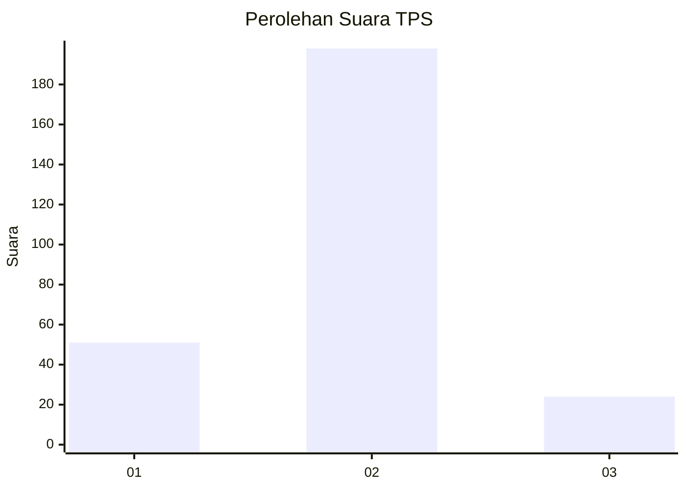
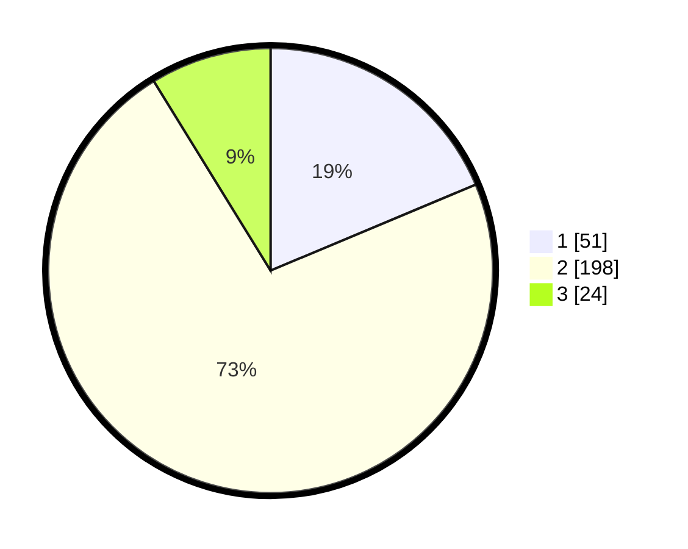

# Hasil

## Grafik

## Tabel

| No. | Nama Paslon    | Suara | Suara (raw) | Persentase |
|:--- |:-------------- | -----:| -----------:| ----------:|
| 1   | ANIES MUHAIMIN | 51    | [51][p-1]   | 18,68      |
| 2   | PRABOWO GIBRAN | 198   | [198][p-2]  | 72,53      |
| 3   | GANJAR MAHFUD  | 24    | [24][p-3]   | 8,79       |

[p-1]: https://github.com/gigit-pemilu/pemilu-2024/blob/main/pilpres/hitung-suara/sub/32-jawa-barat/sub/17-bandung-barat/sub/08-padalarang/sub/2004-campaka-mekar/sub/027-tps/sub/paslon-1.txt
[p-2]: https://github.com/gigit-pemilu/pemilu-2024/blob/main/pilpres/hitung-suara/sub/32-jawa-barat/sub/17-bandung-barat/sub/08-padalarang/sub/2004-campaka-mekar/sub/027-tps/sub/paslon-2.txt
[p-3]: https://github.com/gigit-pemilu/pemilu-2024/blob/main/pilpres/hitung-suara/sub/32-jawa-barat/sub/17-bandung-barat/sub/08-padalarang/sub/2004-campaka-mekar/sub/027-tps/sub/paslon-3.txt

## Foto C Plano

https://sirekap-obj-formc.kpu.go.id/f111/pemilu/ppwp/32/17/08/20/04/3217082004027-20240215-024449--5652ca37-49ae-4f7b-9419-a2f39f713211.jpg

https://sirekap-obj-formc.kpu.go.id/f111/pemilu/ppwp/32/17/08/20/04/3217082004027-20240215-024558--20ee9752-a874-4ff5-a426-d251e1742f12.jpg

https://sirekap-obj-formc.kpu.go.id/f111/pemilu/ppwp/32/17/08/20/04/3217082004027-20240215-024817--2aacc83b-d90e-4936-92bb-03ab5e08daf8.jpg

## Metadata

| Key        | Value               |
| ---------- | ------------------- |
| Time Stamp | 2024-02-24 22:31:28 |

