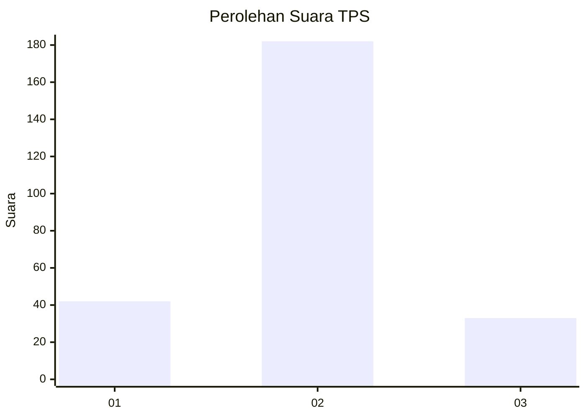
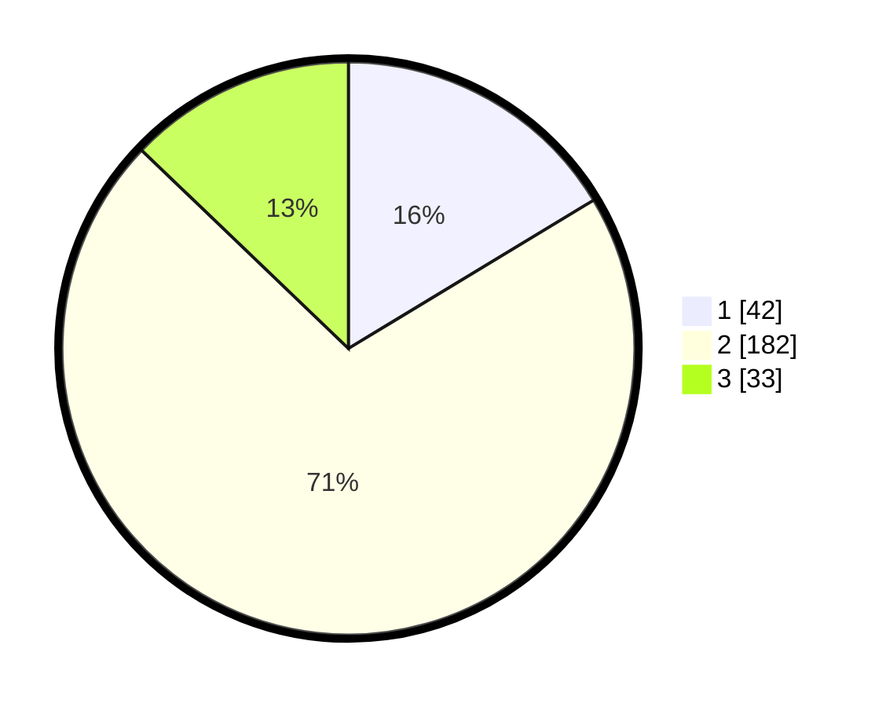

# Hasil

## Grafik

## Tabel

| No. | Nama Paslon    | Suara | Suara (raw) | Persentase |
|:--- |:-------------- | -----:| -----------:| ----------:|
| 1   | ANIES MUHAIMIN | 42    | [42][p-1]   | 16,34      |
| 2   | PRABOWO GIBRAN | 182   | [182][p-2]  | 70,82      |
| 3   | GANJAR MAHFUD  | 33    | [33][p-3]   | 12,84      |

[p-1]: https://github.com/gigit-pemilu/pemilu-2024-32-jawa-barat/blob/main/pilpres/hitung-suara/sub/32-jawa-barat/sub/17-bandung-barat/sub/09-batujajar/sub/2001-batujajar-timur/sub/002-tps/sub/paslon-1.txt
[p-2]: https://github.com/gigit-pemilu/pemilu-2024-32-jawa-barat/blob/main/pilpres/hitung-suara/sub/32-jawa-barat/sub/17-bandung-barat/sub/09-batujajar/sub/2001-batujajar-timur/sub/002-tps/sub/paslon-2.txt
[p-3]: https://github.com/gigit-pemilu/pemilu-2024-32-jawa-barat/blob/main/pilpres/hitung-suara/sub/32-jawa-barat/sub/17-bandung-barat/sub/09-batujajar/sub/2001-batujajar-timur/sub/002-tps/sub/paslon-3.txt

## Foto C Plano

https://sirekap-obj-formc.kpu.go.id/3c60/pemilu/ppwp/32/17/09/20/01/3217092001002-20240216-222736--47a9676f-99b0-4fe9-bd3d-104381d675ef.jpg

https://sirekap-obj-formc.kpu.go.id/3c60/pemilu/ppwp/32/17/09/20/01/3217092001002-20240216-222849--b881db32-cd6d-4904-8e5a-794a27f70607.jpg

https://sirekap-obj-formc.kpu.go.id/3c60/pemilu/ppwp/32/17/09/20/01/3217092001002-20240216-223410--479dee9f-0658-4366-93c3-0c7e69df0938.jpg

## Metadata

| Key        | Value               |
| ---------- | ------------------- |
| Time Stamp | 2024-02-19 06:16:00 |

## DATA PEMILIH TETAP

Jumlah pemilih dalam DPT: **386**.
 * L: **545**.
 * P: **236**.

## DATA PENGGUNA HAK PILIH

Jumlah pengguna hak pilih dalam DPT: **353**.
 * L: **823**.
 * P: **835**.

Jumlah pengguna hak pilih dalam DPTb: **800**.
 * L: **828**.
 * P: **778**.

Jumlah pengguna hak pilih dalam DPK: **884**.
 * L: **284**.
 * P: **288**.

Jumlah pengguna hak pilih: **252**.
 * L: **827**.
 * P: **330**.

## JUMLAH SUARA SAH DAN TIDAK SAH

JUMLAH SELURUH SUARA SAH: **257**.

JUMLAH SUARA TIDAK SAH: **0**.

JUMLAH SELURUH SUARA SAH DAN SUARA TIDAK SAH: **257**.

