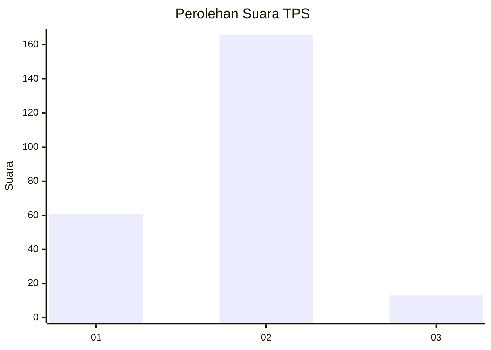
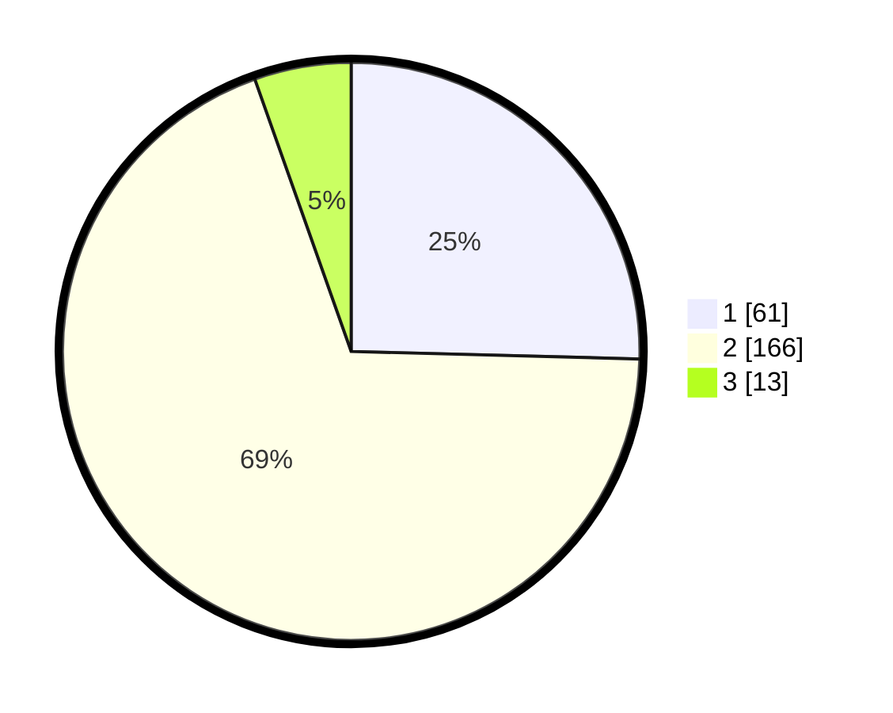

# Hasil

## Grafik

## Tabel

| No. | Nama Paslon    | Suara | Suara (raw) | Persentase |
|:--- |:-------------- | -----:| -----------:| ----------:|
| 1   | ANIES MUHAIMIN | 61    | [61][p-1]   | 25,42      |
| 2   | PRABOWO GIBRAN | 166   | [166][p-2]  | 69,17      |
| 3   | GANJAR MAHFUD  | 13    | [13][p-3]   | 5,42       |

[p-1]: https://github.com/gigit-pemilu/pemilu-2024/blob/main/pilpres/hitung-suara/sub/32-jawa-barat/sub/17-bandung-barat/sub/09-batujajar/sub/2001-batujajar-timur/sub/010-tps/sub/paslon-1.txt
[p-2]: https://github.com/gigit-pemilu/pemilu-2024/blob/main/pilpres/hitung-suara/sub/32-jawa-barat/sub/17-bandung-barat/sub/09-batujajar/sub/2001-batujajar-timur/sub/010-tps/sub/paslon-2.txt
[p-3]: https://github.com/gigit-pemilu/pemilu-2024/blob/main/pilpres/hitung-suara/sub/32-jawa-barat/sub/17-bandung-barat/sub/09-batujajar/sub/2001-batujajar-timur/sub/010-tps/sub/paslon-3.txt

## Foto C Plano

https://sirekap-obj-formc.kpu.go.id/e6dc/pemilu/ppwp/32/17/09/20/01/3217092001010-20240216-233028--d88eae9b-b656-457c-a5c9-767896fcb960.jpg

https://sirekap-obj-formc.kpu.go.id/e6dc/pemilu/ppwp/32/17/09/20/01/3217092001010-20240216-233115--6ce653e1-6e61-4cc4-9ab4-bb318059df30.jpg

https://sirekap-obj-formc.kpu.go.id/e6dc/pemilu/ppwp/32/17/09/20/01/3217092001010-20240216-233312--85fe0c4a-c3ab-435d-9225-d4a5774d2ba8.jpg

## Metadata

| Key        | Value               |
| ---------- | ------------------- |
| Time Stamp | 2024-02-19 06:16:00 |

## DATA PEMILIH TETAP

Jumlah pemilih dalam DPT: **588**.
 * L: **838**.
 * P: **855**.

## DATA PENGGUNA HAK PILIH

Jumlah pengguna hak pilih dalam DPT: **928**.
 * L: **885**.
 * P: **533**.

Jumlah pengguna hak pilih dalam DPTb: **885**.
 * L: **533**.
 * P: **233**.

Jumlah pengguna hak pilih dalam DPK: **333**.
 * L: **538**.
 * P: **333**.

Jumlah pengguna hak pilih: **332**.
 * L: **885**.
 * P: **835**.

## JUMLAH SUARA SAH DAN TIDAK SAH

JUMLAH SELURUH SUARA SAH: **240**.

JUMLAH SUARA TIDAK SAH: **5**.

JUMLAH SELURUH SUARA SAH DAN SUARA TIDAK SAH: **245**.

