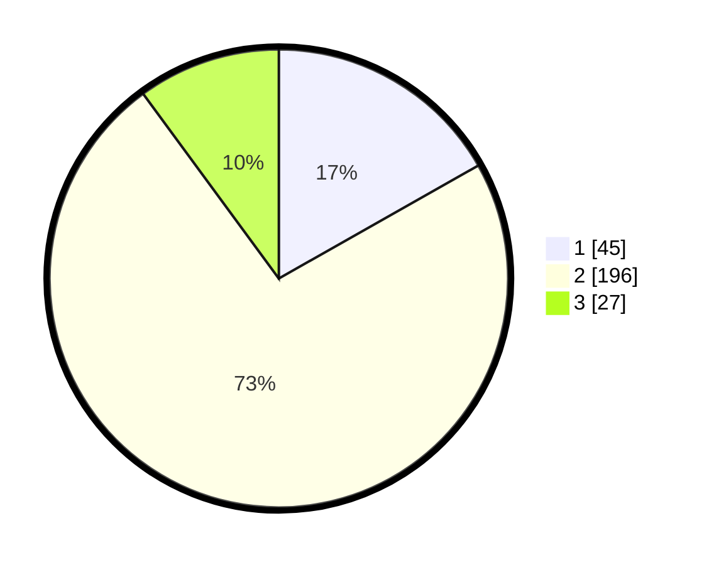

# Hasil

## Grafik

## Tabel

| No. | Nama Paslon    | Suara | Suara (raw) | Persentase |
|:--- |:-------------- | -----:| -----------:| ----------:|
| 1   | ANIES MUHAIMIN | 45    | [45][p-1]   | 16,79      |
| 2   | PRABOWO GIBRAN | 196   | [196][p-2]  | 73,13      |
| 3   | GANJAR MAHFUD  | 27    | [27][p-3]   | 10,07      |

[p-1]: https://github.com/gigit-pemilu/pemilu-2024-32-jawa-barat/blob/main/pilpres/hitung-suara/sub/32-jawa-barat/sub/17-bandung-barat/sub/09-batujajar/sub/2001-batujajar-timur/sub/027-tps/sub/paslon-1.txt
[p-2]: https://github.com/gigit-pemilu/pemilu-2024-32-jawa-barat/blob/main/pilpres/hitung-suara/sub/32-jawa-barat/sub/17-bandung-barat/sub/09-batujajar/sub/2001-batujajar-timur/sub/027-tps/sub/paslon-2.txt
[p-3]: https://github.com/gigit-pemilu/pemilu-2024-32-jawa-barat/blob/main/pilpres/hitung-suara/sub/32-jawa-barat/sub/17-bandung-barat/sub/09-batujajar/sub/2001-batujajar-timur/sub/027-tps/sub/paslon-3.txt

## Foto C Plano

https://sirekap-obj-formc.kpu.go.id/0410/pemilu/ppwp/32/17/09/20/01/3217092001027-20240217-002425--8c96946b-71aa-4b70-8129-775d7dcc7cb7.jpg

https://sirekap-obj-formc.kpu.go.id/0410/pemilu/ppwp/32/17/09/20/01/3217092001027-20240217-002659--f38a28cc-cb8d-4d72-8362-02dad5519f59.jpg

https://sirekap-obj-formc.kpu.go.id/0410/pemilu/ppwp/32/17/09/20/01/3217092001027-20240217-002802--6871a12f-c392-4b28-9056-a1ba05a56440.jpg

## Metadata

| Key        | Value               |
| ---------- | ------------------- |
| Time Stamp | 2024-02-19 06:16:00 |

## DATA PEMILIH TETAP

Jumlah pemilih dalam DPT: **293**.
 * L: **555**.
 * P: **897**.

## DATA PENGGUNA HAK PILIH

Jumlah pengguna hak pilih dalam DPT: **372**.
 * L: **333**.
 * P: **339**.

Jumlah pengguna hak pilih dalam DPTb: **335**.
 * L: **388**.
 * P: **885**.

Jumlah pengguna hak pilih dalam DPK: **838**.
 * L: **888**.
 * P: **888**.

Jumlah pengguna hak pilih: **288**.
 * L: **833**.
 * P: **550**.

## JUMLAH SUARA SAH DAN TIDAK SAH

JUMLAH SELURUH SUARA SAH: **268**.

JUMLAH SUARA TIDAK SAH: **3**.

JUMLAH SELURUH SUARA SAH DAN SUARA TIDAK SAH: **271**.

