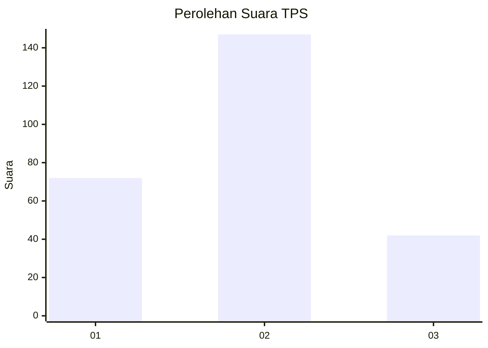
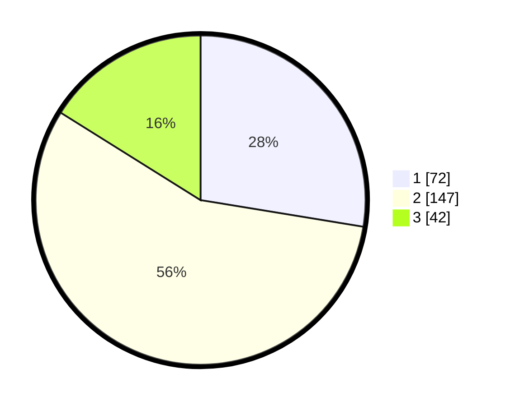

# Hasil

## Grafik

## Tabel

| No. | Nama Paslon    | Suara | Suara (raw) | Persentase |
|:--- |:-------------- | -----:| -----------:| ----------:|
| 1   | ANIES MUHAIMIN | 72    | [72][p-1]   | 27,59      |
| 2   | PRABOWO GIBRAN | 147   | [147][p-2]  | 56,32      |
| 3   | GANJAR MAHFUD  | 42    | [42][p-3]   | 16,09      |

[p-1]: https://github.com/gigit-pemilu/pemilu-2024/blob/main/pilpres/hitung-suara/sub/32-jawa-barat/sub/17-bandung-barat/sub/09-batujajar/sub/2004-galanggang/sub/002-tps/sub/paslon-1.txt
[p-2]: https://github.com/gigit-pemilu/pemilu-2024/blob/main/pilpres/hitung-suara/sub/32-jawa-barat/sub/17-bandung-barat/sub/09-batujajar/sub/2004-galanggang/sub/002-tps/sub/paslon-2.txt
[p-3]: https://github.com/gigit-pemilu/pemilu-2024/blob/main/pilpres/hitung-suara/sub/32-jawa-barat/sub/17-bandung-barat/sub/09-batujajar/sub/2004-galanggang/sub/002-tps/sub/paslon-3.txt

## Foto C Plano

https://sirekap-obj-formc.kpu.go.id/1236/pemilu/ppwp/32/17/09/20/04/3217092004002-20240215-000806--419ad08d-d9b1-4034-a9e4-22fdf15648f3.jpg

https://sirekap-obj-formc.kpu.go.id/1236/pemilu/ppwp/32/17/09/20/04/3217092004002-20240215-000924--860d501c-b9db-40b0-89f5-0e213c9429e1.jpg

https://sirekap-obj-formc.kpu.go.id/1236/pemilu/ppwp/32/17/09/20/04/3217092004002-20240215-000952--4eaaaf50-75e1-4591-8af8-53597caac3d6.jpg

## Metadata

| Key        | Value               |
| ---------- | ------------------- |
| Time Stamp | 2024-02-19 06:16:00 |

