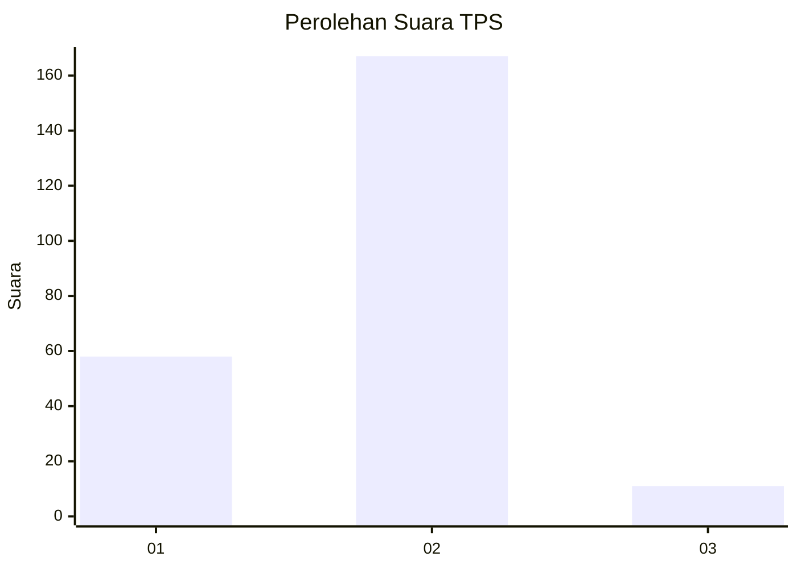
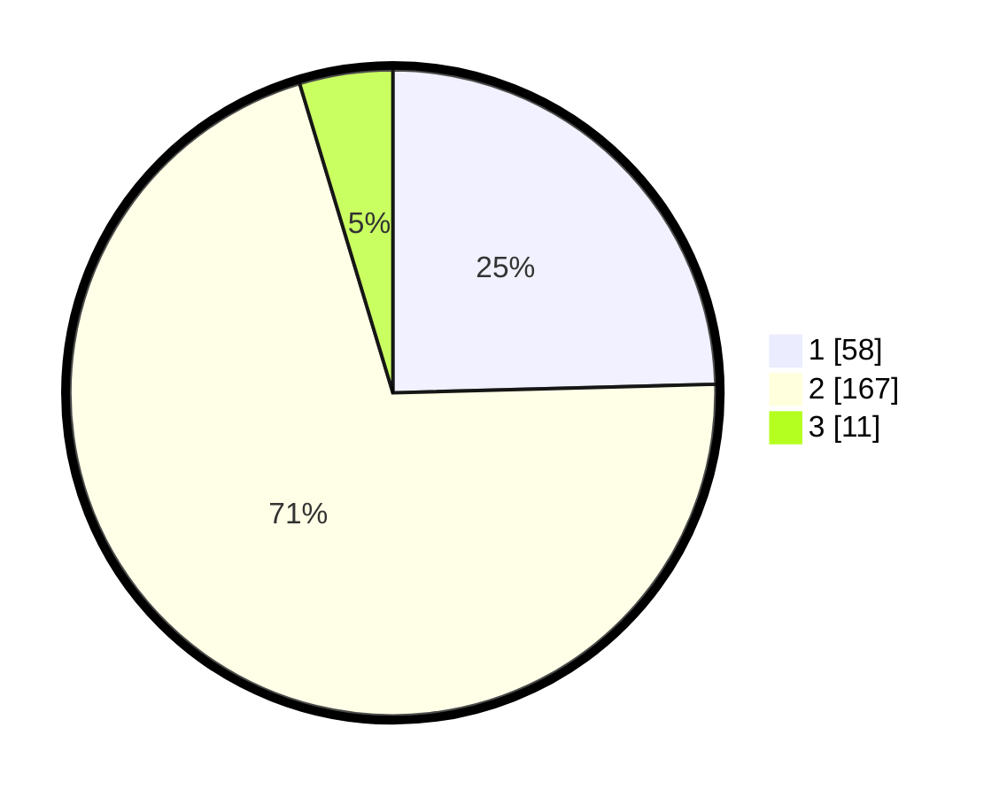

# Hasil

## Grafik

## Tabel

| No. | Nama Paslon    | Suara | Suara (raw) | Persentase |
|:--- |:-------------- | -----:| -----------:| ----------:|
| 1   | ANIES MUHAIMIN | 58    | [58][p-1]   | 24,58      |
| 2   | PRABOWO GIBRAN | 167   | [167][p-2]  | 70,76      |
| 3   | GANJAR MAHFUD  | 11    | [11][p-3]   | 4,66       |

[p-1]: https://github.com/gigit-pemilu/pemilu-2024/blob/main/pilpres/hitung-suara/sub/32-jawa-barat/sub/17-bandung-barat/sub/11-cililin/sub/2001-cililin/sub/004-tps/sub/paslon-1.txt
[p-2]: https://github.com/gigit-pemilu/pemilu-2024/blob/main/pilpres/hitung-suara/sub/32-jawa-barat/sub/17-bandung-barat/sub/11-cililin/sub/2001-cililin/sub/004-tps/sub/paslon-2.txt
[p-3]: https://github.com/gigit-pemilu/pemilu-2024/blob/main/pilpres/hitung-suara/sub/32-jawa-barat/sub/17-bandung-barat/sub/11-cililin/sub/2001-cililin/sub/004-tps/sub/paslon-3.txt

## Foto C Plano

https://sirekap-obj-formc.kpu.go.id/5bdd/pemilu/ppwp/32/17/11/20/01/3217112001004-20240215-004532--0ead6f58-be32-41ca-9588-b26d4b35465e.jpg

https://sirekap-obj-formc.kpu.go.id/5bdd/pemilu/ppwp/32/17/11/20/01/3217112001004-20240215-164307--d3bbd559-adab-4635-95c7-16de36874896.jpg

https://sirekap-obj-formc.kpu.go.id/5bdd/pemilu/ppwp/32/17/11/20/01/3217112001004-20240215-004435--55baad66-550b-4661-bd13-963dbf1fb639.jpg

## Metadata

| Key        | Value               |
| ---------- | ------------------- |
| Time Stamp | 2024-02-19 06:16:00 |

