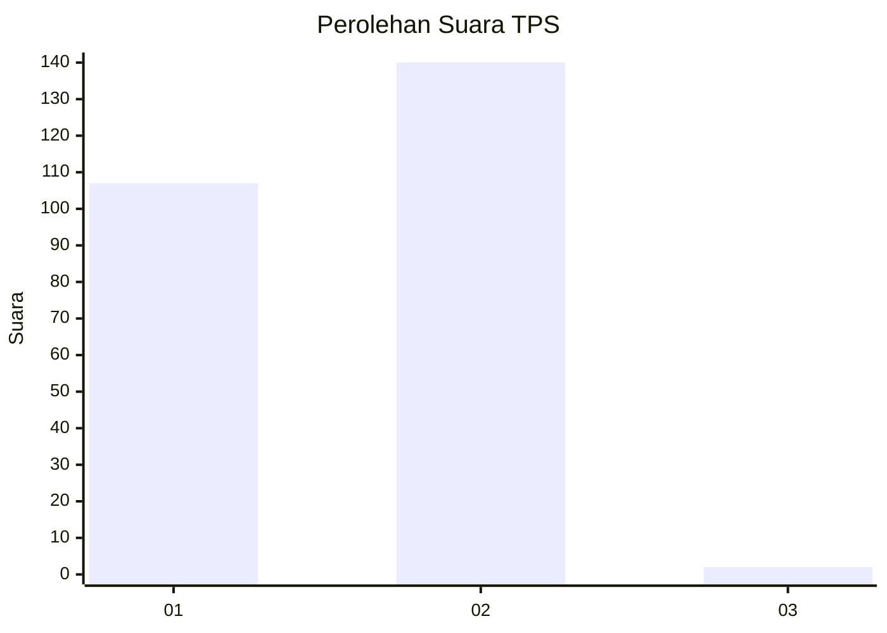
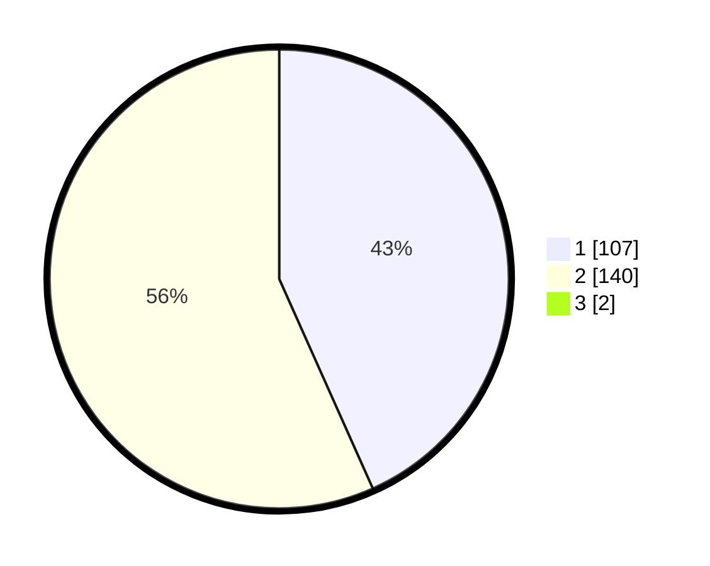

# Hasil

## Grafik

## Tabel

| No. | Nama Paslon    | Suara | Suara (raw) | Persentase |
|:--- |:-------------- | -----:| -----------:| ----------:|
| 1   | ANIES MUHAIMIN | 107   | [107][p-1]  | 42,97      |
| 2   | PRABOWO GIBRAN | 140   | [140][p-2]  | 56,22      |
| 3   | GANJAR MAHFUD  | 2     | [2][p-3]    | 0,80       |

[p-1]: https://github.com/gigit-pemilu/pemilu-2024-32-jawa-barat/blob/main/pilpres/hitung-suara/sub/32-jawa-barat/sub/17-bandung-barat/sub/14-sindangkerta/sub/2001-cintakarya/sub/004-tps/sub/paslon-1.txt
[p-2]: https://github.com/gigit-pemilu/pemilu-2024-32-jawa-barat/blob/main/pilpres/hitung-suara/sub/32-jawa-barat/sub/17-bandung-barat/sub/14-sindangkerta/sub/2001-cintakarya/sub/004-tps/sub/paslon-2.txt
[p-3]: https://github.com/gigit-pemilu/pemilu-2024-32-jawa-barat/blob/main/pilpres/hitung-suara/sub/32-jawa-barat/sub/17-bandung-barat/sub/14-sindangkerta/sub/2001-cintakarya/sub/004-tps/sub/paslon-3.txt

## Foto C Plano

https://sirekap-obj-formc.kpu.go.id/ce5e/pemilu/ppwp/32/17/14/20/01/3217142001004-20240219-223829--ec70136c-c7f3-4025-a859-d0d182acd380.jpg

https://sirekap-obj-formc.kpu.go.id/ce5e/pemilu/ppwp/32/17/14/20/01/3217142001004-20240219-224035--a8c68705-76f3-4822-88bb-45fb9856ee83.jpg

https://sirekap-obj-formc.kpu.go.id/ce5e/pemilu/ppwp/32/17/14/20/01/3217142001004-20240215-023552--09741685-8c94-4c4f-99de-35823aba3139.jpg

## Metadata

| Key        | Value               |
| ---------- | ------------------- |
| Time Stamp | 2024-02-25 16:00:00 |

