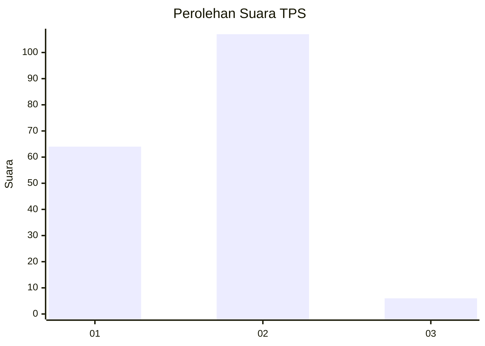
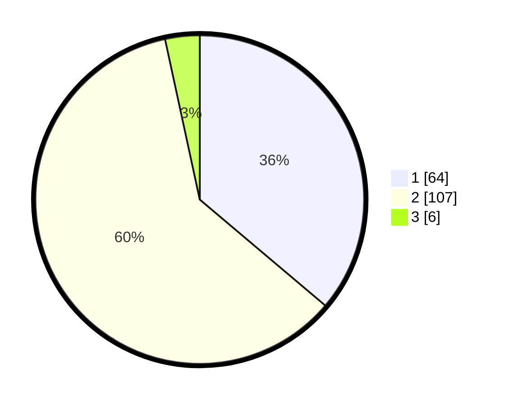

# Hasil

## Grafik

## Tabel

| No. | Nama Paslon    | Suara | Suara (raw) | Persentase |
|:--- |:-------------- | -----:| -----------:| ----------:|
| 1   | ANIES MUHAIMIN | 64    | [64][p-1]   | 36,16      |
| 2   | PRABOWO GIBRAN | 107   | [107][p-2]  | 60,45      |
| 3   | GANJAR MAHFUD  | 6     | [6][p-3]    | 3,39       |

[p-1]: https://github.com/gigit-pemilu/pemilu-2024/blob/main/pilpres/hitung-suara/sub/32-jawa-barat/sub/17-bandung-barat/sub/15-gununghalu/sub/2001-sirnajaya/sub/006-tps/sub/paslon-1.txt
[p-2]: https://github.com/gigit-pemilu/pemilu-2024/blob/main/pilpres/hitung-suara/sub/32-jawa-barat/sub/17-bandung-barat/sub/15-gununghalu/sub/2001-sirnajaya/sub/006-tps/sub/paslon-2.txt
[p-3]: https://github.com/gigit-pemilu/pemilu-2024/blob/main/pilpres/hitung-suara/sub/32-jawa-barat/sub/17-bandung-barat/sub/15-gununghalu/sub/2001-sirnajaya/sub/006-tps/sub/paslon-3.txt

## Foto C Plano

https://sirekap-obj-formc.kpu.go.id/e35d/pemilu/ppwp/32/17/15/20/01/3217152001006-20240214-221159--3d1f1b6f-2400-4230-8f40-27ce2a5c537a.jpg

https://sirekap-obj-formc.kpu.go.id/e35d/pemilu/ppwp/32/17/15/20/01/3217152001006-20240214-221323--780e25ff-5fca-4009-97a0-a507aca1f741.jpg

https://sirekap-obj-formc.kpu.go.id/e35d/pemilu/ppwp/32/17/15/20/01/3217152001006-20240214-221606--354d1862-73e2-42d2-a0ef-8246f022a287.jpg

## Metadata

| Key        | Value               |
| ---------- | ------------------- |
| Time Stamp | 2024-02-15 09:00:24 |

