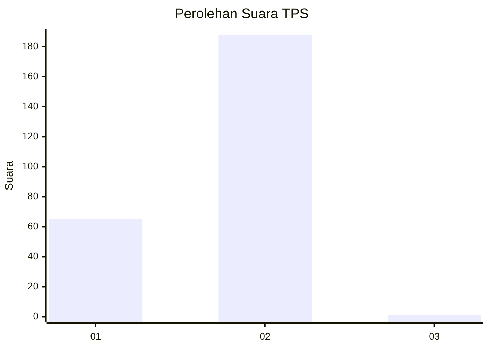
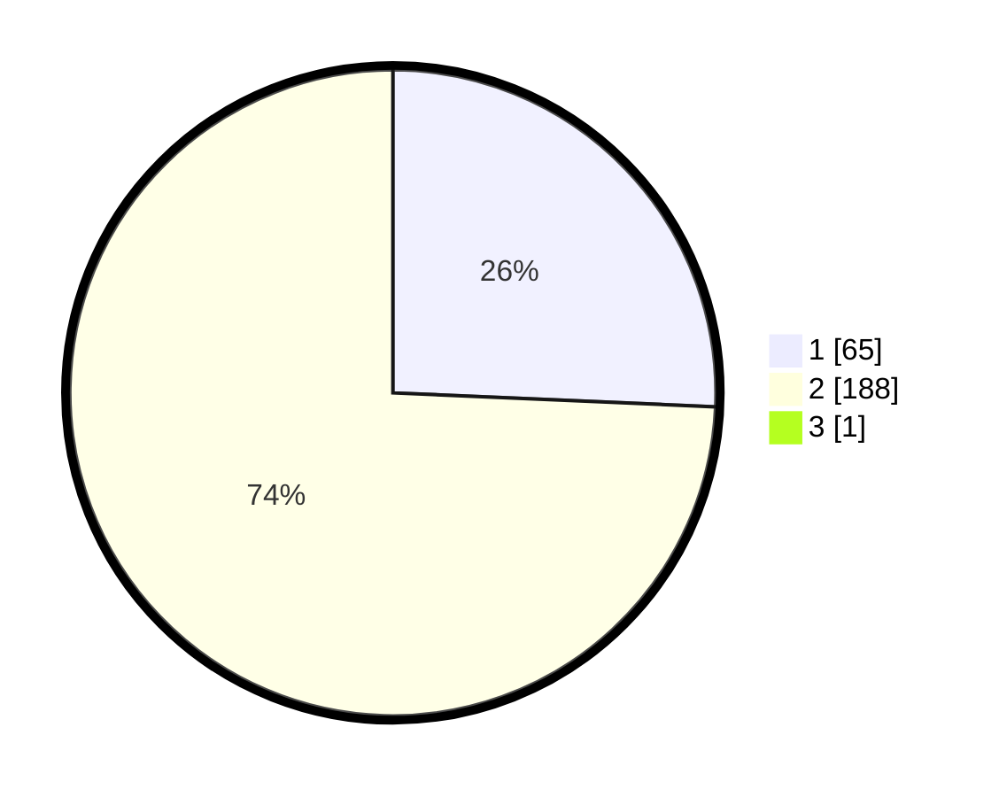

# Hasil

## Grafik

## Tabel

| No. | Nama Paslon    | Suara | Suara (raw) | Persentase |
|:--- |:-------------- | -----:| -----------:| ----------:|
| 1   | ANIES MUHAIMIN | 65    | [65][p-1]   | 25,59      |
| 2   | PRABOWO GIBRAN | 188   | [188][p-2]  | 74,02      |
| 3   | GANJAR MAHFUD  | 1     | [1][p-3]    | 0,39       |

[p-1]: https://github.com/gigit-pemilu/pemilu-2024/blob/main/pilpres/hitung-suara/sub/32-jawa-barat/sub/17-bandung-barat/sub/16-saguling/sub/2001-cikande/sub/005-tps/sub/paslon-1.txt
[p-2]: https://github.com/gigit-pemilu/pemilu-2024/blob/main/pilpres/hitung-suara/sub/32-jawa-barat/sub/17-bandung-barat/sub/16-saguling/sub/2001-cikande/sub/005-tps/sub/paslon-2.txt
[p-3]: https://github.com/gigit-pemilu/pemilu-2024/blob/main/pilpres/hitung-suara/sub/32-jawa-barat/sub/17-bandung-barat/sub/16-saguling/sub/2001-cikande/sub/005-tps/sub/paslon-3.txt

## Foto C Plano

https://sirekap-obj-formc.kpu.go.id/38a4/pemilu/ppwp/32/17/16/20/01/3217162001005-20240214-223719--996ff6ec-cb54-4402-8dd5-8f1689ec3a6b.jpg

https://sirekap-obj-formc.kpu.go.id/38a4/pemilu/ppwp/32/17/16/20/01/3217162001005-20240214-223821--668b9804-ef74-4ac0-b861-04e855475928.jpg

https://sirekap-obj-formc.kpu.go.id/38a4/pemilu/ppwp/32/17/16/20/01/3217162001005-20240214-223905--6a7e34d6-6ac3-45f7-a59f-2cf2757513db.jpg

## Metadata

| Key        | Value               |
| ---------- | ------------------- |
| Time Stamp | 2024-02-15 12:00:28 |

