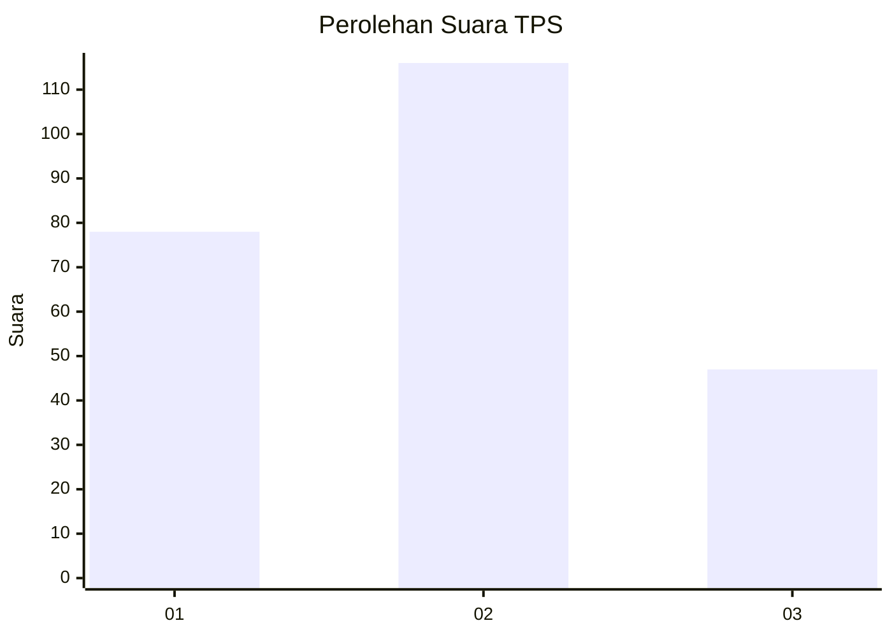
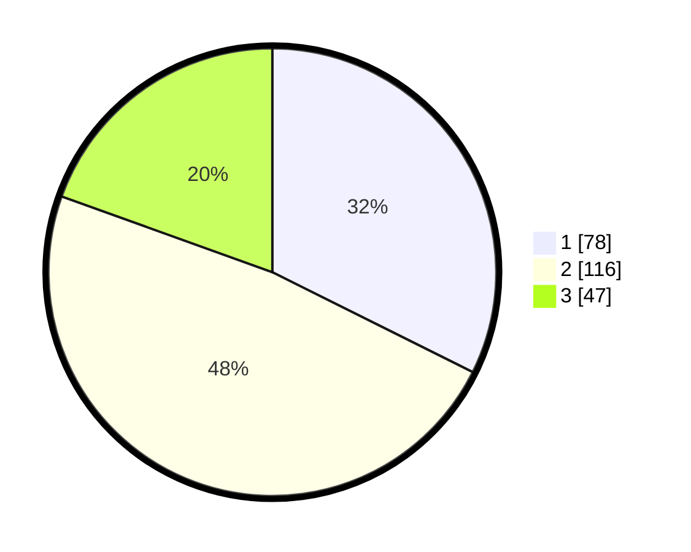

# Hasil

## Grafik

## Tabel

| No. | Nama Paslon    | Suara | Suara (raw) | Persentase |
|:--- |:-------------- | -----:| -----------:| ----------:|
| 1   | ANIES MUHAIMIN | 78    | [78][p-1]   | 32,37      |
| 2   | PRABOWO GIBRAN | 116   | [116][p-2]  | 48,13      |
| 3   | GANJAR MAHFUD  | 47    | [47][p-3]   | 19,50      |

[p-1]: https://github.com/gigit-pemilu/pemilu-2024/blob/main/pilpres/hitung-suara/sub/32-jawa-barat/sub/18-pangandaran/sub/01-parigi/sub/2001-parigi/sub/004-tps/sub/paslon-1.txt
[p-2]: https://github.com/gigit-pemilu/pemilu-2024/blob/main/pilpres/hitung-suara/sub/32-jawa-barat/sub/18-pangandaran/sub/01-parigi/sub/2001-parigi/sub/004-tps/sub/paslon-2.txt
[p-3]: https://github.com/gigit-pemilu/pemilu-2024/blob/main/pilpres/hitung-suara/sub/32-jawa-barat/sub/18-pangandaran/sub/01-parigi/sub/2001-parigi/sub/004-tps/sub/paslon-3.txt

## Foto C Plano

https://sirekap-obj-formc.kpu.go.id/a85e/pemilu/ppwp/32/18/01/20/01/3218012001004-20240215-031813--4b433f4e-a1b3-4228-ad6e-3bf02b76e750.jpg

https://sirekap-obj-formc.kpu.go.id/a85e/pemilu/ppwp/32/18/01/20/01/3218012001004-20240215-032013--f782076e-f176-4e64-9320-32f87a17f79f.jpg

https://sirekap-obj-formc.kpu.go.id/a85e/pemilu/ppwp/32/18/01/20/01/3218012001004-20240215-024830--2cceb013-7403-40a9-bb5d-b8754a07c6a3.jpg

## Metadata

| Key        | Value               |
| ---------- | ------------------- |
| Time Stamp | 2024-02-15 15:00:29 |

