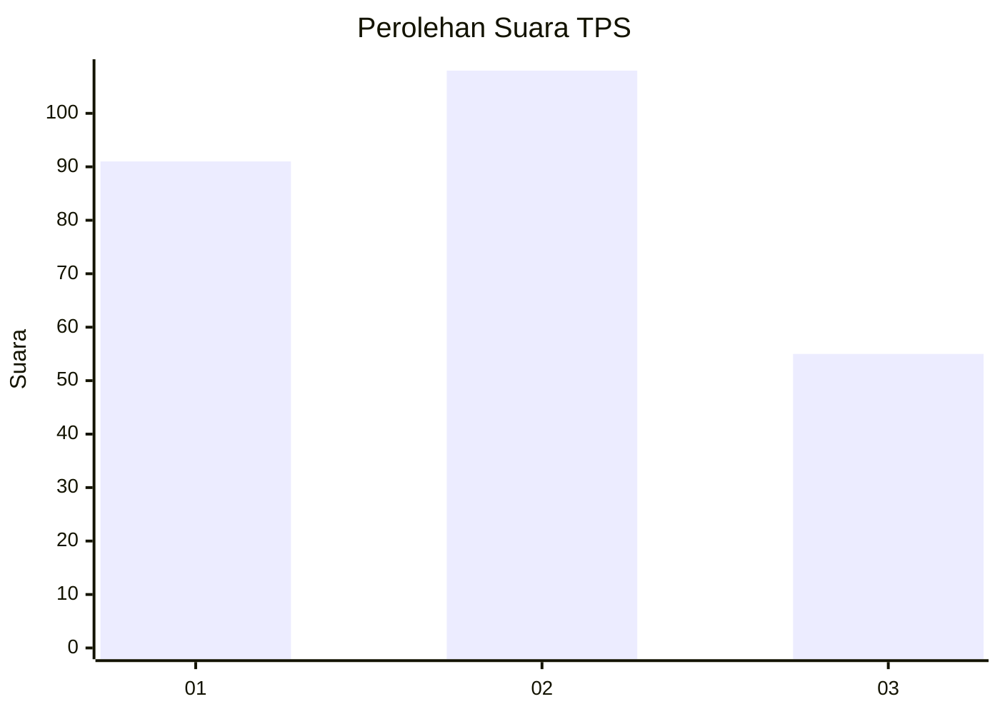
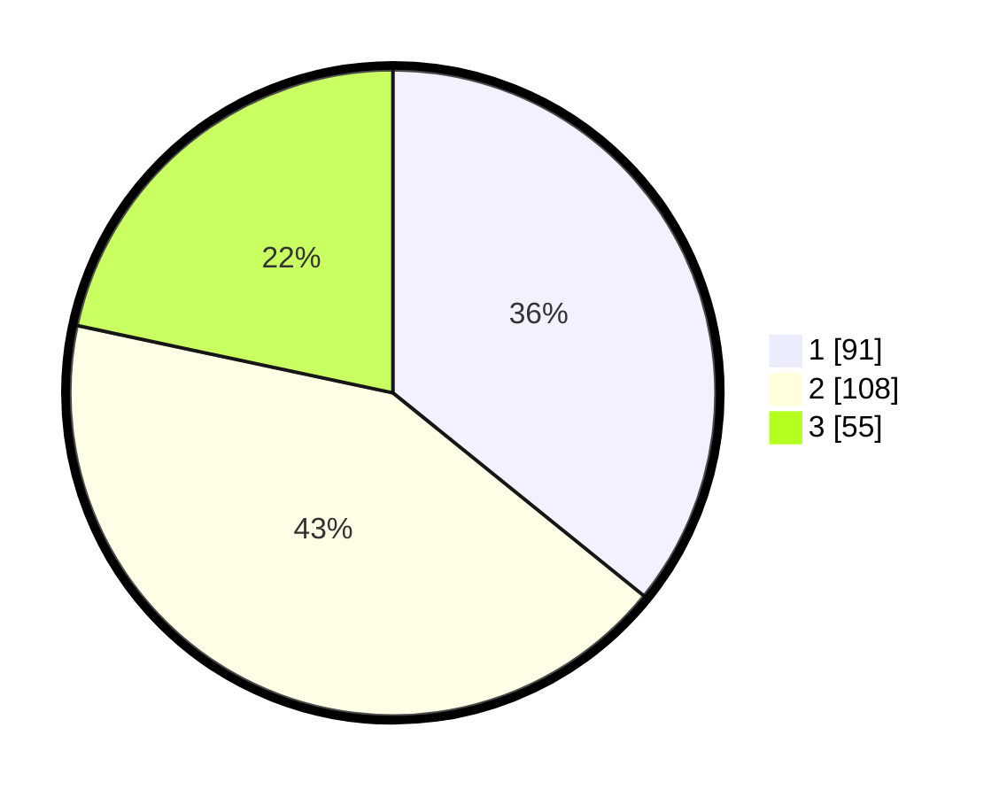

# Hasil

## Grafik

## Tabel

| No. | Nama Paslon    | Suara | Suara (raw) | Persentase |
|:--- |:-------------- | -----:| -----------:| ----------:|
| 1   | ANIES MUHAIMIN | 91    | [91][p-1]   | 35,83      |
| 2   | PRABOWO GIBRAN | 108   | [108][p-2]  | 42,52      |
| 3   | GANJAR MAHFUD  | 55    | [55][p-3]   | 21,65      |

[p-1]: https://github.com/gigit-pemilu/pemilu-2024-32-jawa-barat/blob/main/pilpres/hitung-suara/sub/32-jawa-barat/sub/18-pangandaran/sub/01-parigi/sub/2001-parigi/sub/014-tps/sub/paslon-1.txt
[p-2]: https://github.com/gigit-pemilu/pemilu-2024-32-jawa-barat/blob/main/pilpres/hitung-suara/sub/32-jawa-barat/sub/18-pangandaran/sub/01-parigi/sub/2001-parigi/sub/014-tps/sub/paslon-2.txt
[p-3]: https://github.com/gigit-pemilu/pemilu-2024-32-jawa-barat/blob/main/pilpres/hitung-suara/sub/32-jawa-barat/sub/18-pangandaran/sub/01-parigi/sub/2001-parigi/sub/014-tps/sub/paslon-3.txt

## Foto C Plano

https://sirekap-obj-formc.kpu.go.id/9f6b/pemilu/ppwp/32/18/01/20/01/3218012001014-20240218-201844--91561afd-e2c4-4b9d-92f6-728a893c00c7.jpg

https://sirekap-obj-formc.kpu.go.id/9f6b/pemilu/ppwp/32/18/01/20/01/3218012001014-20240218-201729--a69469ce-e101-4145-a6d2-5b8205d228a3.jpg

https://sirekap-obj-formc.kpu.go.id/9f6b/pemilu/ppwp/32/18/01/20/01/3218012001014-20240218-201746--17759927-1d44-4b54-89fa-e2b62d33e3ea.jpg

## Metadata

| Key        | Value               |
| ---------- | ------------------- |
| Time Stamp | 2024-02-19 06:16:00 |

