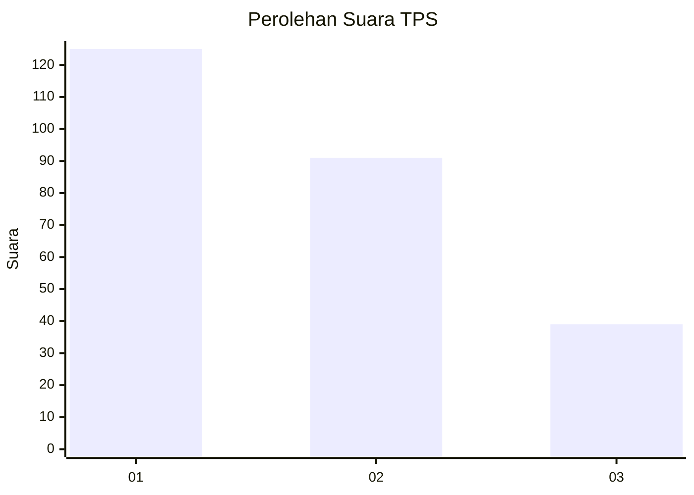
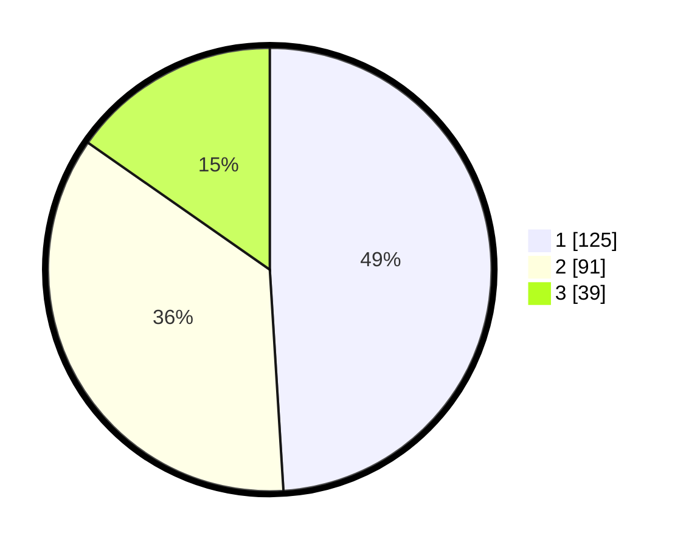

# Hasil

## Grafik

## Tabel

| No. | Nama Paslon    | Suara | Suara (raw) | Persentase |
|:--- |:-------------- | -----:| -----------:| ----------:|
| 1   | ANIES MUHAIMIN | 125   | [125][p-1]  | 49,02      |
| 2   | PRABOWO GIBRAN | 91    | [91][p-2]   | 35,69      |
| 3   | GANJAR MAHFUD  | 39    | [39][p-3]   | 15,29      |

[p-1]: https://github.com/gigit-pemilu/pemilu-2024/blob/main/pilpres/hitung-suara/sub/32-jawa-barat/sub/18-pangandaran/sub/01-parigi/sub/2002-karangbenda/sub/012-tps/sub/paslon-1.txt
[p-2]: https://github.com/gigit-pemilu/pemilu-2024/blob/main/pilpres/hitung-suara/sub/32-jawa-barat/sub/18-pangandaran/sub/01-parigi/sub/2002-karangbenda/sub/012-tps/sub/paslon-2.txt
[p-3]: https://github.com/gigit-pemilu/pemilu-2024/blob/main/pilpres/hitung-suara/sub/32-jawa-barat/sub/18-pangandaran/sub/01-parigi/sub/2002-karangbenda/sub/012-tps/sub/paslon-3.txt

## Foto C Plano

https://sirekap-obj-formc.kpu.go.id/6a05/pemilu/ppwp/32/18/01/20/02/3218012002012-20240214-195315--5e09290a-e93f-48c1-962a-e98c18d96d6a.jpg

https://sirekap-obj-formc.kpu.go.id/6a05/pemilu/ppwp/32/18/01/20/02/3218012002012-20240214-195431--c19b48c0-5299-4d8f-a020-dcfd3ffc928d.jpg

https://sirekap-obj-formc.kpu.go.id/6a05/pemilu/ppwp/32/18/01/20/02/3218012002012-20240214-195446--bdd87d0b-67dd-44a2-8083-a9c508c8d9fd.jpg

## Metadata

| Key        | Value               |
| ---------- | ------------------- |
| Time Stamp | 2024-02-15 01:47:43 |

