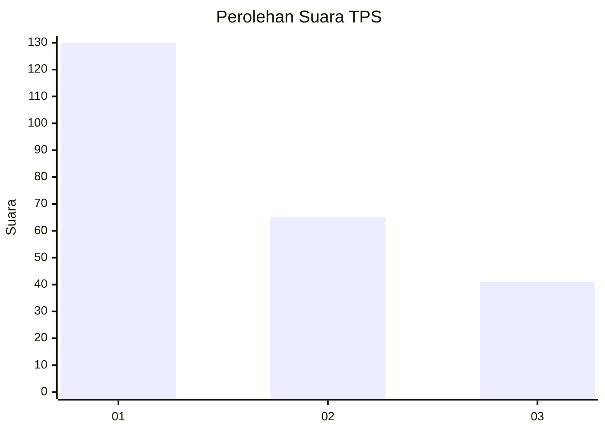
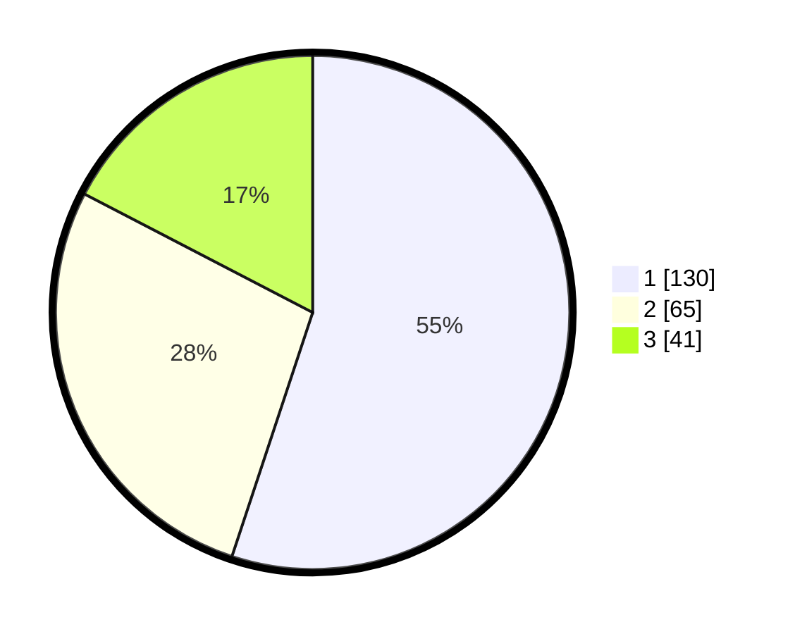

# Hasil

## Grafik

## Tabel

| No. | Nama Paslon    | Suara | Suara (raw) | Persentase |
|:--- |:-------------- | -----:| -----------:| ----------:|
| 1   | ANIES MUHAIMIN | 130   | [130][p-1]  | 55,08      |
| 2   | PRABOWO GIBRAN | 65    | [65][p-2]   | 27,54      |
| 3   | GANJAR MAHFUD  | 41    | [41][p-3]   | 17,37      |

[p-1]: https://github.com/gigit-pemilu/pemilu-2024-32-jawa-barat/blob/main/pilpres/hitung-suara/sub/32-jawa-barat/sub/18-pangandaran/sub/01-parigi/sub/2002-karangbenda/sub/014-tps/sub/paslon-1.txt
[p-2]: https://github.com/gigit-pemilu/pemilu-2024-32-jawa-barat/blob/main/pilpres/hitung-suara/sub/32-jawa-barat/sub/18-pangandaran/sub/01-parigi/sub/2002-karangbenda/sub/014-tps/sub/paslon-2.txt
[p-3]: https://github.com/gigit-pemilu/pemilu-2024-32-jawa-barat/blob/main/pilpres/hitung-suara/sub/32-jawa-barat/sub/18-pangandaran/sub/01-parigi/sub/2002-karangbenda/sub/014-tps/sub/paslon-3.txt

## Foto C Plano

https://sirekap-obj-formc.kpu.go.id/cd3a/pemilu/ppwp/32/18/01/20/02/3218012002014-20240218-200505--8018d030-da89-4750-9b12-b4f97e6ecc5a.jpg

https://sirekap-obj-formc.kpu.go.id/cd3a/pemilu/ppwp/32/18/01/20/02/3218012002014-20240218-200603--f304f53b-532a-4a05-9e0c-13a669b2cb9a.jpg

https://sirekap-obj-formc.kpu.go.id/cd3a/pemilu/ppwp/32/18/01/20/02/3218012002014-20240218-200701--601a1e13-9dfa-4e10-9412-33f24eaeeffe.jpg

## Metadata

| Key        | Value               |
| ---------- | ------------------- |
| Time Stamp | 2024-02-24 22:31:28 |

