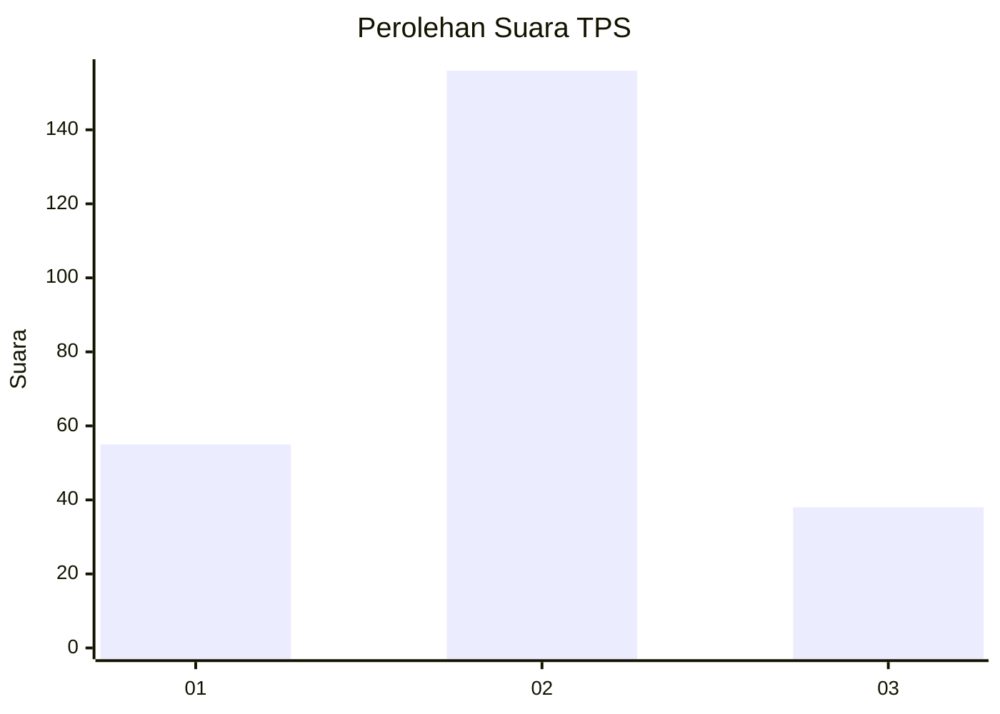
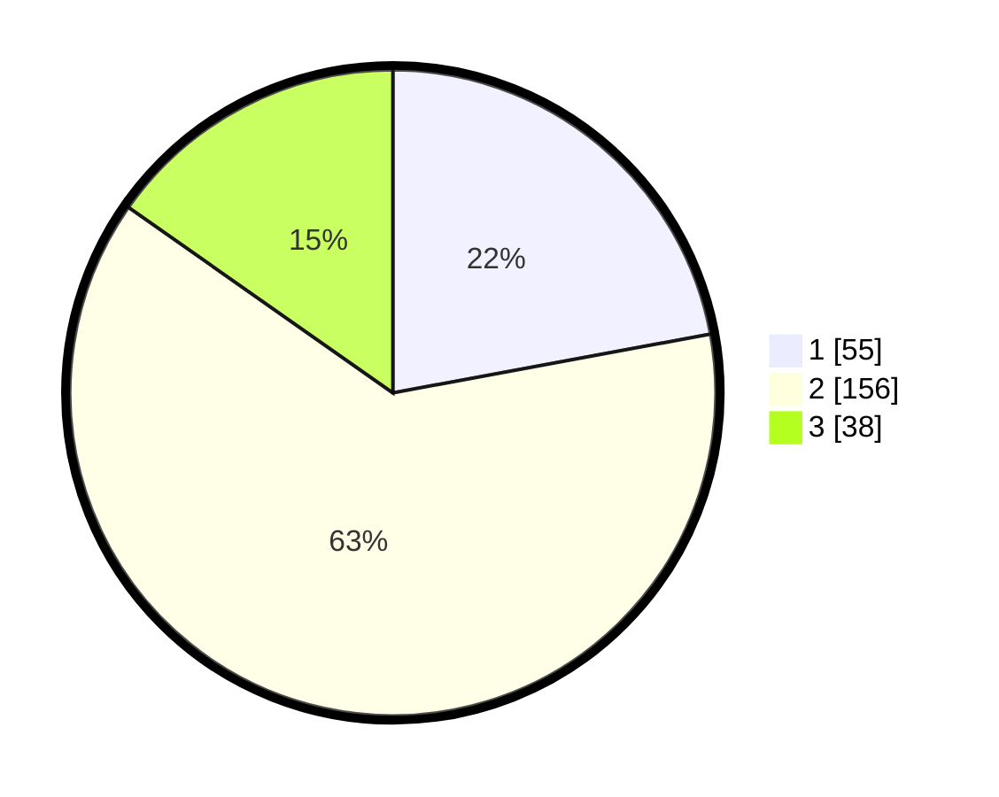

# Hasil

## Grafik

## Tabel

| No. | Nama Paslon    | Suara | Suara (raw) | Persentase |
|:--- |:-------------- | -----:| -----------:| ----------:|
| 1   | ANIES MUHAIMIN | 55    | [55][p-1]   | 22,09      |
| 2   | PRABOWO GIBRAN | 156   | [156][p-2]  | 62,65      |
| 3   | GANJAR MAHFUD  | 38    | [38][p-3]   | 15,26      |

[p-1]: https://github.com/gigit-pemilu/pemilu-2024/blob/main/pilpres/hitung-suara/sub/32-jawa-barat/sub/18-pangandaran/sub/02-cijulang/sub/2001-batukaras/sub/002-tps/sub/paslon-1.txt
[p-2]: https://github.com/gigit-pemilu/pemilu-2024/blob/main/pilpres/hitung-suara/sub/32-jawa-barat/sub/18-pangandaran/sub/02-cijulang/sub/2001-batukaras/sub/002-tps/sub/paslon-2.txt
[p-3]: https://github.com/gigit-pemilu/pemilu-2024/blob/main/pilpres/hitung-suara/sub/32-jawa-barat/sub/18-pangandaran/sub/02-cijulang/sub/2001-batukaras/sub/002-tps/sub/paslon-3.txt

## Foto C Plano

https://sirekap-obj-formc.kpu.go.id/1b01/pemilu/ppwp/32/18/02/20/01/3218022001002-20240214-155727--dd60e043-f406-4728-80c3-698934f56608.jpg

https://sirekap-obj-formc.kpu.go.id/1b01/pemilu/ppwp/32/18/02/20/01/3218022001002-20240214-155740--607dbdb8-ecf2-41ea-bc96-3866a68d05aa.jpg

https://sirekap-obj-formc.kpu.go.id/1b01/pemilu/ppwp/32/18/02/20/01/3218022001002-20240214-155836--42ddaeb7-b3fc-4c0a-8782-bc15ff8258ec.jpg

## Metadata

| Key        | Value               |
| ---------- | ------------------- |
| Time Stamp | 2024-02-17 09:00:02 |

