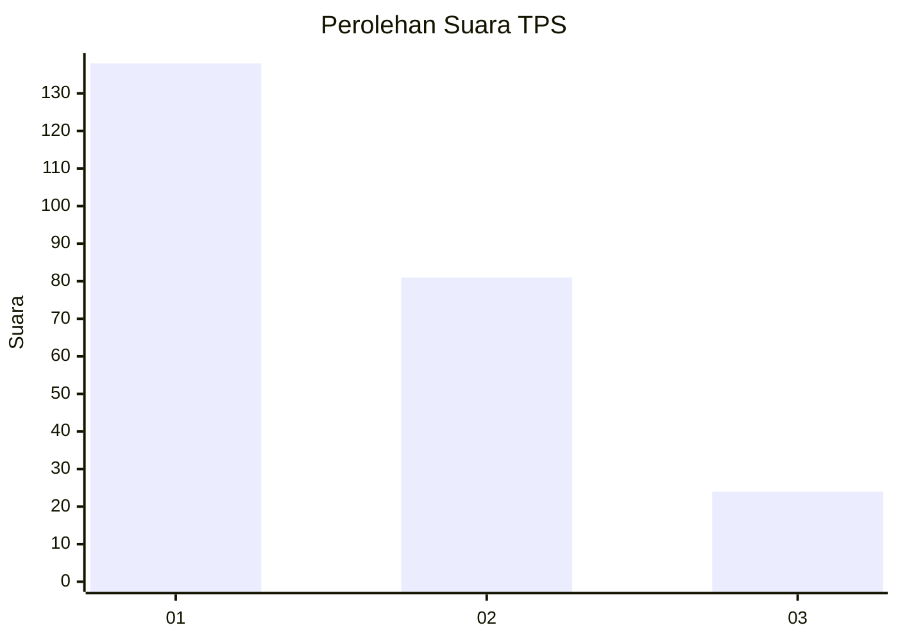
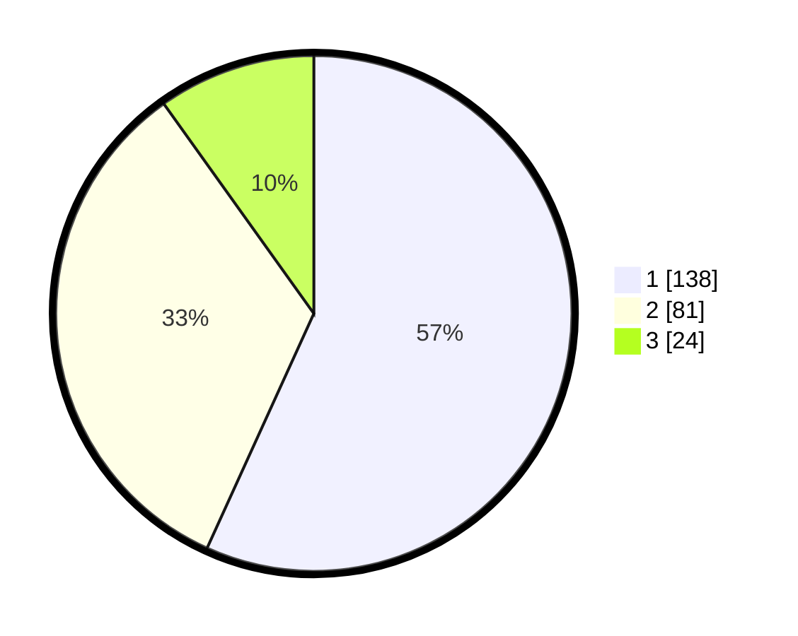

# Hasil

## Grafik

## Tabel

| No. | Nama Paslon    | Suara | Suara (raw) | Persentase |
|:--- |:-------------- | -----:| -----------:| ----------:|
| 1   | ANIES MUHAIMIN | 138   | [138][p-1]  | 56,79      |
| 2   | PRABOWO GIBRAN | 81    | [81][p-2]   | 33,33      |
| 3   | GANJAR MAHFUD  | 24    | [24][p-3]   | 9,88       |

[p-1]: https://github.com/gigit-pemilu/pemilu-2024-32-jawa-barat/blob/main/pilpres/hitung-suara/sub/32-jawa-barat/sub/18-pangandaran/sub/02-cijulang/sub/2005-cijulang/sub/002-tps/sub/paslon-1.txt
[p-2]: https://github.com/gigit-pemilu/pemilu-2024-32-jawa-barat/blob/main/pilpres/hitung-suara/sub/32-jawa-barat/sub/18-pangandaran/sub/02-cijulang/sub/2005-cijulang/sub/002-tps/sub/paslon-2.txt
[p-3]: https://github.com/gigit-pemilu/pemilu-2024-32-jawa-barat/blob/main/pilpres/hitung-suara/sub/32-jawa-barat/sub/18-pangandaran/sub/02-cijulang/sub/2005-cijulang/sub/002-tps/sub/paslon-3.txt

## Foto C Plano

https://sirekap-obj-formc.kpu.go.id/9446/pemilu/ppwp/32/18/02/20/05/3218022005002-20240217-200246--f09e6240-5ad6-4cd1-b772-fe1d05ab575c.jpg

https://sirekap-obj-formc.kpu.go.id/9446/pemilu/ppwp/32/18/02/20/05/3218022005002-20240214-220631--0ec24969-2f28-48aa-affa-9cec23ab1748.jpg

https://sirekap-obj-formc.kpu.go.id/9446/pemilu/ppwp/32/18/02/20/05/3218022005002-20240214-220651--172a48f8-099a-4f6f-8724-1df8c6c79b24.jpg

## Metadata

| Key        | Value               |
| ---------- | ------------------- |
| Time Stamp | 2024-02-24 22:31:28 |

