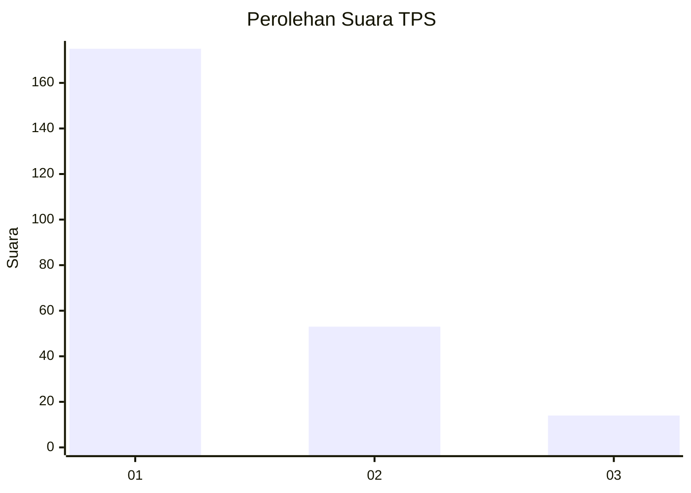
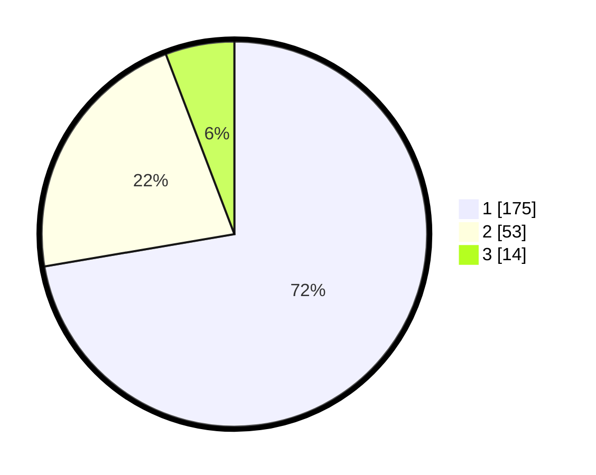

# Hasil

## Grafik

## Tabel

| No. | Nama Paslon    | Suara | Suara (raw) | Persentase |
|:--- |:-------------- | -----:| -----------:| ----------:|
| 1   | ANIES MUHAIMIN | 175   | [175][p-1]  | 72,31      |
| 2   | PRABOWO GIBRAN | 53    | [53][p-2]   | 21,90      |
| 3   | GANJAR MAHFUD  | 14    | [14][p-3]   | 5,79       |

[p-1]: https://github.com/gigit-pemilu/pemilu-2024-32-jawa-barat/blob/main/pilpres/hitung-suara/sub/32-jawa-barat/sub/18-pangandaran/sub/03-cimerak/sub/2005-cimerak/sub/012-tps/sub/paslon-1.txt
[p-2]: https://github.com/gigit-pemilu/pemilu-2024-32-jawa-barat/blob/main/pilpres/hitung-suara/sub/32-jawa-barat/sub/18-pangandaran/sub/03-cimerak/sub/2005-cimerak/sub/012-tps/sub/paslon-2.txt
[p-3]: https://github.com/gigit-pemilu/pemilu-2024-32-jawa-barat/blob/main/pilpres/hitung-suara/sub/32-jawa-barat/sub/18-pangandaran/sub/03-cimerak/sub/2005-cimerak/sub/012-tps/sub/paslon-3.txt

## Foto C Plano

https://sirekap-obj-formc.kpu.go.id/69d5/pemilu/ppwp/32/18/03/20/05/3218032005012-20240215-033511--cba346c7-d4af-4985-873e-dde10db72011.jpg

https://sirekap-obj-formc.kpu.go.id/69d5/pemilu/ppwp/32/18/03/20/05/3218032005012-20240215-033649--4199ddd4-e1ba-4dfa-a871-768db05fbf60.jpg

https://sirekap-obj-formc.kpu.go.id/69d5/pemilu/ppwp/32/18/03/20/05/3218032005012-20240215-033823--e7365ee3-1c3a-44f7-a3e5-f69ea493c89a.jpg

## Metadata

| Key        | Value               |
| ---------- | ------------------- |
| Time Stamp | 2024-02-19 06:16:00 |

